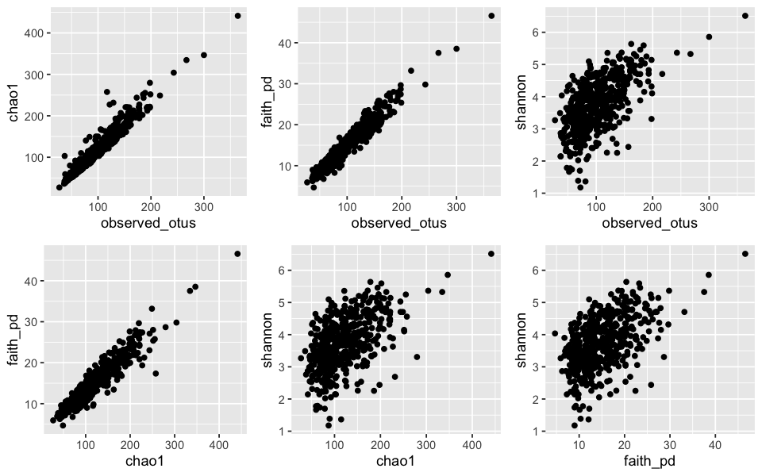
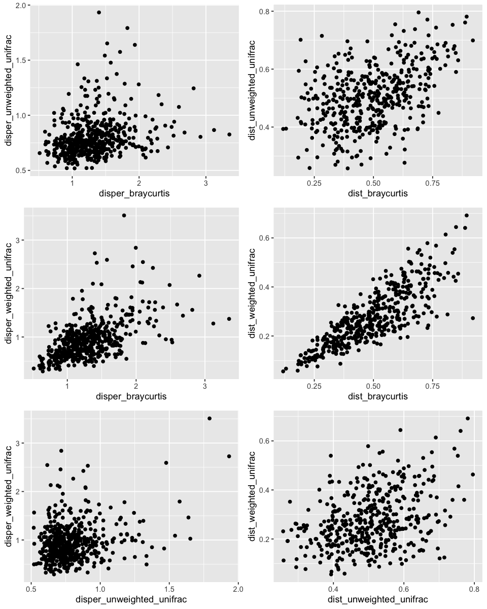
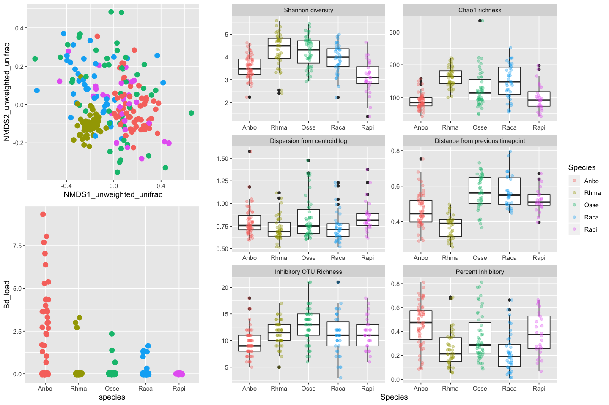
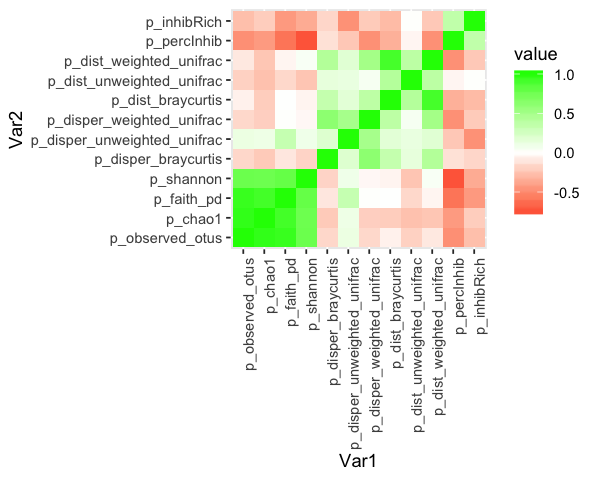
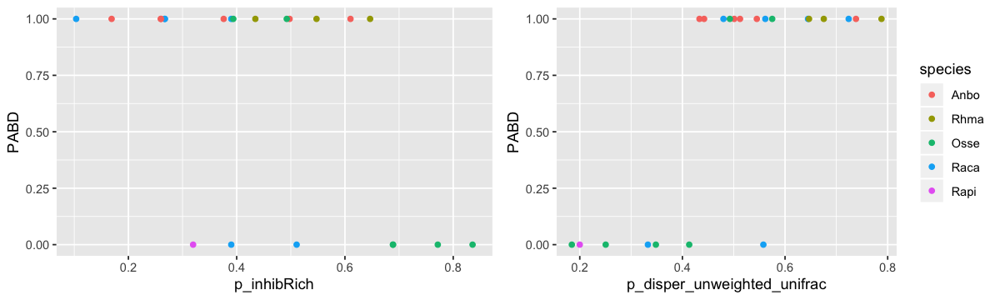
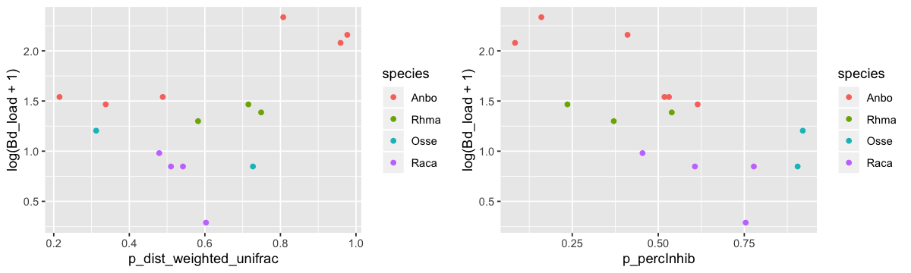
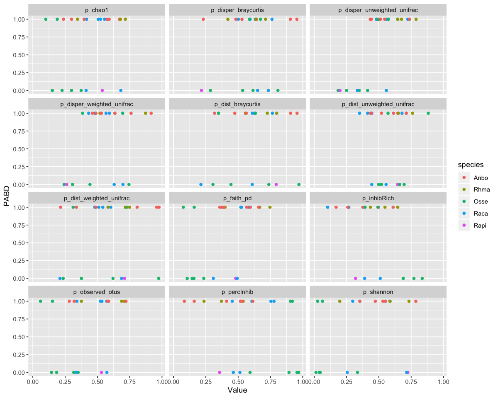
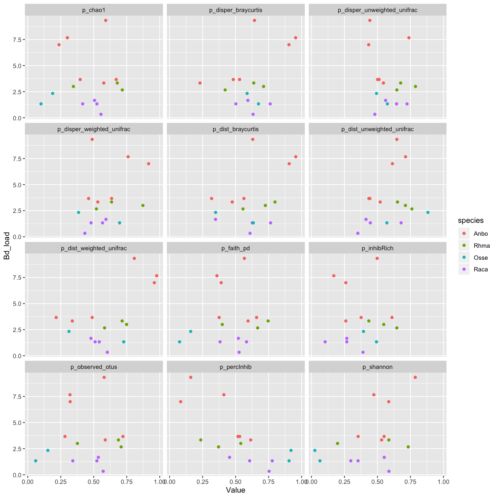
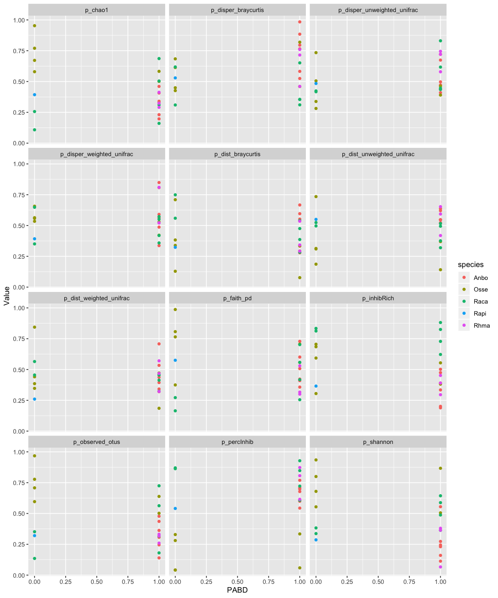
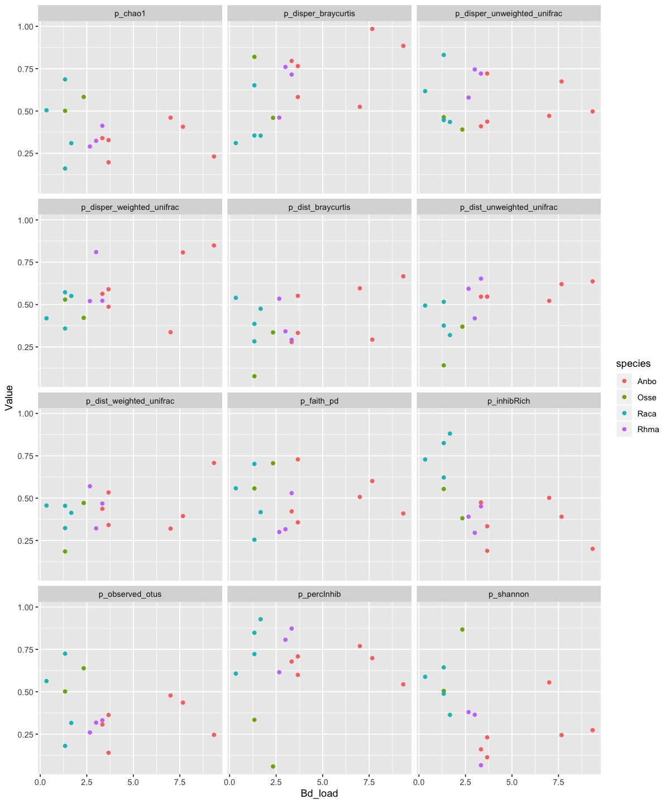

# Statistics


```R
# Load packages
library(tidyverse)
library(rstanarm)
library(car) #Anova
library(vegan) # for permanova and bray curtis
library(gridExtra)
library(betareg) # for beta distr
library(lmtest) # for beta analysis
library(MASS) # for isoMDS and stepAIC
library(ade4)
library(reshape2)
dir.create("./6_Statistics")
```

    ── Attaching packages ─────────────────────────────────────── tidyverse 1.3.0 ──
    ✔ ggplot2 3.2.1          ✔ purrr   0.3.3     
    ✔ tibble  2.1.3          ✔ dplyr   0.8.3     
    ✔ tidyr   1.0.0.9000     ✔ stringr 1.4.0     
    ✔ readr   1.3.1          ✔ forcats 0.4.0     
    ── Conflicts ────────────────────────────────────────── tidyverse_conflicts() ──
    ✖ dplyr::filter() masks stats::filter()
    ✖ dplyr::lag()    masks stats::lag()
    Loading required package: Rcpp
    Registered S3 method overwritten by 'xts':
      method     from
      as.zoo.xts zoo 
    rstanarm (Version 2.19.2, packaged: 2019-10-01 20:20:33 UTC)
    - Do not expect the default priors to remain the same in future rstanarm versions.
    Thus, R scripts should specify priors explicitly, even if they are just the defaults.
    - For execution on a local, multicore CPU with excess RAM we recommend calling
    options(mc.cores = parallel::detectCores())
    - bayesplot theme set to bayesplot::theme_default()
       * Does _not_ affect other ggplot2 plots
       * See ?bayesplot_theme_set for details on theme setting
    Loading required package: carData
    Registered S3 methods overwritten by 'car':
      method                          from
      influence.merMod                lme4
      cooks.distance.influence.merMod lme4
      dfbeta.influence.merMod         lme4
      dfbetas.influence.merMod        lme4
    
    Attaching package: ‘car’
    
    The following object is masked from ‘package:dplyr’:
    
        recode
    
    The following object is masked from ‘package:purrr’:
    
        some
    
    Loading required package: permute
    Loading required package: lattice
    This is vegan 2.5-6
    
    Attaching package: ‘gridExtra’
    
    The following object is masked from ‘package:dplyr’:
    
        combine
    
    Loading required package: zoo
    
    Attaching package: ‘zoo’
    
    The following objects are masked from ‘package:base’:
    
        as.Date, as.Date.numeric
    
    
    Attaching package: ‘MASS’
    
    The following object is masked from ‘package:dplyr’:
    
        select
    
    
    Attaching package: ‘reshape2’
    
    The following object is masked from ‘package:tidyr’:
    
        smiths
    
    Warning message in dir.create("./6_Statistics"):
    “'./6_Statistics' already exists”


```R
# Mapping files
load("./3_5sp_mapping_otu_downstream/mf_alt_filt_final.RData")
# OTU table of inhibitory bacteria
load("./3_5sp_mapping_otu_downstream/otu_filt.RData")

# Distance matrices
load("./3_5sp_mapping_otu_downstream/braycurtis_filt.RData")
load("./3_5sp_mapping_otu_downstream/unweighted_unifrac_filt.RData")
load("./3_5sp_mapping_otu_downstream/weighted_unifrac_filt.RData")

# Previous analyses summaries
load("./4_Bayesian_models/all_p_con.RData")
load("./4_Bayesian_models/all_p.RData")
load("./4_Bayesian_models/all_p_pred.RData")
# load("./5_logratio_tests/lr_con_inhib.RData")
# load("./5_logratio_tests/lr_treat_inhib.RData")

```


```R
# add a species column and PABD column
all_p <- all_p %>%
    mutate(PABD=ifelse(infect>0,1,0)) %>%
    rename(Bd_load=infect) %>%
    separate(indivID, into=c("species","indiv"), remove=FALSE) %>%
    mutate(species=factor(species, levels=c("Anbo","Rhma","Osse","Raca","Rapi"))) 
all_p_pred <- all_p_pred %>%
    mutate(PABD=ifelse(infect>0,1,0)) %>%
    rename(Bd_load=infect) %>%
    separate(indivID, into=c("species","indiv"), remove=FALSE)
all_p_pred_infectonly <- all_p_pred %>%
    filter(PABD>0) %>%
    mutate(log_Bd_load=log(Bd_load +1))
```


```R
### Filter mapping file in mf_con and mf_treat
mf_con <- mf_alt_filt_final %>%
    filter(Bd_exposure=="Control")
mf_treat <- mf_alt_filt_final %>%
    filter(Bd_exposure=="Bd-exposed")
### Filter dm into con and treat
braycurtis_filt_con <- braycurtis_filt[mf_con$SampleID,mf_con$SampleID]
braycurtis_filt_treat <- braycurtis_filt[mf_treat$SampleID,mf_treat$SampleID]

unweighted_unifrac_filt_con <- unweighted_unifrac_filt[mf_con$SampleID,mf_con$SampleID]
unweighted_unifrac_filt_treat <- unweighted_unifrac_filt[mf_treat$SampleID,mf_treat$SampleID]

weighted_unifrac_filt_con <- unweighted_unifrac_filt[mf_con$SampleID,mf_con$SampleID]
weighted_unifrac_filt_treat <- unweighted_unifrac_filt[mf_treat$SampleID,mf_treat$SampleID]
```


```R
# Test to see if different alpha and beta metrics show the same result
options(repr.plot.height=5, repr.plot.width=8)
gg_mf <- ggplot(data=mf_alt_filt_final)            
grid.arrange(gg_mf + geom_point(aes(x=observed_otus, y=chao1))
             , gg_mf + geom_point(aes(x=observed_otus, y=faith_pd))
             , gg_mf + geom_point(aes(x=observed_otus, y=shannon))
             , gg_mf + geom_point(aes(x=chao1, y=faith_pd))
             , gg_mf + geom_point(aes(x=chao1, y=shannon))
             , gg_mf + geom_point(aes(x=faith_pd, y=shannon))  
             , nrow=2)
```





Of all the diversity metrics, it looks like shannon diversity is the only what that "looks" different-- probably because it takes into account evenness, unlike the others.


```R
## Correlate beta diversity metrics with each other
mantel.rtest(as.dist(braycurtis_filt)
, as.dist(unweighted_unifrac_filt)
            , nrepet = 99)
mantel.rtest(as.dist(braycurtis_filt)
, as.dist(weighted_unifrac_filt)
            , nrepet = 99)
mantel.rtest(as.dist(unweighted_unifrac_filt)
, as.dist(weighted_unifrac_filt)
            , nrepet = 99)
```


    Monte-Carlo test
    Call: mantelnoneuclid(m1 = m1, m2 = m2, nrepet = nrepet)
    
    Observation: 0.5111041 
    
    Based on 99 replicates
    Simulated p-value: 0.01 
    Alternative hypothesis: greater 
    
          Std.Obs   Expectation      Variance 
     5.437193e+01 -6.612665e-04  8.859155e-05 


    Monte-Carlo test
    Call: mantelnoneuclid(m1 = m1, m2 = m2, nrepet = nrepet)
    
    Observation: 0.510179 
    
    Based on 99 replicates
    Simulated p-value: 0.01 
    Alternative hypothesis: greater 
    
         Std.Obs  Expectation     Variance 
    4.735978e+01 1.358403e-05 1.160387e-04 


    Monte-Carlo test
    Call: mantelnoneuclid(m1 = m1, m2 = m2, nrepet = nrepet)
    
    Observation: 0.3153188 
    
    Based on 99 replicates
    Simulated p-value: 0.01 
    Alternative hypothesis: greater 
    
         Std.Obs  Expectation     Variance 
    1.754650e+01 1.151417e-03 3.205836e-04 


It looks like all the distance matrices are correlated to each other, which is good. Now, let's see if distance and dispersion are correlated


```R
# Test to see if different beta metrics show the same result
options(repr.plot.height=10, repr.plot.width=8)
grid.arrange(gg_mf + geom_point(aes(x=disper_braycurtis, y=disper_unweighted_unifrac))
            , gg_mf + geom_point(aes(x=dist_braycurtis, y=dist_unweighted_unifrac))

             , gg_mf + geom_point(aes(x=disper_braycurtis, y=disper_weighted_unifrac))
            , gg_mf + geom_point(aes(x=dist_braycurtis, y=dist_weighted_unifrac))

             , gg_mf + geom_point(aes(x=disper_unweighted_unifrac, y=disper_weighted_unifrac))
             , gg_mf + geom_point(aes(x=dist_unweighted_unifrac, y=dist_weighted_unifrac))
             , nrow=3
            )
```

    Warning message:
    “Removed 84 rows containing missing values (geom_point).”Warning message:
    “Removed 84 rows containing missing values (geom_point).”Warning message:
    “Removed 84 rows containing missing values (geom_point).”





```R
#### CURSORY GLANCE AT DATA ####
gg_NMDS <- mf_con %>%
    ggplot(aes(x=NMDS1_unweighted_unifrac, y=NMDS2_unweighted_unifrac)) +
    geom_point(aes(col=species), cex=3, show.legend = FALSE)
gg_infect <- mf_treat  %>%
    ggplot(aes(x=species, y=Bd_load)) +
    geom_point(aes(col=species), cex=3, position = position_jitter(width=0.1, height=0.05), show.legend = FALSE)

temp1a <-  mf_con %>%
    dplyr::select(species, shannon) %>%
    mutate(metric="Shannon_diversity") %>%
    rename(value=shannon)
temp1b <-  mf_con %>%
    dplyr::select(species, chao1) %>%
    mutate(metric="Chao1_richness") %>%
    rename(value=chao1)
temp2 <- mf_con %>%
    dplyr::select(species, inhibRich) %>%
    mutate(metric="Inhibitory_OTU_Richness")%>%
    rename(value=inhibRich)
temp3 <- mf_con %>%
    dplyr::select(species, percInhib) %>%
    mutate(metric="Percent_Inhibitory")%>%
    rename(value=percInhib)
temp4 <- mf_con %>%
    dplyr::select(species, disper_unweighted_unifrac) %>%
    mutate(metric="Dispersion_from_centroid_log")%>%
    rename(value=disper_unweighted_unifrac)
temp5 <- mf_con %>%
    dplyr::select(species, dist_unweighted_unifrac) %>%
    mutate(metric="Distance_from_previous_timepoint")%>%
    rename(value=dist_unweighted_unifrac)


gg_all <- rbind(temp1a,temp1b,temp2,temp3,temp4, temp5) %>%
    rename(Species=species) %>%
    mutate(Metric = gsub("_"," ",metric, fixed=TRUE)) %>%
    mutate(Metric = factor(Metric, levels=c("Shannon diversity","Chao1 richness","Dispersion from centroid log", "Distance from previous timepoint","Inhibitory OTU Richness","Percent Inhibitory"))) %>%
    ggplot(aes(x=Species, y=value)) +
    geom_boxplot() +
    geom_point(aes(col=Species), position = position_jitter(width=0.1, height=0), alpha=1/3)+
    facet_wrap(Metric~., scales = "free",nrow=3) +
    ylab("")+
    xlab("Species") 
lay <- rbind(c(1,2,2),
             c(3,2,2))

#+ fig.height=12, fig.width=10
options(repr.plot.height=8, repr.plot.width=12)
grid.arrange(gg_NMDS, gg_all, gg_infect, layout_matrix = lay)
```

    Warning message:
    “Removed 33 rows containing non-finite values (stat_boxplot).”Warning message:
    “Removed 33 rows containing missing values (geom_point).”





```R
print("Braycurtis")
adonis_composition_bc_timexspecies_con <- adonis2(dist(braycurtis_filt_con) ~ species*time, data=mf_con)
adonis_composition_bc_timexspecies_con
write.table(adonis_composition_bc_timexspecies_con
            , file="./6_Statistics/adonis_composition_bc_timexspecies_con.txt"
            , quote=FALSE, sep="\t", col.names=NA, row.names=TRUE)
print("Unweighted Unifrac")
adonis_composition_uwu_timexspecies_con <- adonis2(dist(unweighted_unifrac_filt_con) ~ species*time, data=mf_con)
adonis_composition_uwu_timexspecies_con
write.table(adonis_composition_uwu_timexspecies_con
            , file="./6_Statistics/adonis_composition_uwu_timexspecies_con.txt"
            , quote=FALSE, sep="\t", col.names=NA, row.names=TRUE)
print("Weighted Unifrac")
adonis_composition_wu_timexspecies_con <- adonis2(dist(weighted_unifrac_filt_con) ~ species*time, data=mf_con)
adonis_composition_wu_timexspecies_con
write.table(adonis_composition_wu_timexspecies_con
            , file="./6_Statistics/adonis_composition_wu_timexspecies_con.txt"
            , quote=FALSE, sep="\t", col.names=NA, row.names=TRUE)

```

    [1] "Braycurtis"


<table>
<caption>A anova.cca: 5 × 5</caption>
<thead>
	<tr><th></th><th scope=col>Df</th><th scope=col>SumOfSqs</th><th scope=col>R2</th><th scope=col>F</th><th scope=col>Pr(&gt;F)</th></tr>
	<tr><th></th><th scope=col>&lt;dbl&gt;</th><th scope=col>&lt;dbl&gt;</th><th scope=col>&lt;dbl&gt;</th><th scope=col>&lt;dbl&gt;</th><th scope=col>&lt;dbl&gt;</th></tr>
</thead>
<tbody>
	<tr><th scope=row>species</th><td>  4</td><td>461.46728</td><td>0.54909625</td><td>81.044417</td><td>0.001</td></tr>
	<tr><th scope=row>time</th><td>  1</td><td> 41.03933</td><td>0.04883237</td><td>28.829855</td><td>0.001</td></tr>
	<tr><th scope=row>species:time</th><td>  4</td><td> 44.66452</td><td>0.05314596</td><td> 7.844132</td><td>0.001</td></tr>
	<tr><th scope=row>Residual</th><td>206</td><td>293.24123</td><td>0.34892541</td><td>       NA</td><td>   NA</td></tr>
	<tr><th scope=row>Total</th><td>215</td><td>840.41236</td><td>1.00000000</td><td>       NA</td><td>   NA</td></tr>
</tbody>
</table>


    [1] "Unweighted Unifrac"


<table>
<caption>A anova.cca: 5 × 5</caption>
<thead>
	<tr><th></th><th scope=col>Df</th><th scope=col>SumOfSqs</th><th scope=col>R2</th><th scope=col>F</th><th scope=col>Pr(&gt;F)</th></tr>
	<tr><th></th><th scope=col>&lt;dbl&gt;</th><th scope=col>&lt;dbl&gt;</th><th scope=col>&lt;dbl&gt;</th><th scope=col>&lt;dbl&gt;</th><th scope=col>&lt;dbl&gt;</th></tr>
</thead>
<tbody>
	<tr><th scope=row>species</th><td>  4</td><td>140.51617</td><td>0.43507514</td><td>46.090424</td><td>0.001</td></tr>
	<tr><th scope=row>time</th><td>  1</td><td> 12.71518</td><td>0.03936955</td><td>16.682719</td><td>0.001</td></tr>
	<tr><th scope=row>species:time</th><td>  4</td><td> 12.73016</td><td>0.03941594</td><td> 4.175595</td><td>0.001</td></tr>
	<tr><th scope=row>Residual</th><td>206</td><td>157.00838</td><td>0.48613937</td><td>       NA</td><td>   NA</td></tr>
	<tr><th scope=row>Total</th><td>215</td><td>322.96989</td><td>1.00000000</td><td>       NA</td><td>   NA</td></tr>
</tbody>
</table>


    [1] "Weighted Unifrac"


<table>
<caption>A anova.cca: 5 × 5</caption>
<thead>
	<tr><th></th><th scope=col>Df</th><th scope=col>SumOfSqs</th><th scope=col>R2</th><th scope=col>F</th><th scope=col>Pr(&gt;F)</th></tr>
	<tr><th></th><th scope=col>&lt;dbl&gt;</th><th scope=col>&lt;dbl&gt;</th><th scope=col>&lt;dbl&gt;</th><th scope=col>&lt;dbl&gt;</th><th scope=col>&lt;dbl&gt;</th></tr>
</thead>
<tbody>
	<tr><th scope=row>species</th><td>  4</td><td>140.51617</td><td>0.43507514</td><td>46.090424</td><td>0.001</td></tr>
	<tr><th scope=row>time</th><td>  1</td><td> 12.71518</td><td>0.03936955</td><td>16.682719</td><td>0.001</td></tr>
	<tr><th scope=row>species:time</th><td>  4</td><td> 12.73016</td><td>0.03941594</td><td> 4.175595</td><td>0.001</td></tr>
	<tr><th scope=row>Residual</th><td>206</td><td>157.00838</td><td>0.48613937</td><td>       NA</td><td>   NA</td></tr>
	<tr><th scope=row>Total</th><td>215</td><td>322.96989</td><td>1.00000000</td><td>       NA</td><td>   NA</td></tr>
</tbody>
</table>


```R
print("Braycurtis")
adonis_composition_bc_timexspeciesxpabd_treat <- adonis2(dist(braycurtis_filt_treat) ~ species*time*PABD, data=mf_treat)
adonis_composition_bc_timexspeciesxpabd_treat
write.table(adonis_composition_bc_timexspeciesxpabd_treat
            , file="./6_Statistics/adonis_composition_bc_timexspeciesxpabd_treat.txt"
            , quote=FALSE, sep="\t", col.names=NA, row.names=TRUE)

print("Unweighted Unifrac")
adonis_composition_uwu_timexspeciesxpabd_treat <- adonis2(dist(unweighted_unifrac_filt_treat) ~ species*time*PABD, data=mf_treat)
adonis_composition_uwu_timexspeciesxpabd_treat
write.table(adonis_composition_uwu_timexspeciesxpabd_treat
            , file="./6_Statistics/adonis_composition_uwu_timexspeciesxpabd_treat.txt"
            , quote=FALSE, sep="\t", col.names=NA, row.names=TRUE)

print("Weighted Unifrac")
adonis_composition_wu_timexspeciesxpabd_treat <- adonis2(dist(weighted_unifrac_filt_treat) ~ species*time*PABD, data=mf_treat)
adonis_composition_wu_timexspeciesxpabd_treat
write.table(adonis_composition_wu_timexspeciesxpabd_treat
            , file="./6_Statistics/adonis_composition_wu_timexspeciesxpabd_treat.txt"
            , quote=FALSE, sep="\t", col.names=NA, row.names=TRUE)
```

    [1] "Braycurtis"


<table>
<caption>A anova.cca: 9 × 5</caption>
<thead>
	<tr><th></th><th scope=col>Df</th><th scope=col>SumOfSqs</th><th scope=col>R2</th><th scope=col>F</th><th scope=col>Pr(&gt;F)</th></tr>
	<tr><th></th><th scope=col>&lt;dbl&gt;</th><th scope=col>&lt;dbl&gt;</th><th scope=col>&lt;dbl&gt;</th><th scope=col>&lt;dbl&gt;</th><th scope=col>&lt;dbl&gt;</th></tr>
</thead>
<tbody>
	<tr><th scope=row>species</th><td>  4</td><td> 625.584701</td><td>0.421950636</td><td>66.573237</td><td>0.001</td></tr>
	<tr><th scope=row>time</th><td>  1</td><td>  92.486081</td><td>0.062380939</td><td>39.368596</td><td>0.001</td></tr>
	<tr><th scope=row>PABD</th><td>  1</td><td>   8.299677</td><td>0.005598049</td><td> 3.532928</td><td>0.004</td></tr>
	<tr><th scope=row>species:time</th><td>  4</td><td>  61.721768</td><td>0.041630716</td><td> 6.568284</td><td>0.001</td></tr>
	<tr><th scope=row>species:PABD</th><td>  3</td><td>   9.040943</td><td>0.006098026</td><td> 1.282821</td><td>0.157</td></tr>
	<tr><th scope=row>time:PABD</th><td>  1</td><td>  14.980506</td><td>0.010104202</td><td> 6.376759</td><td>0.001</td></tr>
	<tr><th scope=row>species:time:PABD</th><td>  2</td><td>   8.003703</td><td>0.005398418</td><td> 1.703470</td><td>0.042</td></tr>
	<tr><th scope=row>Residual</th><td>282</td><td> 662.484252</td><td>0.446839014</td><td>       NA</td><td>   NA</td></tr>
	<tr><th scope=row>Total</th><td>298</td><td>1482.601631</td><td>1.000000000</td><td>       NA</td><td>   NA</td></tr>
</tbody>
</table>


    [1] "Unweighted Unifrac"


<table>
<caption>A anova.cca: 9 × 5</caption>
<thead>
	<tr><th></th><th scope=col>Df</th><th scope=col>SumOfSqs</th><th scope=col>R2</th><th scope=col>F</th><th scope=col>Pr(&gt;F)</th></tr>
	<tr><th></th><th scope=col>&lt;dbl&gt;</th><th scope=col>&lt;dbl&gt;</th><th scope=col>&lt;dbl&gt;</th><th scope=col>&lt;dbl&gt;</th><th scope=col>&lt;dbl&gt;</th></tr>
</thead>
<tbody>
	<tr><th scope=row>species</th><td>  4</td><td>155.288528</td><td>0.325394687</td><td>40.480792</td><td>0.001</td></tr>
	<tr><th scope=row>time</th><td>  1</td><td> 24.032886</td><td>0.050358989</td><td>25.059681</td><td>0.001</td></tr>
	<tr><th scope=row>PABD</th><td>  1</td><td>  1.132054</td><td>0.002372129</td><td> 1.180421</td><td>0.267</td></tr>
	<tr><th scope=row>species:time</th><td>  4</td><td> 18.319874</td><td>0.038387830</td><td> 4.775646</td><td>0.001</td></tr>
	<tr><th scope=row>species:PABD</th><td>  3</td><td>  3.655380</td><td>0.007659557</td><td> 1.270518</td><td>0.154</td></tr>
	<tr><th scope=row>time:PABD</th><td>  1</td><td>  2.411559</td><td>0.005053230</td><td> 2.514592</td><td>0.019</td></tr>
	<tr><th scope=row>species:time:PABD</th><td>  2</td><td>  1.945682</td><td>0.004077020</td><td> 1.014405</td><td>0.396</td></tr>
	<tr><th scope=row>Residual</th><td>282</td><td>270.445333</td><td>0.566696558</td><td>       NA</td><td>   NA</td></tr>
	<tr><th scope=row>Total</th><td>298</td><td>477.231296</td><td>1.000000000</td><td>       NA</td><td>   NA</td></tr>
</tbody>
</table>


    [1] "Weighted Unifrac"


<table>
<caption>A anova.cca: 9 × 5</caption>
<thead>
	<tr><th></th><th scope=col>Df</th><th scope=col>SumOfSqs</th><th scope=col>R2</th><th scope=col>F</th><th scope=col>Pr(&gt;F)</th></tr>
	<tr><th></th><th scope=col>&lt;dbl&gt;</th><th scope=col>&lt;dbl&gt;</th><th scope=col>&lt;dbl&gt;</th><th scope=col>&lt;dbl&gt;</th><th scope=col>&lt;dbl&gt;</th></tr>
</thead>
<tbody>
	<tr><th scope=row>species</th><td>  4</td><td>155.288528</td><td>0.325394687</td><td>40.480792</td><td>0.001</td></tr>
	<tr><th scope=row>time</th><td>  1</td><td> 24.032886</td><td>0.050358989</td><td>25.059681</td><td>0.001</td></tr>
	<tr><th scope=row>PABD</th><td>  1</td><td>  1.132054</td><td>0.002372129</td><td> 1.180421</td><td>0.289</td></tr>
	<tr><th scope=row>species:time</th><td>  4</td><td> 18.319874</td><td>0.038387830</td><td> 4.775646</td><td>0.001</td></tr>
	<tr><th scope=row>species:PABD</th><td>  3</td><td>  3.655380</td><td>0.007659557</td><td> 1.270518</td><td>0.169</td></tr>
	<tr><th scope=row>time:PABD</th><td>  1</td><td>  2.411559</td><td>0.005053230</td><td> 2.514592</td><td>0.023</td></tr>
	<tr><th scope=row>species:time:PABD</th><td>  2</td><td>  1.945682</td><td>0.004077020</td><td> 1.014405</td><td>0.427</td></tr>
	<tr><th scope=row>Residual</th><td>282</td><td>270.445333</td><td>0.566696558</td><td>       NA</td><td>   NA</td></tr>
	<tr><th scope=row>Total</th><td>298</td><td>477.231296</td><td>1.000000000</td><td>       NA</td><td>   NA</td></tr>
</tbody>
</table>


```R
### All data, see if there is an effect of exposure/bd on overall composition

print("Braycurtis")
adonis_composition_bc_timexspeciesxpabdxtreatment <- adonis2(dist(braycurtis_filt) ~ species + time + prepost:Bd_exposure + prepost:Bd_exposure:PABD, data=mf_alt_filt_final)
adonis_composition_bc_timexspeciesxpabdxtreatment
write.table(adonis_composition_bc_timexspeciesxpabdxtreatment
            , file="./6_Statistics/adonis_composition_bc_timexspeciesxpabdxtreatment.txt"
            , quote=FALSE, sep="\t", col.names=NA, row.names=TRUE)

print("Unweighted Unifrac")
adonis_composition_uwu_timexspeciesxpabdxtreatment <- adonis2(dist(unweighted_unifrac_filt) ~ species + time + prepost:Bd_exposure + prepost:Bd_exposure:PABD, data=mf_alt_filt_final)
adonis_composition_uwu_timexspeciesxpabdxtreatment
write.table(adonis_composition_uwu_timexspeciesxpabdxtreatment
            , file="./6_Statistics/adonis_composition_uwu_timexspeciesxpabdxtreatment.txt"
            , quote=FALSE, sep="\t", col.names=NA, row.names=TRUE)

print("Weighted Unifrac")
adonis_composition_wu_timexspeciesxpabdxtreatment <- adonis2(dist(weighted_unifrac_filt) ~ species + time + prepost:Bd_exposure + prepost:Bd_exposure:PABD, data=mf_alt_filt_final)
adonis_composition_wu_timexspeciesxpabdxtreatment
write.table(adonis_composition_wu_timexspeciesxpabdxtreatment
            , file="./6_Statistics/adonis_composition_wu_timexspeciesxpabdxtreatment.txt"
            , quote=FALSE, sep="\t", col.names=NA, row.names=TRUE)
```

    [1] "Braycurtis"


<table>
<caption>A anova.cca: 6 × 5</caption>
<thead>
	<tr><th></th><th scope=col>Df</th><th scope=col>SumOfSqs</th><th scope=col>R2</th><th scope=col>F</th><th scope=col>Pr(&gt;F)</th></tr>
	<tr><th></th><th scope=col>&lt;dbl&gt;</th><th scope=col>&lt;dbl&gt;</th><th scope=col>&lt;dbl&gt;</th><th scope=col>&lt;dbl&gt;</th><th scope=col>&lt;dbl&gt;</th></tr>
</thead>
<tbody>
	<tr><th scope=row>species</th><td>  4</td><td>1759.80287</td><td>0.463323565</td><td>127.783086</td><td>0.001</td></tr>
	<tr><th scope=row>time</th><td>  1</td><td> 211.44091</td><td>0.055668484</td><td> 61.412725</td><td>0.001</td></tr>
	<tr><th scope=row>prepost:Bd_exposure</th><td>  3</td><td>  69.05117</td><td>0.018179897</td><td>  6.685273</td><td>0.001</td></tr>
	<tr><th scope=row>prepost:Bd_exposure:PABD</th><td>  1</td><td>  19.23130</td><td>0.005063245</td><td>  5.585704</td><td>0.001</td></tr>
	<tr><th scope=row>Residual</th><td>505</td><td>1738.68952</td><td>0.457764809</td><td>        NA</td><td>   NA</td></tr>
	<tr><th scope=row>Total</th><td>514</td><td>3798.21578</td><td>1.000000000</td><td>        NA</td><td>   NA</td></tr>
</tbody>
</table>


    [1] "Unweighted Unifrac"


<table>
<caption>A anova.cca: 6 × 5</caption>
<thead>
	<tr><th></th><th scope=col>Df</th><th scope=col>SumOfSqs</th><th scope=col>R2</th><th scope=col>F</th><th scope=col>Pr(&gt;F)</th></tr>
	<tr><th></th><th scope=col>&lt;dbl&gt;</th><th scope=col>&lt;dbl&gt;</th><th scope=col>&lt;dbl&gt;</th><th scope=col>&lt;dbl&gt;</th><th scope=col>&lt;dbl&gt;</th></tr>
</thead>
<tbody>
	<tr><th scope=row>species</th><td>  4</td><td> 468.946614</td><td>0.374846682</td><td>84.889900</td><td>0.001</td></tr>
	<tr><th scope=row>time</th><td>  1</td><td>  57.078811</td><td>0.045625242</td><td>41.330202</td><td>0.001</td></tr>
	<tr><th scope=row>prepost:Bd_exposure</th><td>  3</td><td>  25.265218</td><td>0.020195440</td><td> 6.098098</td><td>0.001</td></tr>
	<tr><th scope=row>prepost:Bd_exposure:PABD</th><td>  1</td><td>   2.318127</td><td>0.001852966</td><td> 1.678533</td><td>0.108</td></tr>
	<tr><th scope=row>Residual</th><td>505</td><td> 697.427019</td><td>0.557479670</td><td>       NA</td><td>   NA</td></tr>
	<tr><th scope=row>Total</th><td>514</td><td>1251.035789</td><td>1.000000000</td><td>       NA</td><td>   NA</td></tr>
</tbody>
</table>


    [1] "Weighted Unifrac"


<table>
<caption>A anova.cca: 6 × 5</caption>
<thead>
	<tr><th></th><th scope=col>Df</th><th scope=col>SumOfSqs</th><th scope=col>R2</th><th scope=col>F</th><th scope=col>Pr(&gt;F)</th></tr>
	<tr><th></th><th scope=col>&lt;dbl&gt;</th><th scope=col>&lt;dbl&gt;</th><th scope=col>&lt;dbl&gt;</th><th scope=col>&lt;dbl&gt;</th><th scope=col>&lt;dbl&gt;</th></tr>
</thead>
<tbody>
	<tr><th scope=row>species</th><td>  4</td><td> 653.3744</td><td>0.249681365</td><td>45.529466</td><td>0.001</td></tr>
	<tr><th scope=row>time</th><td>  1</td><td> 115.7513</td><td>0.044233360</td><td>32.263862</td><td>0.001</td></tr>
	<tr><th scope=row>prepost:Bd_exposure</th><td>  3</td><td>  23.0808</td><td>0.008820128</td><td> 2.144470</td><td>0.019</td></tr>
	<tr><th scope=row>prepost:Bd_exposure:PABD</th><td>  1</td><td>  12.8652</td><td>0.004916326</td><td> 3.585974</td><td>0.007</td></tr>
	<tr><th scope=row>Residual</th><td>505</td><td>1811.7612</td><td>0.692348820</td><td>       NA</td><td>   NA</td></tr>
	<tr><th scope=row>Total</th><td>514</td><td>2616.8330</td><td>1.000000000</td><td>       NA</td><td>   NA</td></tr>
</tbody>
</table>


```R
### All data, see if there is an effect of exposure/bd on overall composition
print("Braycurtis")
adonis_composition_bc_timexspeciesxbdloadxtreatment <- adonis2(dist(braycurtis_filt) ~ species + time + prepost:Bd_exposure + prepost:Bd_exposure:Bd_load, data=mf_alt_filt_final)
adonis_composition_bc_timexspeciesxbdloadxtreatment
write.table(adonis_composition_bc_timexspeciesxbdloadxtreatment
            , file="./6_Statistics/adonis_composition_bc_timexspeciesxbdloadxtreatment.txt"
            , quote=FALSE, sep="\t", col.names=NA, row.names=TRUE)

print("Unweighted Unifrac")
adonis_composition_uwu_timexspeciesxbdloadxtreatment <- adonis2(dist(unweighted_unifrac_filt) ~ species + time + prepost:Bd_exposure + prepost:Bd_exposure:Bd_load, data=mf_alt_filt_final)
adonis_composition_uwu_timexspeciesxbdloadxtreatment
write.table(adonis_composition_uwu_timexspeciesxbdloadxtreatment
            , file="./6_Statistics/adonis_composition_uwu_timexspeciesxbdloadxtreatment.txt"
            , quote=FALSE, sep="\t", col.names=NA, row.names=TRUE)

print("Weighted Unifrac")
adonis_composition_wu_timexspeciesxbdloadxtreatment <- adonis2(dist(weighted_unifrac_filt) ~ species + time + prepost:Bd_exposure + prepost:Bd_exposure:Bd_load, data=mf_alt_filt_final)
adonis_composition_wu_timexspeciesxbdloadxtreatment
write.table(adonis_composition_wu_timexspeciesxbdloadxtreatment
            , file="./6_Statistics/adonis_composition_wu_timexspeciesxbdloadxtreatment.txt"
            , quote=FALSE, sep="\t", col.names=NA, row.names=TRUE)
```

    [1] "Braycurtis"


<table>
<caption>A anova.cca: 6 × 5</caption>
<thead>
	<tr><th></th><th scope=col>Df</th><th scope=col>SumOfSqs</th><th scope=col>R2</th><th scope=col>F</th><th scope=col>Pr(&gt;F)</th></tr>
	<tr><th></th><th scope=col>&lt;dbl&gt;</th><th scope=col>&lt;dbl&gt;</th><th scope=col>&lt;dbl&gt;</th><th scope=col>&lt;dbl&gt;</th><th scope=col>&lt;dbl&gt;</th></tr>
</thead>
<tbody>
	<tr><th scope=row>species</th><td>  4</td><td>1759.80287</td><td>0.463323565</td><td>128.935910</td><td>0.001</td></tr>
	<tr><th scope=row>time</th><td>  1</td><td> 211.44091</td><td>0.055668484</td><td> 61.966773</td><td>0.001</td></tr>
	<tr><th scope=row>prepost:Bd_exposure</th><td>  3</td><td>  69.05117</td><td>0.018179897</td><td>  6.745586</td><td>0.001</td></tr>
	<tr><th scope=row>prepost:Bd_exposure:Bd_load</th><td>  1</td><td>  34.77702</td><td>0.009156147</td><td> 10.192066</td><td>0.001</td></tr>
	<tr><th scope=row>Residual</th><td>505</td><td>1723.14380</td><td>0.453671907</td><td>        NA</td><td>   NA</td></tr>
	<tr><th scope=row>Total</th><td>514</td><td>3798.21578</td><td>1.000000000</td><td>        NA</td><td>   NA</td></tr>
</tbody>
</table>


    [1] "Unweighted Unifrac"


<table>
<caption>A anova.cca: 6 × 5</caption>
<thead>
	<tr><th></th><th scope=col>Df</th><th scope=col>SumOfSqs</th><th scope=col>R2</th><th scope=col>F</th><th scope=col>Pr(&gt;F)</th></tr>
	<tr><th></th><th scope=col>&lt;dbl&gt;</th><th scope=col>&lt;dbl&gt;</th><th scope=col>&lt;dbl&gt;</th><th scope=col>&lt;dbl&gt;</th><th scope=col>&lt;dbl&gt;</th></tr>
</thead>
<tbody>
	<tr><th scope=row>species</th><td>  4</td><td> 468.946614</td><td>0.374846682</td><td>84.988269</td><td>0.001</td></tr>
	<tr><th scope=row>time</th><td>  1</td><td>  57.078811</td><td>0.045625242</td><td>41.378094</td><td>0.001</td></tr>
	<tr><th scope=row>prepost:Bd_exposure</th><td>  3</td><td>  25.265218</td><td>0.020195440</td><td> 6.105164</td><td>0.001</td></tr>
	<tr><th scope=row>prepost:Bd_exposure:Bd_load</th><td>  1</td><td>   3.125354</td><td>0.002498213</td><td> 2.265660</td><td>0.056</td></tr>
	<tr><th scope=row>Residual</th><td>505</td><td> 696.619792</td><td>0.556834423</td><td>       NA</td><td>   NA</td></tr>
	<tr><th scope=row>Total</th><td>514</td><td>1251.035789</td><td>1.000000000</td><td>       NA</td><td>   NA</td></tr>
</tbody>
</table>


    [1] "Weighted Unifrac"


<table>
<caption>A anova.cca: 6 × 5</caption>
<thead>
	<tr><th></th><th scope=col>Df</th><th scope=col>SumOfSqs</th><th scope=col>R2</th><th scope=col>F</th><th scope=col>Pr(&gt;F)</th></tr>
	<tr><th></th><th scope=col>&lt;dbl&gt;</th><th scope=col>&lt;dbl&gt;</th><th scope=col>&lt;dbl&gt;</th><th scope=col>&lt;dbl&gt;</th><th scope=col>&lt;dbl&gt;</th></tr>
</thead>
<tbody>
	<tr><th scope=row>species</th><td>  4</td><td> 653.37443</td><td>0.249681365</td><td>45.997061</td><td>0.001</td></tr>
	<tr><th scope=row>time</th><td>  1</td><td> 115.75132</td><td>0.044233360</td><td>32.595217</td><td>0.001</td></tr>
	<tr><th scope=row>prepost:Bd_exposure</th><td>  3</td><td>  23.08080</td><td>0.008820128</td><td> 2.166495</td><td>0.015</td></tr>
	<tr><th scope=row>prepost:Bd_exposure:Bd_load</th><td>  1</td><td>  31.28313</td><td>0.011954578</td><td> 8.809235</td><td>0.001</td></tr>
	<tr><th scope=row>Residual</th><td>505</td><td>1793.34329</td><td>0.685310569</td><td>       NA</td><td>   NA</td></tr>
	<tr><th scope=row>Total</th><td>514</td><td>2616.83297</td><td>1.000000000</td><td>       NA</td><td>   NA</td></tr>
</tbody>
</table>


# Preliminary stats on broad patterns

## Richness/diversity and time
Does richness change over time in control individuals?

### Observed otus, chao1, faith's PD, and shannon


```R
### Observed_otus
# Type I ANOVA to see if interactions present
anova(lm(log(observed_otus) ~ species*time, data=mf_con))
# Type III ANOVA (regardless of interactions)
anova_richness_logobsotu_speciesxtime_con <- Anova(lm(log(observed_otus) ~ species*time, data=mf_con), type=3)
anova_richness_logobsotu_speciesxtime_con

write.table(anova_richness_logobsotu_speciesxtime_con
            , file="./6_Statistics/anova_richness_logobsotu_speciesxtime_con.txt"
            , quote=FALSE, sep="\t", col.names=NA, row.names=TRUE)

### Chao1
# Type I ANOVA to see if interactions present
anova(lm(log(chao1) ~ species*time, data=mf_con))
# Type III ANOVA (regardless of interactions)
anova_richness_logchao1_speciesxtime_con <- Anova(lm(log(chao1) ~ species*time, data=mf_con), type=3)
anova_richness_logchao1_speciesxtime_con

write.table(anova_richness_logchao1_speciesxtime_con
            , file="./6_Statistics/anova_richness_logchao1_speciesxtime_con.txt"
            , quote=FALSE, sep="\t", col.names=NA, row.names=TRUE)

### Faith's PD
# Type I ANOVA to see if interactions present
anova(lm(log(faith_pd) ~ species*time, data=mf_con))
# Type III ANOVA (regardless of interactions)
anova_richness_logfaithpd_speciesxtime_con <- Anova(lm(log(faith_pd) ~ species*time, data=mf_con), type=3)
anova_richness_logfaithpd_speciesxtime_con

write.table(anova_richness_logfaithpd_speciesxtime_con
            , file="./6_Statistics/anova_richness_logfaithpd_speciesxtime_con.txt"
            , quote=FALSE, sep="\t", col.names=NA, row.names=TRUE)

### Shannon
# Type I ANOVA to see if interactions present
anova(lm(shannon ~ species*time, data=mf_con))
# Type III ANOVA (regardless of interactions)
anova_richness_shannon_speciesxtime_con <- Anova(lm(shannon ~ species*time, data=mf_con), type=3)
anova_richness_shannon_speciesxtime_con

write.table(anova_richness_shannon_speciesxtime_con
            , file="./6_Statistics/anova_richness_shannon_speciesxtime_con.txt"
            , quote=FALSE, sep="\t", col.names=NA, row.names=TRUE)
```


<table>
<caption>A anova: 4 × 5</caption>
<thead>
	<tr><th></th><th scope=col>Df</th><th scope=col>Sum Sq</th><th scope=col>Mean Sq</th><th scope=col>F value</th><th scope=col>Pr(&gt;F)</th></tr>
	<tr><th></th><th scope=col>&lt;int&gt;</th><th scope=col>&lt;dbl&gt;</th><th scope=col>&lt;dbl&gt;</th><th scope=col>&lt;dbl&gt;</th><th scope=col>&lt;dbl&gt;</th></tr>
</thead>
<tbody>
	<tr><th scope=row>species</th><td>  4</td><td>11.9904552</td><td>2.99761379</td><td>36.237632</td><td>6.410584e-23</td></tr>
	<tr><th scope=row>time</th><td>  1</td><td> 0.4344881</td><td>0.43448807</td><td> 5.252451</td><td>2.292659e-02</td></tr>
	<tr><th scope=row>species:time</th><td>  4</td><td> 0.7500439</td><td>0.18751097</td><td> 2.266788</td><td>6.323145e-02</td></tr>
	<tr><th scope=row>Residuals</th><td>206</td><td>17.0405295</td><td>0.08272102</td><td>       NA</td><td>          NA</td></tr>
</tbody>
</table>


<table>
<caption>A anova: 5 × 4</caption>
<thead>
	<tr><th></th><th scope=col>Sum Sq</th><th scope=col>Df</th><th scope=col>F value</th><th scope=col>Pr(&gt;F)</th></tr>
	<tr><th></th><th scope=col>&lt;dbl&gt;</th><th scope=col>&lt;dbl&gt;</th><th scope=col>&lt;dbl&gt;</th><th scope=col>&lt;dbl&gt;</th></tr>
</thead>
<tbody>
	<tr><th scope=row>(Intercept)</th><td>260.28358055</td><td>  1</td><td>3146.5229773</td><td>9.400378e-127</td></tr>
	<tr><th scope=row>species</th><td>  3.15632930</td><td>  4</td><td>   9.5390791</td><td> 4.279910e-07</td></tr>
	<tr><th scope=row>time</th><td>  0.01771548</td><td>  1</td><td>   0.2141594</td><td> 6.440151e-01</td></tr>
	<tr><th scope=row>species:time</th><td>  0.75004388</td><td>  4</td><td>   2.2667875</td><td> 6.323145e-02</td></tr>
	<tr><th scope=row>Residuals</th><td> 17.04052949</td><td>206</td><td>          NA</td><td>           NA</td></tr>
</tbody>
</table>


<table>
<caption>A anova: 4 × 5</caption>
<thead>
	<tr><th></th><th scope=col>Df</th><th scope=col>Sum Sq</th><th scope=col>Mean Sq</th><th scope=col>F value</th><th scope=col>Pr(&gt;F)</th></tr>
	<tr><th></th><th scope=col>&lt;int&gt;</th><th scope=col>&lt;dbl&gt;</th><th scope=col>&lt;dbl&gt;</th><th scope=col>&lt;dbl&gt;</th><th scope=col>&lt;dbl&gt;</th></tr>
</thead>
<tbody>
	<tr><th scope=row>species</th><td>  4</td><td>12.6020732</td><td>3.1505183</td><td>29.905350</td><td>1.282782e-19</td></tr>
	<tr><th scope=row>time</th><td>  1</td><td> 0.3462987</td><td>0.3462987</td><td> 3.287137</td><td>7.128022e-02</td></tr>
	<tr><th scope=row>species:time</th><td>  4</td><td> 0.9050430</td><td>0.2262608</td><td> 2.147712</td><td>7.619630e-02</td></tr>
	<tr><th scope=row>Residuals</th><td>206</td><td>21.7020290</td><td>0.1053497</td><td>       NA</td><td>          NA</td></tr>
</tbody>
</table>


<table>
<caption>A anova: 5 × 4</caption>
<thead>
	<tr><th></th><th scope=col>Sum Sq</th><th scope=col>Df</th><th scope=col>F value</th><th scope=col>Pr(&gt;F)</th></tr>
	<tr><th></th><th scope=col>&lt;dbl&gt;</th><th scope=col>&lt;dbl&gt;</th><th scope=col>&lt;dbl&gt;</th><th scope=col>&lt;dbl&gt;</th></tr>
</thead>
<tbody>
	<tr><th scope=row>(Intercept)</th><td>284.43636374</td><td>  1</td><td>2699.9268621</td><td>2.345785e-120</td></tr>
	<tr><th scope=row>species</th><td>  3.76685587</td><td>  4</td><td>   8.9389374</td><td> 1.124425e-06</td></tr>
	<tr><th scope=row>time</th><td>  0.05078522</td><td>  1</td><td>   0.4820635</td><td> 4.882714e-01</td></tr>
	<tr><th scope=row>species:time</th><td>  0.90504301</td><td>  4</td><td>   2.1477123</td><td> 7.619630e-02</td></tr>
	<tr><th scope=row>Residuals</th><td> 21.70202895</td><td>206</td><td>          NA</td><td>           NA</td></tr>
</tbody>
</table>


<table>
<caption>A anova: 4 × 5</caption>
<thead>
	<tr><th></th><th scope=col>Df</th><th scope=col>Sum Sq</th><th scope=col>Mean Sq</th><th scope=col>F value</th><th scope=col>Pr(&gt;F)</th></tr>
	<tr><th></th><th scope=col>&lt;int&gt;</th><th scope=col>&lt;dbl&gt;</th><th scope=col>&lt;dbl&gt;</th><th scope=col>&lt;dbl&gt;</th><th scope=col>&lt;dbl&gt;</th></tr>
</thead>
<tbody>
	<tr><th scope=row>species</th><td>  4</td><td> 8.2882323</td><td>2.07205807</td><td>27.83758</td><td>1.736426e-18</td></tr>
	<tr><th scope=row>time</th><td>  1</td><td> 0.9730478</td><td>0.97304776</td><td>13.07265</td><td>3.767638e-04</td></tr>
	<tr><th scope=row>species:time</th><td>  4</td><td> 0.6753651</td><td>0.16884127</td><td> 2.26834</td><td>6.307730e-02</td></tr>
	<tr><th scope=row>Residuals</th><td>206</td><td>15.3333717</td><td>0.07443384</td><td>      NA</td><td>          NA</td></tr>
</tbody>
</table>


<table>
<caption>A anova: 5 × 4</caption>
<thead>
	<tr><th></th><th scope=col>Sum Sq</th><th scope=col>Df</th><th scope=col>F value</th><th scope=col>Pr(&gt;F)</th></tr>
	<tr><th></th><th scope=col>&lt;dbl&gt;</th><th scope=col>&lt;dbl&gt;</th><th scope=col>&lt;dbl&gt;</th><th scope=col>&lt;dbl&gt;</th></tr>
</thead>
<tbody>
	<tr><th scope=row>(Intercept)</th><td>79.71311001</td><td>  1</td><td>1070.9256213</td><td>1.498127e-83</td></tr>
	<tr><th scope=row>species</th><td> 2.73480307</td><td>  4</td><td>   9.1853482</td><td>7.557138e-07</td></tr>
	<tr><th scope=row>time</th><td> 0.03175822</td><td>  1</td><td>   0.4266638</td><td>5.143589e-01</td></tr>
	<tr><th scope=row>species:time</th><td> 0.67536507</td><td>  4</td><td>   2.2683400</td><td>6.307730e-02</td></tr>
	<tr><th scope=row>Residuals</th><td>15.33337174</td><td>206</td><td>          NA</td><td>          NA</td></tr>
</tbody>
</table>


<table>
<caption>A anova: 4 × 5</caption>
<thead>
	<tr><th></th><th scope=col>Df</th><th scope=col>Sum Sq</th><th scope=col>Mean Sq</th><th scope=col>F value</th><th scope=col>Pr(&gt;F)</th></tr>
	<tr><th></th><th scope=col>&lt;int&gt;</th><th scope=col>&lt;dbl&gt;</th><th scope=col>&lt;dbl&gt;</th><th scope=col>&lt;dbl&gt;</th><th scope=col>&lt;dbl&gt;</th></tr>
</thead>
<tbody>
	<tr><th scope=row>species</th><td>  4</td><td>36.163364</td><td>9.0408409</td><td>24.276036</td><td>1.802228e-16</td></tr>
	<tr><th scope=row>time</th><td>  1</td><td> 1.810998</td><td>1.8109979</td><td> 4.862805</td><td>2.854795e-02</td></tr>
	<tr><th scope=row>species:time</th><td>  4</td><td> 6.577704</td><td>1.6444260</td><td> 4.415534</td><td>1.909615e-03</td></tr>
	<tr><th scope=row>Residuals</th><td>206</td><td>76.718177</td><td>0.3724183</td><td>       NA</td><td>          NA</td></tr>
</tbody>
</table>


<table>
<caption>A anova: 5 × 4</caption>
<thead>
	<tr><th></th><th scope=col>Sum Sq</th><th scope=col>Df</th><th scope=col>F value</th><th scope=col>Pr(&gt;F)</th></tr>
	<tr><th></th><th scope=col>&lt;dbl&gt;</th><th scope=col>&lt;dbl&gt;</th><th scope=col>&lt;dbl&gt;</th><th scope=col>&lt;dbl&gt;</th></tr>
</thead>
<tbody>
	<tr><th scope=row>(Intercept)</th><td>184.46887119</td><td>  1</td><td>495.3270381</td><td>1.041438e-56</td></tr>
	<tr><th scope=row>species</th><td>  4.19586425</td><td>  4</td><td>  2.8166338</td><td>2.631657e-02</td></tr>
	<tr><th scope=row>time</th><td>  0.06433537</td><td>  1</td><td>  0.1727503</td><td>6.781116e-01</td></tr>
	<tr><th scope=row>species:time</th><td>  6.57770404</td><td>  4</td><td>  4.4155345</td><td>1.909615e-03</td></tr>
	<tr><th scope=row>Residuals</th><td> 76.71817717</td><td>206</td><td>         NA</td><td>          NA</td></tr>
</tbody>
</table>


All metrics show sig effect of time, except chao1 and shannon. It's p=0.07 for chao1, nd 0.6 for shannon if you take into account species:time interactions.
All metrics show NO effect of interaction, except shannon. 

This suggests that evenness changes differently in species, but richness doesn't necessarily.


```R
### Observed otus
# Type I ANOVA to see if interactions present
anova(lm(log(observed_otus) ~ species*time, data=mf_treat))
# Type III ANOVA (regardless of interactions)
anova_richness_logobsotu_speciesxtime_treat <- Anova(lm(log(observed_otus) ~ species*time, data=mf_treat), type=3)
anova_richness_logobsotu_speciesxtime_treat

write.table(anova_richness_logobsotu_speciesxtime_treat
            , file="./6_Statistics/anova_richness_logobsotu_speciesxtime_treat.txt"
            , quote=FALSE, sep="\t", col.names=NA, row.names=TRUE)

### Chao1
# Type I ANOVA to see if interactions present
anova(lm(log(chao1) ~ species*time, data=mf_treat))
# Type III ANOVA when interactions ARE present
anova_richness_logchao1_speciesxtime_treat <- Anova(lm(log(chao1) ~ species*time, data=mf_treat), type=3)
anova_richness_logchao1_speciesxtime_treat

write.table(anova_richness_logchao1_speciesxtime_treat
            , file="./6_Statistics/anova_richness_logchao1_speciesxtime_treat.txt"
            , quote=FALSE, sep="\t", col.names=NA, row.names=TRUE)

### Faith's PD
# Type I ANOVA to see if interactions present
anova(lm(log(faith_pd) ~ species*time, data=mf_treat))
# Type III ANOVA when interactions ARE present
anova_richness_logfaithpd_speciesxtime_treat <- Anova(lm(log(faith_pd) ~ species*time, data=mf_treat), type=3)
anova_richness_logfaithpd_speciesxtime_treat

write.table(anova_richness_logfaithpd_speciesxtime_treat
            , file="./6_Statistics/anova_richness_logfaithpd_speciesxtime_treat.txt"
            , quote=FALSE, sep="\t", col.names=NA, row.names=TRUE)

### Shannon
# Type I ANOVA to see if interactions present
anova(lm(shannon ~ species*time, data=mf_treat))
# Type III ANOVA when interactions ARE present
anova_richness_shannon_speciesxtime_treat <- Anova(lm(shannon ~ species*time, data=mf_treat), type=3)
anova_richness_shannon_speciesxtime_treat

write.table(anova_richness_logobsotu_speciesxtime_treat
            , file="./6_Statistics/anova_richness_shannon_speciesxtime_treat.txt"
            , quote=FALSE, sep="\t", col.names=NA, row.names=TRUE)
```


<table>
<caption>A anova: 4 × 5</caption>
<thead>
	<tr><th></th><th scope=col>Df</th><th scope=col>Sum Sq</th><th scope=col>Mean Sq</th><th scope=col>F value</th><th scope=col>Pr(&gt;F)</th></tr>
	<tr><th></th><th scope=col>&lt;int&gt;</th><th scope=col>&lt;dbl&gt;</th><th scope=col>&lt;dbl&gt;</th><th scope=col>&lt;dbl&gt;</th><th scope=col>&lt;dbl&gt;</th></tr>
</thead>
<tbody>
	<tr><th scope=row>species</th><td>  4</td><td>18.8285412</td><td>4.70713530</td><td>52.871513</td><td>2.139980e-33</td></tr>
	<tr><th scope=row>time</th><td>  1</td><td> 0.1933914</td><td>0.19339141</td><td> 2.172212</td><td>1.416124e-01</td></tr>
	<tr><th scope=row>species:time</th><td>  4</td><td> 2.6064823</td><td>0.65162056</td><td> 7.319136</td><td>1.257635e-05</td></tr>
	<tr><th scope=row>Residuals</th><td>289</td><td>25.7295851</td><td>0.08902971</td><td>       NA</td><td>          NA</td></tr>
</tbody>
</table>


<table>
<caption>A anova: 5 × 4</caption>
<thead>
	<tr><th></th><th scope=col>Sum Sq</th><th scope=col>Df</th><th scope=col>F value</th><th scope=col>Pr(&gt;F)</th></tr>
	<tr><th></th><th scope=col>&lt;dbl&gt;</th><th scope=col>&lt;dbl&gt;</th><th scope=col>&lt;dbl&gt;</th><th scope=col>&lt;dbl&gt;</th></tr>
</thead>
<tbody>
	<tr><th scope=row>(Intercept)</th><td>343.25413860</td><td>  1</td><td>3855.5011876</td><td>3.644978e-169</td></tr>
	<tr><th scope=row>species</th><td>  5.46961769</td><td>  4</td><td>  15.3589681</td><td> 2.110071e-11</td></tr>
	<tr><th scope=row>time</th><td>  0.05890139</td><td>  1</td><td>   0.6615925</td><td> 4.166679e-01</td></tr>
	<tr><th scope=row>species:time</th><td>  2.60648225</td><td>  4</td><td>   7.3191364</td><td> 1.257635e-05</td></tr>
	<tr><th scope=row>Residuals</th><td> 25.72958514</td><td>289</td><td>          NA</td><td>           NA</td></tr>
</tbody>
</table>


<table>
<caption>A anova: 4 × 5</caption>
<thead>
	<tr><th></th><th scope=col>Df</th><th scope=col>Sum Sq</th><th scope=col>Mean Sq</th><th scope=col>F value</th><th scope=col>Pr(&gt;F)</th></tr>
	<tr><th></th><th scope=col>&lt;int&gt;</th><th scope=col>&lt;dbl&gt;</th><th scope=col>&lt;dbl&gt;</th><th scope=col>&lt;dbl&gt;</th><th scope=col>&lt;dbl&gt;</th></tr>
</thead>
<tbody>
	<tr><th scope=row>species</th><td>  4</td><td>19.9008857</td><td>4.9752214</td><td>44.728138</td><td>3.243947e-29</td></tr>
	<tr><th scope=row>time</th><td>  1</td><td> 0.1253726</td><td>0.1253726</td><td> 1.127122</td><td>2.892764e-01</td></tr>
	<tr><th scope=row>species:time</th><td>  4</td><td> 2.2266499</td><td>0.5566625</td><td> 5.004496</td><td>6.493386e-04</td></tr>
	<tr><th scope=row>Residuals</th><td>289</td><td>32.1461848</td><td>0.1112325</td><td>       NA</td><td>          NA</td></tr>
</tbody>
</table>


<table>
<caption>A anova: 5 × 4</caption>
<thead>
	<tr><th></th><th scope=col>Sum Sq</th><th scope=col>Df</th><th scope=col>F value</th><th scope=col>Pr(&gt;F)</th></tr>
	<tr><th></th><th scope=col>&lt;dbl&gt;</th><th scope=col>&lt;dbl&gt;</th><th scope=col>&lt;dbl&gt;</th><th scope=col>&lt;dbl&gt;</th></tr>
</thead>
<tbody>
	<tr><th scope=row>(Intercept)</th><td>370.1334936</td><td>  1</td><td>3327.5668766</td><td>1.303061e-160</td></tr>
	<tr><th scope=row>species</th><td>  5.9807303</td><td>  4</td><td>  13.4419611</td><td> 4.638392e-10</td></tr>
	<tr><th scope=row>time</th><td>  0.0558652</td><td>  1</td><td>   0.5022382</td><td> 4.790896e-01</td></tr>
	<tr><th scope=row>species:time</th><td>  2.2266499</td><td>  4</td><td>   5.0044961</td><td> 6.493386e-04</td></tr>
	<tr><th scope=row>Residuals</th><td> 32.1461848</td><td>289</td><td>          NA</td><td>           NA</td></tr>
</tbody>
</table>


<table>
<caption>A anova: 4 × 5</caption>
<thead>
	<tr><th></th><th scope=col>Df</th><th scope=col>Sum Sq</th><th scope=col>Mean Sq</th><th scope=col>F value</th><th scope=col>Pr(&gt;F)</th></tr>
	<tr><th></th><th scope=col>&lt;int&gt;</th><th scope=col>&lt;dbl&gt;</th><th scope=col>&lt;dbl&gt;</th><th scope=col>&lt;dbl&gt;</th><th scope=col>&lt;dbl&gt;</th></tr>
</thead>
<tbody>
	<tr><th scope=row>species</th><td>  4</td><td>11.2222018</td><td>2.80555045</td><td>41.434224</td><td>1.919050e-27</td></tr>
	<tr><th scope=row>time</th><td>  1</td><td> 0.9734825</td><td>0.97348251</td><td>14.377033</td><td>1.821602e-04</td></tr>
	<tr><th scope=row>species:time</th><td>  4</td><td> 2.4754767</td><td>0.61886919</td><td> 9.139869</td><td>5.765842e-07</td></tr>
	<tr><th scope=row>Residuals</th><td>289</td><td>19.5684631</td><td>0.06771094</td><td>       NA</td><td>          NA</td></tr>
</tbody>
</table>


<table>
<caption>A anova: 5 × 4</caption>
<thead>
	<tr><th></th><th scope=col>Sum Sq</th><th scope=col>Df</th><th scope=col>F value</th><th scope=col>Pr(&gt;F)</th></tr>
	<tr><th></th><th scope=col>&lt;dbl&gt;</th><th scope=col>&lt;dbl&gt;</th><th scope=col>&lt;dbl&gt;</th><th scope=col>&lt;dbl&gt;</th></tr>
</thead>
<tbody>
	<tr><th scope=row>(Intercept)</th><td>104.09272878</td><td>  1</td><td>1537.310235</td><td>1.024371e-117</td></tr>
	<tr><th scope=row>species</th><td>  5.38450014</td><td>  4</td><td>  19.880464</td><td> 1.792252e-14</td></tr>
	<tr><th scope=row>time</th><td>  0.08961887</td><td>  1</td><td>   1.323551</td><td> 2.509068e-01</td></tr>
	<tr><th scope=row>species:time</th><td>  2.47547674</td><td>  4</td><td>   9.139869</td><td> 5.765842e-07</td></tr>
	<tr><th scope=row>Residuals</th><td> 19.56846310</td><td>289</td><td>         NA</td><td>           NA</td></tr>
</tbody>
</table>


<table>
<caption>A anova: 4 × 5</caption>
<thead>
	<tr><th></th><th scope=col>Df</th><th scope=col>Sum Sq</th><th scope=col>Mean Sq</th><th scope=col>F value</th><th scope=col>Pr(&gt;F)</th></tr>
	<tr><th></th><th scope=col>&lt;int&gt;</th><th scope=col>&lt;dbl&gt;</th><th scope=col>&lt;dbl&gt;</th><th scope=col>&lt;dbl&gt;</th><th scope=col>&lt;dbl&gt;</th></tr>
</thead>
<tbody>
	<tr><th scope=row>species</th><td>  4</td><td> 28.1682931</td><td>7.0420733</td><td>12.9246404</td><td>1.077889e-09</td></tr>
	<tr><th scope=row>time</th><td>  1</td><td>  0.1058364</td><td>0.1058364</td><td> 0.1942464</td><td>6.597351e-01</td></tr>
	<tr><th scope=row>species:time</th><td>  4</td><td> 21.6232910</td><td>5.4058227</td><td> 9.9215547</td><td>1.551469e-07</td></tr>
	<tr><th scope=row>Residuals</th><td>289</td><td>157.4635047</td><td>0.5448564</td><td>        NA</td><td>          NA</td></tr>
</tbody>
</table>


<table>
<caption>A anova: 5 × 4</caption>
<thead>
	<tr><th></th><th scope=col>Sum Sq</th><th scope=col>Df</th><th scope=col>F value</th><th scope=col>Pr(&gt;F)</th></tr>
	<tr><th></th><th scope=col>&lt;dbl&gt;</th><th scope=col>&lt;dbl&gt;</th><th scope=col>&lt;dbl&gt;</th><th scope=col>&lt;dbl&gt;</th></tr>
</thead>
<tbody>
	<tr><th scope=row>(Intercept)</th><td>257.601313</td><td>  1</td><td>472.787518</td><td>8.882566e-63</td></tr>
	<tr><th scope=row>species</th><td> 16.232638</td><td>  4</td><td>  7.448127</td><td>1.009971e-05</td></tr>
	<tr><th scope=row>time</th><td>  3.655725</td><td>  1</td><td>  6.709520</td><td>1.007619e-02</td></tr>
	<tr><th scope=row>species:time</th><td> 21.623291</td><td>  4</td><td>  9.921555</td><td>1.551469e-07</td></tr>
	<tr><th scope=row>Residuals</th><td>157.463505</td><td>289</td><td>        NA</td><td>          NA</td></tr>
</tbody>
</table>


In treatment, all metrics shows a signficiant interaction of species:time.
In Shannon, it also shows a significant effect of time. No other metric shows time alone, after accounting for species effects.

## Dispersion between individuals at each time point
Does dispersion change over time?
### Distance using bray-curtis, unweighted unifrac, weighted unifrac


```R
### Braycurtis
# Type I ANOVA to see if interactions present
anova(lm(log(disper_braycurtis) ~ species*time, data=mf_con))
# Type III ANOVA (regardless of interactions)
anova_disper_braycurtis_speciesxtime_con <- Anova(lm(log(disper_braycurtis) ~ species*time, data=mf_con), type=3)

anova_disper_braycurtis_speciesxtime_con

write.table(anova_disper_braycurtis_speciesxtime_con
            , file="./6_Statistics/anova_disper_braycurtis_speciesxtime_con.txt"
            , quote=FALSE, sep="\t", col.names=NA, row.names=TRUE)

### Unweighted Unifrac
# Type I ANOVA to see if interactions present
anova(lm(log(disper_unweighted_unifrac) ~ species*time, data=mf_con))
# Type III ANOVA (regardless of interactions)
anova_disper_unweighted_unifrac_speciesxtime_con <- Anova(lm(log(disper_unweighted_unifrac) ~ species*time, data=mf_con), type=3)

anova_disper_unweighted_unifrac_speciesxtime_con

write.table(anova_disper_unweighted_unifrac_speciesxtime_con
            , file="./6_Statistics/anova_disper_unweighted_unifrac_speciesxtime_con.txt"
            , quote=FALSE, sep="\t", col.names=NA, row.names=TRUE)

### Unweighted Unifrac
# Type I ANOVA to see if interactions present
anova(lm(log(disper_weighted_unifrac) ~ species*time, data=mf_con))
# Type III ANOVA (regardless of interactions)
anova_disper_weighted_unifrac_speciesxtime_con <- Anova(lm(log(disper_weighted_unifrac) ~ species*time, data=mf_con), type=3)

anova_disper_weighted_unifrac_speciesxtime_con

write.table(anova_disper_weighted_unifrac_speciesxtime_con
            , file="./6_Statistics/anova_disper_weighted_unifrac_speciesxtime_con.txt"
            , quote=FALSE, sep="\t", col.names=NA, row.names=TRUE)


```


<table>
<caption>A anova: 4 × 5</caption>
<thead>
	<tr><th></th><th scope=col>Df</th><th scope=col>Sum Sq</th><th scope=col>Mean Sq</th><th scope=col>F value</th><th scope=col>Pr(&gt;F)</th></tr>
	<tr><th></th><th scope=col>&lt;int&gt;</th><th scope=col>&lt;dbl&gt;</th><th scope=col>&lt;dbl&gt;</th><th scope=col>&lt;dbl&gt;</th><th scope=col>&lt;dbl&gt;</th></tr>
</thead>
<tbody>
	<tr><th scope=row>species</th><td>  4</td><td> 2.1893593</td><td>0.54733983</td><td> 9.964876</td><td>2.165226e-07</td></tr>
	<tr><th scope=row>time</th><td>  1</td><td> 1.7510348</td><td>1.75103475</td><td>31.879362</td><td>5.393798e-08</td></tr>
	<tr><th scope=row>species:time</th><td>  4</td><td> 0.4798391</td><td>0.11995979</td><td> 2.183989</td><td>7.199838e-02</td></tr>
	<tr><th scope=row>Residuals</th><td>206</td><td>11.3149428</td><td>0.05492691</td><td>       NA</td><td>          NA</td></tr>
</tbody>
</table>


<table>
<caption>A anova: 5 × 4</caption>
<thead>
	<tr><th></th><th scope=col>Sum Sq</th><th scope=col>Df</th><th scope=col>F value</th><th scope=col>Pr(&gt;F)</th></tr>
	<tr><th></th><th scope=col>&lt;dbl&gt;</th><th scope=col>&lt;dbl&gt;</th><th scope=col>&lt;dbl&gt;</th><th scope=col>&lt;dbl&gt;</th></tr>
</thead>
<tbody>
	<tr><th scope=row>(Intercept)</th><td> 0.4144175</td><td>  1</td><td> 7.544890</td><td>6.551113e-03</td></tr>
	<tr><th scope=row>species</th><td> 1.3880259</td><td>  4</td><td> 6.317605</td><td>8.170592e-05</td></tr>
	<tr><th scope=row>time</th><td> 1.4991669</td><td>  1</td><td>27.293853</td><td>4.267143e-07</td></tr>
	<tr><th scope=row>species:time</th><td> 0.4798391</td><td>  4</td><td> 2.183989</td><td>7.199838e-02</td></tr>
	<tr><th scope=row>Residuals</th><td>11.3149428</td><td>206</td><td>       NA</td><td>          NA</td></tr>
</tbody>
</table>


<table>
<caption>A anova: 4 × 5</caption>
<thead>
	<tr><th></th><th scope=col>Df</th><th scope=col>Sum Sq</th><th scope=col>Mean Sq</th><th scope=col>F value</th><th scope=col>Pr(&gt;F)</th></tr>
	<tr><th></th><th scope=col>&lt;int&gt;</th><th scope=col>&lt;dbl&gt;</th><th scope=col>&lt;dbl&gt;</th><th scope=col>&lt;dbl&gt;</th><th scope=col>&lt;dbl&gt;</th></tr>
</thead>
<tbody>
	<tr><th scope=row>species</th><td>  4</td><td>0.7727508</td><td>0.19318769</td><td>5.293078</td><td>0.0004456608</td></tr>
	<tr><th scope=row>time</th><td>  1</td><td>0.2804246</td><td>0.28042463</td><td>7.683251</td><td>0.0060841695</td></tr>
	<tr><th scope=row>species:time</th><td>  4</td><td>0.4788704</td><td>0.11971759</td><td>3.280098</td><td>0.0123981417</td></tr>
	<tr><th scope=row>Residuals</th><td>206</td><td>7.5186240</td><td>0.03649817</td><td>      NA</td><td>          NA</td></tr>
</tbody>
</table>


<table>
<caption>A anova: 5 × 4</caption>
<thead>
	<tr><th></th><th scope=col>Sum Sq</th><th scope=col>Df</th><th scope=col>F value</th><th scope=col>Pr(&gt;F)</th></tr>
	<tr><th></th><th scope=col>&lt;dbl&gt;</th><th scope=col>&lt;dbl&gt;</th><th scope=col>&lt;dbl&gt;</th><th scope=col>&lt;dbl&gt;</th></tr>
</thead>
<tbody>
	<tr><th scope=row>(Intercept)</th><td>1.6113805</td><td>  1</td><td>44.1496175</td><td>2.664420e-10</td></tr>
	<tr><th scope=row>species</th><td>0.1005303</td><td>  4</td><td> 0.6885978</td><td>6.006027e-01</td></tr>
	<tr><th scope=row>time</th><td>0.1875224</td><td>  1</td><td> 5.1378565</td><td>2.444819e-02</td></tr>
	<tr><th scope=row>species:time</th><td>0.4788704</td><td>  4</td><td> 3.2800980</td><td>1.239814e-02</td></tr>
	<tr><th scope=row>Residuals</th><td>7.5186240</td><td>206</td><td>        NA</td><td>          NA</td></tr>
</tbody>
</table>


<table>
<caption>A anova: 4 × 5</caption>
<thead>
	<tr><th></th><th scope=col>Df</th><th scope=col>Sum Sq</th><th scope=col>Mean Sq</th><th scope=col>F value</th><th scope=col>Pr(&gt;F)</th></tr>
	<tr><th></th><th scope=col>&lt;int&gt;</th><th scope=col>&lt;dbl&gt;</th><th scope=col>&lt;dbl&gt;</th><th scope=col>&lt;dbl&gt;</th><th scope=col>&lt;dbl&gt;</th></tr>
</thead>
<tbody>
	<tr><th scope=row>species</th><td>  4</td><td> 0.6829631</td><td>0.1707408</td><td> 1.412053</td><td>2.311559e-01</td></tr>
	<tr><th scope=row>time</th><td>  1</td><td> 2.0841929</td><td>2.0841929</td><td>17.236598</td><td>4.830544e-05</td></tr>
	<tr><th scope=row>species:time</th><td>  4</td><td> 2.0533411</td><td>0.5133353</td><td> 4.245362</td><td>2.531034e-03</td></tr>
	<tr><th scope=row>Residuals</th><td>206</td><td>24.9088442</td><td>0.1209167</td><td>       NA</td><td>          NA</td></tr>
</tbody>
</table>


<table>
<caption>A anova: 5 × 4</caption>
<thead>
	<tr><th></th><th scope=col>Sum Sq</th><th scope=col>Df</th><th scope=col>F value</th><th scope=col>Pr(&gt;F)</th></tr>
	<tr><th></th><th scope=col>&lt;dbl&gt;</th><th scope=col>&lt;dbl&gt;</th><th scope=col>&lt;dbl&gt;</th><th scope=col>&lt;dbl&gt;</th></tr>
</thead>
<tbody>
	<tr><th scope=row>(Intercept)</th><td> 4.836874</td><td>  1</td><td>40.001697</td><td>1.550409e-09</td></tr>
	<tr><th scope=row>species</th><td> 2.561515</td><td>  4</td><td> 5.296032</td><td>4.434827e-04</td></tr>
	<tr><th scope=row>time</th><td> 2.877433</td><td>  1</td><td>23.796821</td><td>2.139305e-06</td></tr>
	<tr><th scope=row>species:time</th><td> 2.053341</td><td>  4</td><td> 4.245362</td><td>2.531034e-03</td></tr>
	<tr><th scope=row>Residuals</th><td>24.908844</td><td>206</td><td>       NA</td><td>          NA</td></tr>
</tbody>
</table>


Time as a strong effect on dispersion over time. The interaction between species and time is only significant in metrics that include bacterial phylogeny, so perhaps certain species have more "redundancy" with similar microbes than others.


```R
### Braycurtis
# Type I ANOVA to see if interactions present
anova(lm(log(disper_braycurtis) ~ species*time, data=mf_treat))
# Type III ANOVA (regardless of interactions)
anova_disper_braycurtis_speciesxtime_treat <- Anova(lm(log(disper_braycurtis) ~ species*time, data=mf_treat), type=3)

anova_disper_braycurtis_speciesxtime_treat

write.table(anova_disper_braycurtis_speciesxtime_treat
            , file="./6_Statistics/anova_disper_braycurtis_speciesxtime_treat.txt"
            , quote=FALSE, sep="\t", col.names=NA, row.names=TRUE)

### Unweighted Unifrac
# Type I ANOVA to see if interactions present
anova(lm(log(disper_unweighted_unifrac) ~ species*time, data=mf_treat))
# Type III ANOVA (regardless of interactions)
anova_disper_unweighted_unifrac_speciesxtime_treat <- Anova(lm(log(disper_unweighted_unifrac) ~ species*time, data=mf_treat), type=3)

anova_disper_unweighted_unifrac_speciesxtime_treat

write.table(anova_disper_unweighted_unifrac_speciesxtime_treat
            , file="./6_Statistics/anova_disper_unweighted_unifrac_speciesxtime_treat.txt"
            , quote=FALSE, sep="\t", col.names=NA, row.names=TRUE)

### Unweighted Unifrac
# Type I ANOVA to see if interactions present
anova(lm(log(disper_weighted_unifrac) ~ species*time, data=mf_treat))
# Type III ANOVA (regardless of interactions)
anova_disper_weighted_unifrac_speciesxtime_treat <- Anova(lm(log(disper_weighted_unifrac) ~ species*time, data=mf_treat), type=3)

anova_disper_weighted_unifrac_speciesxtime_treat

write.table(anova_disper_weighted_unifrac_speciesxtime_treat
            , file="./6_Statistics/anova_disper_weighted_unifrac_speciesxtime_treat.txt"
            , quote=FALSE, sep="\t", col.names=NA, row.names=TRUE)


```


<table>
<caption>A anova: 4 × 5</caption>
<thead>
	<tr><th></th><th scope=col>Df</th><th scope=col>Sum Sq</th><th scope=col>Mean Sq</th><th scope=col>F value</th><th scope=col>Pr(&gt;F)</th></tr>
	<tr><th></th><th scope=col>&lt;int&gt;</th><th scope=col>&lt;dbl&gt;</th><th scope=col>&lt;dbl&gt;</th><th scope=col>&lt;dbl&gt;</th><th scope=col>&lt;dbl&gt;</th></tr>
</thead>
<tbody>
	<tr><th scope=row>species</th><td>  4</td><td> 2.467272</td><td>0.61681800</td><td> 7.811700</td><td>5.446694e-06</td></tr>
	<tr><th scope=row>time</th><td>  1</td><td> 1.815273</td><td>1.81527346</td><td>22.989557</td><td>2.611200e-06</td></tr>
	<tr><th scope=row>species:time</th><td>  4</td><td> 1.067074</td><td>0.26676845</td><td> 3.378493</td><td>1.010365e-02</td></tr>
	<tr><th scope=row>Residuals</th><td>289</td><td>22.819667</td><td>0.07896079</td><td>       NA</td><td>          NA</td></tr>
</tbody>
</table>


<table>
<caption>A anova: 5 × 4</caption>
<thead>
	<tr><th></th><th scope=col>Sum Sq</th><th scope=col>Df</th><th scope=col>F value</th><th scope=col>Pr(&gt;F)</th></tr>
	<tr><th></th><th scope=col>&lt;dbl&gt;</th><th scope=col>&lt;dbl&gt;</th><th scope=col>&lt;dbl&gt;</th><th scope=col>&lt;dbl&gt;</th></tr>
</thead>
<tbody>
	<tr><th scope=row>(Intercept)</th><td> 0.06560050</td><td>  1</td><td> 0.8307985</td><td>3.628014e-01</td></tr>
	<tr><th scope=row>species</th><td> 0.09274091</td><td>  4</td><td> 0.2936297</td><td>8.820037e-01</td></tr>
	<tr><th scope=row>time</th><td> 2.17718710</td><td>  1</td><td>27.5730173</td><td>2.937161e-07</td></tr>
	<tr><th scope=row>species:time</th><td> 1.06707381</td><td>  4</td><td> 3.3784929</td><td>1.010365e-02</td></tr>
	<tr><th scope=row>Residuals</th><td>22.81966697</td><td>289</td><td>        NA</td><td>          NA</td></tr>
</tbody>
</table>


<table>
<caption>A anova: 4 × 5</caption>
<thead>
	<tr><th></th><th scope=col>Df</th><th scope=col>Sum Sq</th><th scope=col>Mean Sq</th><th scope=col>F value</th><th scope=col>Pr(&gt;F)</th></tr>
	<tr><th></th><th scope=col>&lt;int&gt;</th><th scope=col>&lt;dbl&gt;</th><th scope=col>&lt;dbl&gt;</th><th scope=col>&lt;dbl&gt;</th><th scope=col>&lt;dbl&gt;</th></tr>
</thead>
<tbody>
	<tr><th scope=row>species</th><td>  4</td><td> 0.2562521</td><td>0.06406303</td><td> 1.729188</td><td>0.1435383850</td></tr>
	<tr><th scope=row>time</th><td>  1</td><td> 0.4492347</td><td>0.44923467</td><td>12.125734</td><td>0.0005742073</td></tr>
	<tr><th scope=row>species:time</th><td>  4</td><td> 0.2323688</td><td>0.05809221</td><td> 1.568024</td><td>0.1828666183</td></tr>
	<tr><th scope=row>Residuals</th><td>289</td><td>10.7068835</td><td>0.03704804</td><td>       NA</td><td>          NA</td></tr>
</tbody>
</table>


<table>
<caption>A anova: 5 × 4</caption>
<thead>
	<tr><th></th><th scope=col>Sum Sq</th><th scope=col>Df</th><th scope=col>F value</th><th scope=col>Pr(&gt;F)</th></tr>
	<tr><th></th><th scope=col>&lt;dbl&gt;</th><th scope=col>&lt;dbl&gt;</th><th scope=col>&lt;dbl&gt;</th><th scope=col>&lt;dbl&gt;</th></tr>
</thead>
<tbody>
	<tr><th scope=row>(Intercept)</th><td> 1.7236399</td><td>  1</td><td>46.524457</td><td>5.295493e-11</td></tr>
	<tr><th scope=row>species</th><td> 0.1755604</td><td>  4</td><td> 1.184681</td><td>3.176415e-01</td></tr>
	<tr><th scope=row>time</th><td> 0.1958597</td><td>  1</td><td> 5.286641</td><td>2.220275e-02</td></tr>
	<tr><th scope=row>species:time</th><td> 0.2323688</td><td>  4</td><td> 1.568024</td><td>1.828666e-01</td></tr>
	<tr><th scope=row>Residuals</th><td>10.7068835</td><td>289</td><td>       NA</td><td>          NA</td></tr>
</tbody>
</table>


<table>
<caption>A anova: 4 × 5</caption>
<thead>
	<tr><th></th><th scope=col>Df</th><th scope=col>Sum Sq</th><th scope=col>Mean Sq</th><th scope=col>F value</th><th scope=col>Pr(&gt;F)</th></tr>
	<tr><th></th><th scope=col>&lt;int&gt;</th><th scope=col>&lt;dbl&gt;</th><th scope=col>&lt;dbl&gt;</th><th scope=col>&lt;dbl&gt;</th><th scope=col>&lt;dbl&gt;</th></tr>
</thead>
<tbody>
	<tr><th scope=row>species</th><td>  4</td><td> 1.5413511</td><td>0.38533776</td><td> 2.5622900</td><td>0.038674723</td></tr>
	<tr><th scope=row>time</th><td>  1</td><td> 2.0634892</td><td>2.06348922</td><td>13.7210993</td><td>0.000254017</td></tr>
	<tr><th scope=row>species:time</th><td>  4</td><td> 0.3484022</td><td>0.08710056</td><td> 0.5791721</td><td>0.677963489</td></tr>
	<tr><th scope=row>Residuals</th><td>289</td><td>43.4621434</td><td>0.15038804</td><td>        NA</td><td>         NA</td></tr>
</tbody>
</table>


<table>
<caption>A anova: 5 × 4</caption>
<thead>
	<tr><th></th><th scope=col>Sum Sq</th><th scope=col>Df</th><th scope=col>F value</th><th scope=col>Pr(&gt;F)</th></tr>
	<tr><th></th><th scope=col>&lt;dbl&gt;</th><th scope=col>&lt;dbl&gt;</th><th scope=col>&lt;dbl&gt;</th><th scope=col>&lt;dbl&gt;</th></tr>
</thead>
<tbody>
	<tr><th scope=row>(Intercept)</th><td> 0.7374543</td><td>  1</td><td>4.9036764</td><td>0.02757977</td></tr>
	<tr><th scope=row>species</th><td> 0.4572924</td><td>  4</td><td>0.7601874</td><td>0.55193491</td></tr>
	<tr><th scope=row>time</th><td> 0.8098590</td><td>  1</td><td>5.3851294</td><td>0.02100518</td></tr>
	<tr><th scope=row>species:time</th><td> 0.3484022</td><td>  4</td><td>0.5791721</td><td>0.67796349</td></tr>
	<tr><th scope=row>Residuals</th><td>43.4621434</td><td>289</td><td>       NA</td><td>        NA</td></tr>
</tbody>
</table>


As with control, time significantly affects dispersion. However, unlike controls, the interaction between species and time is NOT significant with phylogenetic methods and IS significant with non-phylogenetic methods.

## Distance between time points
Does turnover rate change over time?
### Distance using bray-curtis, unweighted unifrac, weighted unifrac
I'm using gamma because glm doesn't have a beta family


```R
### Braycurtis
# Type I ANOVA to see if interactions present
Anova(glm(dist_braycurtis ~ species*time, data=mf_con, family=Gamma(link="identity")), type=3)
# Type III ANOVA (regardless of interactions)
anova_dist_braycurtis_speciesxtime_con <- Anova(glm(dist_braycurtis ~ species*time, data=mf_con, family=Gamma(link="identity")), type=3)

anova_dist_braycurtis_speciesxtime_con

write.table(anova_dist_braycurtis_speciesxtime_con
            , file="./6_Statistics/anova_dist_braycurtis_speciesxtime_con.txt"
            , quote=FALSE, sep="\t", col.names=NA, row.names=TRUE)

### Unweighted Unifrac
# Type I ANOVA to see if interactions present
Anova(glm(dist_unweighted_unifrac ~ species*time, data=mf_con, family=Gamma(link="identity")), type=3)
# Type III ANOVA (regardless of interactions)
anova_dist_unweighted_unifrac_speciesxtime_con <- Anova(glm(dist_unweighted_unifrac ~ species*time, data=mf_con, family=Gamma(link="identity")), type=3)

anova_dist_unweighted_unifrac_speciesxtime_con

write.table(anova_dist_unweighted_unifrac_speciesxtime_con
            , file="./6_Statistics/anova_dist_unweighted_unifrac_speciesxtime_con.txt"
            , quote=FALSE, sep="\t", col.names=NA, row.names=TRUE)


### Weighted Unifrac
# Type I ANOVA to see if interactions present
Anova(glm(dist_weighted_unifrac ~ species*time, data=mf_con, family=Gamma(link="identity")), type=3)
# Type III ANOVA (regardless of interactions)
anova_dist_weighted_unifrac_speciesxtime_con <- Anova(glm(dist_weighted_unifrac ~ species*time, data=mf_con, family=Gamma(link="identity")), type=3)

anova_dist_weighted_unifrac_speciesxtime_con

write.table(anova_dist_weighted_unifrac_speciesxtime_con
            , file="./6_Statistics/anova_dist_weighted_unifrac_speciesxtime_con.txt"
            , quote=FALSE, sep="\t", col.names=NA, row.names=TRUE)


```


<table>
<caption>A anova: 3 × 3</caption>
<thead>
	<tr><th></th><th scope=col>LR Chisq</th><th scope=col>Df</th><th scope=col>Pr(&gt;Chisq)</th></tr>
	<tr><th></th><th scope=col>&lt;dbl&gt;</th><th scope=col>&lt;dbl&gt;</th><th scope=col>&lt;dbl&gt;</th></tr>
</thead>
<tbody>
	<tr><th scope=row>species</th><td>12.1966953</td><td>4</td><td>0.01594698</td></tr>
	<tr><th scope=row>time</th><td> 0.4504406</td><td>1</td><td>0.50212580</td></tr>
	<tr><th scope=row>species:time</th><td> 1.1283819</td><td>4</td><td>0.88974336</td></tr>
</tbody>
</table>


<table>
<caption>A anova: 3 × 3</caption>
<thead>
	<tr><th></th><th scope=col>LR Chisq</th><th scope=col>Df</th><th scope=col>Pr(&gt;Chisq)</th></tr>
	<tr><th></th><th scope=col>&lt;dbl&gt;</th><th scope=col>&lt;dbl&gt;</th><th scope=col>&lt;dbl&gt;</th></tr>
</thead>
<tbody>
	<tr><th scope=row>species</th><td>12.1966953</td><td>4</td><td>0.01594698</td></tr>
	<tr><th scope=row>time</th><td> 0.4504406</td><td>1</td><td>0.50212580</td></tr>
	<tr><th scope=row>species:time</th><td> 1.1283819</td><td>4</td><td>0.88974336</td></tr>
</tbody>
</table>


<table>
<caption>A anova: 3 × 3</caption>
<thead>
	<tr><th></th><th scope=col>LR Chisq</th><th scope=col>Df</th><th scope=col>Pr(&gt;Chisq)</th></tr>
	<tr><th></th><th scope=col>&lt;dbl&gt;</th><th scope=col>&lt;dbl&gt;</th><th scope=col>&lt;dbl&gt;</th></tr>
</thead>
<tbody>
	<tr><th scope=row>species</th><td>21.020047</td><td>4</td><td>0.0003137841</td></tr>
	<tr><th scope=row>time</th><td> 1.129053</td><td>1</td><td>0.2879773718</td></tr>
	<tr><th scope=row>species:time</th><td> 3.987593</td><td>4</td><td>0.4076876189</td></tr>
</tbody>
</table>


<table>
<caption>A anova: 3 × 3</caption>
<thead>
	<tr><th></th><th scope=col>LR Chisq</th><th scope=col>Df</th><th scope=col>Pr(&gt;Chisq)</th></tr>
	<tr><th></th><th scope=col>&lt;dbl&gt;</th><th scope=col>&lt;dbl&gt;</th><th scope=col>&lt;dbl&gt;</th></tr>
</thead>
<tbody>
	<tr><th scope=row>species</th><td>21.020047</td><td>4</td><td>0.0003137841</td></tr>
	<tr><th scope=row>time</th><td> 1.129053</td><td>1</td><td>0.2879773718</td></tr>
	<tr><th scope=row>species:time</th><td> 3.987593</td><td>4</td><td>0.4076876189</td></tr>
</tbody>
</table>


<table>
<caption>A anova: 3 × 3</caption>
<thead>
	<tr><th></th><th scope=col>LR Chisq</th><th scope=col>Df</th><th scope=col>Pr(&gt;Chisq)</th></tr>
	<tr><th></th><th scope=col>&lt;dbl&gt;</th><th scope=col>&lt;dbl&gt;</th><th scope=col>&lt;dbl&gt;</th></tr>
</thead>
<tbody>
	<tr><th scope=row>species</th><td>8.874591</td><td>4</td><td>0.06431169</td></tr>
	<tr><th scope=row>time</th><td>2.295000</td><td>1</td><td>0.12979119</td></tr>
	<tr><th scope=row>species:time</th><td>1.512674</td><td>4</td><td>0.82439412</td></tr>
</tbody>
</table>


<table>
<caption>A anova: 3 × 3</caption>
<thead>
	<tr><th></th><th scope=col>LR Chisq</th><th scope=col>Df</th><th scope=col>Pr(&gt;Chisq)</th></tr>
	<tr><th></th><th scope=col>&lt;dbl&gt;</th><th scope=col>&lt;dbl&gt;</th><th scope=col>&lt;dbl&gt;</th></tr>
</thead>
<tbody>
	<tr><th scope=row>species</th><td>8.874591</td><td>4</td><td>0.06431169</td></tr>
	<tr><th scope=row>time</th><td>2.295000</td><td>1</td><td>0.12979119</td></tr>
	<tr><th scope=row>species:time</th><td>1.512674</td><td>4</td><td>0.82439412</td></tr>
</tbody>
</table>


Neither time nor interaction are significant in everything EXCEPT unweighted unifrac-- in unweighted unifrac, there is a significant effect of time on distance in control individuals. 


```R
### Braycurtis
# Type I ANOVA to see if interactions present
Anova(glm(dist_braycurtis ~ species*time, data=mf_treat, family=Gamma(link="identity")), type=3)
# Type III ANOVA (regardless of interactions)
anova_dist_braycurtis_speciesxtime_treat <- Anova(glm(dist_braycurtis ~ species*time, data=mf_treat, family=Gamma(link="identity")), type=3)

anova_dist_braycurtis_speciesxtime_treat

write.table(anova_dist_braycurtis_speciesxtime_treat
            , file="./6_Statistics/anova_dist_braycurtis_speciesxtime_treat.txt"
            , quote=FALSE, sep="\t", col.names=NA, row.names=TRUE)

### Unweighted Unifrac
# Type I ANOVA to see if interactions present
Anova(glm(dist_unweighted_unifrac ~ species*time, data=mf_treat, family=Gamma(link="identity")), type=3)
# Type II ANOVA when interactions ARE NOT present
anova_dist_unweighted_unifrac_speciesxtime_treat <- Anova(glm(dist_unweighted_unifrac ~ species*time, data=mf_treat, family=Gamma(link="identity")), type=3)

anova_dist_unweighted_unifrac_speciesxtime_treat

write.table(anova_dist_unweighted_unifrac_speciesxtime_treat
            , file="./6_Statistics/anova_dist_unweighted_unifrac_speciesxtime_treat.txt"
            , quote=FALSE, sep="\t", col.names=NA, row.names=TRUE)


### Weighted Unifrac
# Type I ANOVA to see if interactions present
Anova(glm(dist_weighted_unifrac ~ species*time, data=mf_treat, family=Gamma(link="identity")), type=3)
# Type III ANOVA (regardless of interactions)
anova_dist_weighted_unifrac_speciesxtime_treat <- Anova(glm(dist_weighted_unifrac ~ species*time, data=mf_treat, family=Gamma(link="identity")), type=3)

anova_dist_weighted_unifrac_speciesxtime_treat

write.table(anova_dist_weighted_unifrac_speciesxtime_treat
            , file="./6_Statistics/anova_dist_weighted_unifrac_speciesxtime_treat.txt"
            , quote=FALSE, sep="\t", col.names=NA, row.names=TRUE)


```


<table>
<caption>A anova: 3 × 3</caption>
<thead>
	<tr><th></th><th scope=col>LR Chisq</th><th scope=col>Df</th><th scope=col>Pr(&gt;Chisq)</th></tr>
	<tr><th></th><th scope=col>&lt;dbl&gt;</th><th scope=col>&lt;dbl&gt;</th><th scope=col>&lt;dbl&gt;</th></tr>
</thead>
<tbody>
	<tr><th scope=row>species</th><td>3.92008261</td><td>4</td><td>0.4169295</td></tr>
	<tr><th scope=row>time</th><td>0.09603303</td><td>1</td><td>0.7566431</td></tr>
	<tr><th scope=row>species:time</th><td>1.54284416</td><td>4</td><td>0.8190260</td></tr>
</tbody>
</table>


<table>
<caption>A anova: 3 × 3</caption>
<thead>
	<tr><th></th><th scope=col>LR Chisq</th><th scope=col>Df</th><th scope=col>Pr(&gt;Chisq)</th></tr>
	<tr><th></th><th scope=col>&lt;dbl&gt;</th><th scope=col>&lt;dbl&gt;</th><th scope=col>&lt;dbl&gt;</th></tr>
</thead>
<tbody>
	<tr><th scope=row>species</th><td>3.92008261</td><td>4</td><td>0.4169295</td></tr>
	<tr><th scope=row>time</th><td>0.09603303</td><td>1</td><td>0.7566431</td></tr>
	<tr><th scope=row>species:time</th><td>1.54284416</td><td>4</td><td>0.8190260</td></tr>
</tbody>
</table>


<table>
<caption>A anova: 3 × 3</caption>
<thead>
	<tr><th></th><th scope=col>LR Chisq</th><th scope=col>Df</th><th scope=col>Pr(&gt;Chisq)</th></tr>
	<tr><th></th><th scope=col>&lt;dbl&gt;</th><th scope=col>&lt;dbl&gt;</th><th scope=col>&lt;dbl&gt;</th></tr>
</thead>
<tbody>
	<tr><th scope=row>species</th><td>20.2573187</td><td>4</td><td>0.0004442444</td></tr>
	<tr><th scope=row>time</th><td> 0.3390161</td><td>1</td><td>0.5603977053</td></tr>
	<tr><th scope=row>species:time</th><td> 6.2566079</td><td>4</td><td>0.1807867213</td></tr>
</tbody>
</table>


<table>
<caption>A anova: 3 × 3</caption>
<thead>
	<tr><th></th><th scope=col>LR Chisq</th><th scope=col>Df</th><th scope=col>Pr(&gt;Chisq)</th></tr>
	<tr><th></th><th scope=col>&lt;dbl&gt;</th><th scope=col>&lt;dbl&gt;</th><th scope=col>&lt;dbl&gt;</th></tr>
</thead>
<tbody>
	<tr><th scope=row>species</th><td>20.2573187</td><td>4</td><td>0.0004442444</td></tr>
	<tr><th scope=row>time</th><td> 0.3390161</td><td>1</td><td>0.5603977053</td></tr>
	<tr><th scope=row>species:time</th><td> 6.2566079</td><td>4</td><td>0.1807867213</td></tr>
</tbody>
</table>


<table>
<caption>A anova: 3 × 3</caption>
<thead>
	<tr><th></th><th scope=col>LR Chisq</th><th scope=col>Df</th><th scope=col>Pr(&gt;Chisq)</th></tr>
	<tr><th></th><th scope=col>&lt;dbl&gt;</th><th scope=col>&lt;dbl&gt;</th><th scope=col>&lt;dbl&gt;</th></tr>
</thead>
<tbody>
	<tr><th scope=row>species</th><td>6.5001396</td><td>4</td><td>0.1647816</td></tr>
	<tr><th scope=row>time</th><td>0.3022183</td><td>1</td><td>0.5824951</td></tr>
	<tr><th scope=row>species:time</th><td>1.9117159</td><td>4</td><td>0.7519924</td></tr>
</tbody>
</table>


<table>
<caption>A anova: 3 × 3</caption>
<thead>
	<tr><th></th><th scope=col>LR Chisq</th><th scope=col>Df</th><th scope=col>Pr(&gt;Chisq)</th></tr>
	<tr><th></th><th scope=col>&lt;dbl&gt;</th><th scope=col>&lt;dbl&gt;</th><th scope=col>&lt;dbl&gt;</th></tr>
</thead>
<tbody>
	<tr><th scope=row>species</th><td>6.5001396</td><td>4</td><td>0.1647816</td></tr>
	<tr><th scope=row>time</th><td>0.3022183</td><td>1</td><td>0.5824951</td></tr>
	<tr><th scope=row>species:time</th><td>1.9117159</td><td>4</td><td>0.7519924</td></tr>
</tbody>
</table>


Results are same as control; no effect of time or interaction on anything except unweighted unifrac metric.

## Inhibitory richness
Does richness of inhibitory OTUs change over time?


```R
# Type I ANOVA to see if interactions present
Anova(glm(inhibRich ~ species*time, data=mf_con, family=poisson(link="identity")), type=3)
# Type III ANOVA (regardless of interactions)
anova_inhibRich_speciesxtime_con <- Anova(glm(inhibRich ~ species*time, data=mf_con, family=poisson(link="identity")), type=3)

anova_inhibRich_speciesxtime_con

write.table(anova_inhibRich_speciesxtime_con
            , file="./6_Statistics/anova_inhibRich_speciesxtime_con.txt"
            , quote=FALSE, sep="\t", col.names=NA, row.names=TRUE)

```


<table>
<caption>A anova: 3 × 3</caption>
<thead>
	<tr><th></th><th scope=col>LR Chisq</th><th scope=col>Df</th><th scope=col>Pr(&gt;Chisq)</th></tr>
	<tr><th></th><th scope=col>&lt;dbl&gt;</th><th scope=col>&lt;dbl&gt;</th><th scope=col>&lt;dbl&gt;</th></tr>
</thead>
<tbody>
	<tr><th scope=row>species</th><td>25.883540</td><td>4</td><td>3.340247e-05</td></tr>
	<tr><th scope=row>time</th><td> 9.813418</td><td>1</td><td>1.732432e-03</td></tr>
	<tr><th scope=row>species:time</th><td>27.334764</td><td>4</td><td>1.700920e-05</td></tr>
</tbody>
</table>


<table>
<caption>A anova: 3 × 3</caption>
<thead>
	<tr><th></th><th scope=col>LR Chisq</th><th scope=col>Df</th><th scope=col>Pr(&gt;Chisq)</th></tr>
	<tr><th></th><th scope=col>&lt;dbl&gt;</th><th scope=col>&lt;dbl&gt;</th><th scope=col>&lt;dbl&gt;</th></tr>
</thead>
<tbody>
	<tr><th scope=row>species</th><td>25.883540</td><td>4</td><td>3.340247e-05</td></tr>
	<tr><th scope=row>time</th><td> 9.813418</td><td>1</td><td>1.732432e-03</td></tr>
	<tr><th scope=row>species:time</th><td>27.334764</td><td>4</td><td>1.700920e-05</td></tr>
</tbody>
</table>


```R
# Type I ANOVA to see if interactions present
Anova(glm(inhibRich ~ species*time, data=mf_treat, family=poisson(link="identity")), type=3)
# Type III ANOVA (regardless of interactions)
anova_inhibRich_speciesxtime_treat <- Anova(glm(inhibRich ~ species*time, data=mf_treat, family=poisson(link="identity")), type=3)

anova_inhibRich_speciesxtime_treat

write.table(anova_inhibRich_speciesxtime_treat
            , file="./6_Statistics/anova_inhibRich_speciesxtime_treat.txt"
            , quote=FALSE, sep="\t", col.names=NA, row.names=TRUE)

```


<table>
<caption>A anova: 3 × 3</caption>
<thead>
	<tr><th></th><th scope=col>LR Chisq</th><th scope=col>Df</th><th scope=col>Pr(&gt;Chisq)</th></tr>
	<tr><th></th><th scope=col>&lt;dbl&gt;</th><th scope=col>&lt;dbl&gt;</th><th scope=col>&lt;dbl&gt;</th></tr>
</thead>
<tbody>
	<tr><th scope=row>species</th><td>38.899191</td><td>4</td><td>7.308574e-08</td></tr>
	<tr><th scope=row>time</th><td> 8.706974</td><td>1</td><td>3.169950e-03</td></tr>
	<tr><th scope=row>species:time</th><td>23.355761</td><td>4</td><td>1.074998e-04</td></tr>
</tbody>
</table>


<table>
<caption>A anova: 3 × 3</caption>
<thead>
	<tr><th></th><th scope=col>LR Chisq</th><th scope=col>Df</th><th scope=col>Pr(&gt;Chisq)</th></tr>
	<tr><th></th><th scope=col>&lt;dbl&gt;</th><th scope=col>&lt;dbl&gt;</th><th scope=col>&lt;dbl&gt;</th></tr>
</thead>
<tbody>
	<tr><th scope=row>species</th><td>38.899191</td><td>4</td><td>7.308574e-08</td></tr>
	<tr><th scope=row>time</th><td> 8.706974</td><td>1</td><td>3.169950e-03</td></tr>
	<tr><th scope=row>species:time</th><td>23.355761</td><td>4</td><td>1.074998e-04</td></tr>
</tbody>
</table>


Both control and treatment show significant effects of time and interaction for inhibitory OTU richness

## Percent inhibitory
Does percent inhibitory change over time?


```R
# Type I ANOVA to see if interactions present
Anova(glm(percInhib ~ species*time, data=mf_con, family=Gamma), type=3)
# Type III ANOVA (regardless of interactions)
anova_percInhib_speciesxtime_con <- Anova(glm(percInhib ~ species*time, data=mf_con, family=Gamma), type=3)

anova_percInhib_speciesxtime_con

write.table(anova_percInhib_speciesxtime_con
            , file="./6_Statistics/anova_percInhib_speciesxtime_con.txt"
            , quote=FALSE, sep="\t", col.names=NA, row.names=TRUE)

```


<table>
<caption>A anova: 3 × 3</caption>
<thead>
	<tr><th></th><th scope=col>LR Chisq</th><th scope=col>Df</th><th scope=col>Pr(&gt;Chisq)</th></tr>
	<tr><th></th><th scope=col>&lt;dbl&gt;</th><th scope=col>&lt;dbl&gt;</th><th scope=col>&lt;dbl&gt;</th></tr>
</thead>
<tbody>
	<tr><th scope=row>species</th><td>77.452492</td><td>4</td><td>6.032296e-16</td></tr>
	<tr><th scope=row>time</th><td> 1.957125</td><td>1</td><td>1.618211e-01</td></tr>
	<tr><th scope=row>species:time</th><td>40.898113</td><td>4</td><td>2.821602e-08</td></tr>
</tbody>
</table>


<table>
<caption>A anova: 3 × 3</caption>
<thead>
	<tr><th></th><th scope=col>LR Chisq</th><th scope=col>Df</th><th scope=col>Pr(&gt;Chisq)</th></tr>
	<tr><th></th><th scope=col>&lt;dbl&gt;</th><th scope=col>&lt;dbl&gt;</th><th scope=col>&lt;dbl&gt;</th></tr>
</thead>
<tbody>
	<tr><th scope=row>species</th><td>77.452492</td><td>4</td><td>6.032296e-16</td></tr>
	<tr><th scope=row>time</th><td> 1.957125</td><td>1</td><td>1.618211e-01</td></tr>
	<tr><th scope=row>species:time</th><td>40.898113</td><td>4</td><td>2.821602e-08</td></tr>
</tbody>
</table>


```R
# Type I ANOVA to see if interactions present
Anova(glm(percInhib ~ species*time, data=mf_treat, family=Gamma), type=3)
# Type III ANOVA (regardless of interactions)
anova_percInhib_speciesxtime_treat <- Anova(glm(percInhib ~ species*time, data=mf_treat, family=), type=3)

anova_percInhib_speciesxtime_treat

write.table(anova_percInhib_speciesxtime_treat
            , file="./6_Statistics/anova_percInhib_speciesxtime_treat.txt"
            , quote=FALSE, sep="\t", col.names=NA, row.names=TRUE)

```


<table>
<caption>A anova: 3 × 3</caption>
<thead>
	<tr><th></th><th scope=col>LR Chisq</th><th scope=col>Df</th><th scope=col>Pr(&gt;Chisq)</th></tr>
	<tr><th></th><th scope=col>&lt;dbl&gt;</th><th scope=col>&lt;dbl&gt;</th><th scope=col>&lt;dbl&gt;</th></tr>
</thead>
<tbody>
	<tr><th scope=row>species</th><td>80.0819282</td><td>4</td><td>1.673585e-16</td></tr>
	<tr><th scope=row>time</th><td> 0.2080167</td><td>1</td><td>6.483264e-01</td></tr>
	<tr><th scope=row>species:time</th><td>73.3364783</td><td>4</td><td>4.478797e-15</td></tr>
</tbody>
</table>


<table>
<caption>A anova: 3 × 3</caption>
<thead>
	<tr><th></th><th scope=col>LR Chisq</th><th scope=col>Df</th><th scope=col>Pr(&gt;Chisq)</th></tr>
	<tr><th></th><th scope=col>&lt;dbl&gt;</th><th scope=col>&lt;dbl&gt;</th><th scope=col>&lt;dbl&gt;</th></tr>
</thead>
<tbody>
	<tr><th scope=row>species</th><td>79.6476800</td><td>4</td><td>2.068426e-16</td></tr>
	<tr><th scope=row>time</th><td> 0.3136464</td><td>1</td><td>5.754512e-01</td></tr>
	<tr><th scope=row>species:time</th><td>73.5543851</td><td>4</td><td>4.028078e-15</td></tr>
</tbody>
</table>


#### Make table of statistical results
First, make a function to extract results.


```R
get_stats <- function(stat_test, variable) {
    indep_var <- rownames(stat_test)
stat_col <- colnames(stat_test)
if ("LR Chisq" %in% stat_col) {
    stat_val <- stat_test[variable,"LR Chisq"]
    df_val <- stat_test[variable,"Df"]
    stat_phrase <- paste0("LR Chisq(",df_val,")=",round(stat_val,3))
    
    p_val <- stat_test[variable, "Pr(>Chisq)"]
    test <- "LR Chisq"
} else if ("F value" %in% stat_col) {
    stat_val <- stat_test[variable,"F value"]
    df_val <- stat_test[variable,"Df"]
    df_res <- stat_test["Residuals","Df"]
    stat_phrase <- paste0("F(",df_val,",",df_res,")=",round(stat_val,3))
    
    p_val <- stat_test[variable, "Pr(>F)"]
    test <- "ANOVA"

} else {
    print("NO TEST MATCHING")
}
if ( p_val < 0.001 ) {
    p_phrase <- "p<0.001"
} else {
    p_phrase <- paste0("p=",round(p_val,3))

}

output<- list()
output$p.phrase <- p_phrase
output$stat_phrase <- stat_phrase
output$all <- paste0(p_phrase,", ", stat_phrase)
output$test <- test
return(output)
}


```


```R
stats_table <- data.frame("Microbial Community Trait"=c(
                                                        "Alpha diversity"
                                                       , "Alpha diversity"
                                                       , "Alpha diversity"
                                                       , "Alpha diversity"
                                                       , "Dispersion"
                                                       , "Dispersion"
                                                       , "Dispersion"
                                                       , "Distance"
                                                       , "Distance"
                                                       , "Distance"
                                                       , "Inhibitory Richness"
                                                       , "Percent Inhibitory"
                                                       )
                          , "Metric"=c(
                                       "Observed otus"
                                      , "Chao1"
                                      , "Faith's PD"
                                      , "Shannon"
                                      , "Bray-curtis"
                                      , "Unweighted Unifrac"
                                      , "Weighted Unifrac"
                                      , "Bray-curtis"
                                      , "Unweighted Unifrac"
                                      , "Weighted Unifrac"
                                      , "Count"
                                      , "Proportion"
                                      )
                         , "Test"=NA
                         , "Control_species"=NA
                         , "Control_time"=NA
                         , "Control_speciesxtime"=NA
                         , "Treatment_species"=NA
                         , "Treatment_time"=NA
                         , "Treatment_speciesxtime"=NA)
# List of all tests
all_tests <- c("anova_richness_logobsotu_speciesxtime"
,"anova_richness_logchao1_speciesxtime"
,"anova_richness_logfaithpd_speciesxtime"
,"anova_richness_shannon_speciesxtime"
,"anova_disper_braycurtis_speciesxtime"
,"anova_disper_unweighted_unifrac_speciesxtime"
,"anova_disper_weighted_unifrac_speciesxtime"
,"anova_dist_braycurtis_speciesxtime"
,"anova_dist_unweighted_unifrac_speciesxtime"
,"anova_dist_weighted_unifrac_speciesxtime"
,"anova_inhibRich_speciesxtime"
,"anova_percInhib_speciesxtime")
# Make these the rownames
rownames(stats_table) <- all_tests


```


```R

for ( t in all_tests ) {
    for ( group in c("con","treat") ) {
        full_group <- ifelse (group=="con","Control_","Treatment_")
        for ( variable in c("species","time","speciesxtime")) {
            if ( variable == "speciesxtime") {
                varget = "species:time"
            } else {
                varget = variable
            }
            temp_stats <- get_stats(stat_test = get(paste0(t,"_",group)), varget)
            stats_table[t,"Test"] <- temp_stats$test
            stats_table[t,paste0(full_group,variable)] <- temp_stats$all
        }
    }
}

stats_table
write.table(stats_table, file="./6_Statistics/general_patterns_stats.txt", row.names = FALSE, col.names = TRUE, quote = FALSE, sep="\t")

```


<table>
<caption>A data.frame: 12 × 9</caption>
<thead>
	<tr><th></th><th scope=col>Microbial.Community.Trait</th><th scope=col>Metric</th><th scope=col>Test</th><th scope=col>Control_species</th><th scope=col>Control_time</th><th scope=col>Control_speciesxtime</th><th scope=col>Treatment_species</th><th scope=col>Treatment_time</th><th scope=col>Treatment_speciesxtime</th></tr>
	<tr><th></th><th scope=col>&lt;fct&gt;</th><th scope=col>&lt;fct&gt;</th><th scope=col>&lt;chr&gt;</th><th scope=col>&lt;chr&gt;</th><th scope=col>&lt;chr&gt;</th><th scope=col>&lt;chr&gt;</th><th scope=col>&lt;chr&gt;</th><th scope=col>&lt;chr&gt;</th><th scope=col>&lt;chr&gt;</th></tr>
</thead>
<tbody>
	<tr><th scope=row>anova_richness_logobsotu_speciesxtime</th><td><span style=white-space:pre-wrap>Alpha diversity    </span></td><td><span style=white-space:pre-wrap>Observed otus     </span></td><td><span style=white-space:pre-wrap>ANOVA   </span></td><td><span style=white-space:pre-wrap>p&lt;0.001, F(4,206)=9.539    </span></td><td><span style=white-space:pre-wrap>p=0.644, F(1,206)=0.214   </span></td><td><span style=white-space:pre-wrap>p=0.063, F(4,206)=2.267    </span></td><td><span style=white-space:pre-wrap>p&lt;0.001, F(4,289)=15.359   </span></td><td><span style=white-space:pre-wrap>p=0.417, F(1,289)=0.662   </span></td><td><span style=white-space:pre-wrap>p&lt;0.001, F(4,289)=7.319    </span></td></tr>
	<tr><th scope=row>anova_richness_logchao1_speciesxtime</th><td><span style=white-space:pre-wrap>Alpha diversity    </span></td><td><span style=white-space:pre-wrap>Chao1             </span></td><td><span style=white-space:pre-wrap>ANOVA   </span></td><td><span style=white-space:pre-wrap>p&lt;0.001, F(4,206)=8.939    </span></td><td><span style=white-space:pre-wrap>p=0.488, F(1,206)=0.482   </span></td><td><span style=white-space:pre-wrap>p=0.076, F(4,206)=2.148    </span></td><td><span style=white-space:pre-wrap>p&lt;0.001, F(4,289)=13.442   </span></td><td><span style=white-space:pre-wrap>p=0.479, F(1,289)=0.502   </span></td><td><span style=white-space:pre-wrap>p&lt;0.001, F(4,289)=5.004    </span></td></tr>
	<tr><th scope=row>anova_richness_logfaithpd_speciesxtime</th><td><span style=white-space:pre-wrap>Alpha diversity    </span></td><td><span style=white-space:pre-wrap>Faith's PD        </span></td><td><span style=white-space:pre-wrap>ANOVA   </span></td><td><span style=white-space:pre-wrap>p&lt;0.001, F(4,206)=9.185    </span></td><td><span style=white-space:pre-wrap>p=0.514, F(1,206)=0.427   </span></td><td><span style=white-space:pre-wrap>p=0.063, F(4,206)=2.268    </span></td><td><span style=white-space:pre-wrap>p&lt;0.001, F(4,289)=19.88    </span></td><td><span style=white-space:pre-wrap>p=0.251, F(1,289)=1.324   </span></td><td><span style=white-space:pre-wrap>p&lt;0.001, F(4,289)=9.14     </span></td></tr>
	<tr><th scope=row>anova_richness_shannon_speciesxtime</th><td><span style=white-space:pre-wrap>Alpha diversity    </span></td><td><span style=white-space:pre-wrap>Shannon           </span></td><td><span style=white-space:pre-wrap>ANOVA   </span></td><td><span style=white-space:pre-wrap>p=0.026, F(4,206)=2.817    </span></td><td><span style=white-space:pre-wrap>p=0.678, F(1,206)=0.173   </span></td><td><span style=white-space:pre-wrap>p=0.002, F(4,206)=4.416    </span></td><td><span style=white-space:pre-wrap>p&lt;0.001, F(4,289)=7.448    </span></td><td><span style=white-space:pre-wrap>p=0.01, F(1,289)=6.71     </span></td><td><span style=white-space:pre-wrap>p&lt;0.001, F(4,289)=9.922    </span></td></tr>
	<tr><th scope=row>anova_disper_braycurtis_speciesxtime</th><td><span style=white-space:pre-wrap>Dispersion         </span></td><td><span style=white-space:pre-wrap>Bray-curtis       </span></td><td><span style=white-space:pre-wrap>ANOVA   </span></td><td><span style=white-space:pre-wrap>p&lt;0.001, F(4,206)=6.318    </span></td><td><span style=white-space:pre-wrap>p&lt;0.001, F(1,206)=27.294  </span></td><td><span style=white-space:pre-wrap>p=0.072, F(4,206)=2.184    </span></td><td><span style=white-space:pre-wrap>p=0.882, F(4,289)=0.294    </span></td><td><span style=white-space:pre-wrap>p&lt;0.001, F(1,289)=27.573  </span></td><td><span style=white-space:pre-wrap>p=0.01, F(4,289)=3.378     </span></td></tr>
	<tr><th scope=row>anova_disper_unweighted_unifrac_speciesxtime</th><td>Dispersion         </td><td>Unweighted Unifrac</td><td>ANOVA   </td><td>p=0.601, F(4,206)=0.689    </td><td>p=0.024, F(1,206)=5.138   </td><td>p=0.012, F(4,206)=3.28     </td><td>p=0.318, F(4,289)=1.185    </td><td>p=0.022, F(1,289)=5.287   </td><td>p=0.183, F(4,289)=1.568    </td></tr>
	<tr><th scope=row>anova_disper_weighted_unifrac_speciesxtime</th><td><span style=white-space:pre-wrap>Dispersion         </span></td><td><span style=white-space:pre-wrap>Weighted Unifrac  </span></td><td><span style=white-space:pre-wrap>ANOVA   </span></td><td><span style=white-space:pre-wrap>p&lt;0.001, F(4,206)=5.296    </span></td><td><span style=white-space:pre-wrap>p&lt;0.001, F(1,206)=23.797  </span></td><td><span style=white-space:pre-wrap>p=0.003, F(4,206)=4.245    </span></td><td><span style=white-space:pre-wrap>p=0.552, F(4,289)=0.76     </span></td><td><span style=white-space:pre-wrap>p=0.021, F(1,289)=5.385   </span></td><td><span style=white-space:pre-wrap>p=0.678, F(4,289)=0.579    </span></td></tr>
	<tr><th scope=row>anova_dist_braycurtis_speciesxtime</th><td>Distance           </td><td>Bray-curtis       </td><td>LR Chisq</td><td>p=0.016, LR Chisq(4)=12.197</td><td>p=0.502, LR Chisq(1)=0.45 </td><td>p=0.89, LR Chisq(4)=1.128  </td><td>p=0.417, LR Chisq(4)=3.92  </td><td>p=0.757, LR Chisq(1)=0.096</td><td>p=0.819, LR Chisq(4)=1.543 </td></tr>
	<tr><th scope=row>anova_dist_unweighted_unifrac_speciesxtime</th><td><span style=white-space:pre-wrap>Distance           </span></td><td>Unweighted Unifrac</td><td>LR Chisq</td><td>p&lt;0.001, LR Chisq(4)=21.02 </td><td>p=0.288, LR Chisq(1)=1.129</td><td>p=0.408, LR Chisq(4)=3.988 </td><td>p&lt;0.001, LR Chisq(4)=20.257</td><td>p=0.56, LR Chisq(1)=0.339 </td><td>p=0.181, LR Chisq(4)=6.257 </td></tr>
	<tr><th scope=row>anova_dist_weighted_unifrac_speciesxtime</th><td>Distance           </td><td>Weighted Unifrac  </td><td>LR Chisq</td><td>p=0.064, LR Chisq(4)=8.875 </td><td>p=0.13, LR Chisq(1)=2.295 </td><td>p=0.824, LR Chisq(4)=1.513 </td><td>p=0.165, LR Chisq(4)=6.5   </td><td>p=0.582, LR Chisq(1)=0.302</td><td>p=0.752, LR Chisq(4)=1.912 </td></tr>
	<tr><th scope=row>anova_inhibRich_speciesxtime</th><td>Inhibitory Richness</td><td><span style=white-space:pre-wrap>Count             </span></td><td>LR Chisq</td><td>p&lt;0.001, LR Chisq(4)=25.884</td><td>p=0.002, LR Chisq(1)=9.813</td><td>p&lt;0.001, LR Chisq(4)=27.335</td><td>p&lt;0.001, LR Chisq(4)=38.899</td><td>p=0.003, LR Chisq(1)=8.707</td><td>p&lt;0.001, LR Chisq(4)=23.356</td></tr>
	<tr><th scope=row>anova_percInhib_speciesxtime</th><td>Percent Inhibitory </td><td><span style=white-space:pre-wrap>Proportion        </span></td><td>LR Chisq</td><td>p&lt;0.001, LR Chisq(4)=77.452</td><td>p=0.162, LR Chisq(1)=1.957</td><td>p&lt;0.001, LR Chisq(4)=40.898</td><td>p&lt;0.001, LR Chisq(4)=79.648</td><td>p=0.575, LR Chisq(1)=0.314</td><td>p&lt;0.001, LR Chisq(4)=73.554</td></tr>
</tbody>
</table>


```R
anova_disper_braycurtis_speciesxtime_treat
```


<table>
<caption>A anova: 5 × 4</caption>
<thead>
	<tr><th></th><th scope=col>Sum Sq</th><th scope=col>Df</th><th scope=col>F value</th><th scope=col>Pr(&gt;F)</th></tr>
	<tr><th></th><th scope=col>&lt;dbl&gt;</th><th scope=col>&lt;dbl&gt;</th><th scope=col>&lt;dbl&gt;</th><th scope=col>&lt;dbl&gt;</th></tr>
</thead>
<tbody>
	<tr><th scope=row>(Intercept)</th><td> 0.06560050</td><td>  1</td><td> 0.8307985</td><td>3.628014e-01</td></tr>
	<tr><th scope=row>species</th><td> 0.09274091</td><td>  4</td><td> 0.2936297</td><td>8.820037e-01</td></tr>
	<tr><th scope=row>time</th><td> 2.17718710</td><td>  1</td><td>27.5730173</td><td>2.937161e-07</td></tr>
	<tr><th scope=row>species:time</th><td> 1.06707381</td><td>  4</td><td> 3.3784929</td><td>1.010365e-02</td></tr>
	<tr><th scope=row>Residuals</th><td>22.81966697</td><td>289</td><td>        NA</td><td>          NA</td></tr>
</tbody>
</table>


# Correlating prior microbial community traits to future Bd infection


```R
# First, find out if any metrics are correlated to each other
all_metrics <- c("p_observed_otus"
 , "p_chao1"
 , "p_faith_pd"
 , "p_shannon"
 , "p_disper_braycurtis"
 , "p_disper_unweighted_unifrac"
 , "p_disper_weighted_unifrac"
 , "p_dist_braycurtis"
 , "p_dist_unweighted_unifrac"
 , "p_dist_weighted_unifrac"
 , "p_percInhib"
 , "p_inhibRich")

all_p_ponly <- all_p %>%
dplyr::select(one_of(all_metrics))

all_corr <- cor(all_p_ponly)
all_corr

```


<table>
<caption>A matrix: 12 × 12 of type dbl</caption>
<thead>
	<tr><th></th><th scope=col>p_observed_otus</th><th scope=col>p_chao1</th><th scope=col>p_faith_pd</th><th scope=col>p_shannon</th><th scope=col>p_disper_braycurtis</th><th scope=col>p_disper_unweighted_unifrac</th><th scope=col>p_disper_weighted_unifrac</th><th scope=col>p_dist_braycurtis</th><th scope=col>p_dist_unweighted_unifrac</th><th scope=col>p_dist_weighted_unifrac</th><th scope=col>p_percInhib</th><th scope=col>p_inhibRich</th></tr>
</thead>
<tbody>
	<tr><th scope=row>p_observed_otus</th><td> 1.00000000</td><td> 0.96689155</td><td> 0.949756363</td><td> 0.76945006</td><td>-0.1671852</td><td> 0.11511247</td><td>-0.161693631</td><td>-0.058242865</td><td>-0.193538124</td><td>-0.09483088</td><td>-0.47789397</td><td>-0.273071170</td></tr>
	<tr><th scope=row>p_chao1</th><td> 0.96689155</td><td> 1.00000000</td><td> 0.917570906</td><td> 0.76007695</td><td>-0.2253583</td><td> 0.09886577</td><td>-0.203046354</td><td>-0.207373873</td><td>-0.261298590</td><td>-0.24000862</td><td>-0.43226885</td><td>-0.208260945</td></tr>
	<tr><th scope=row>p_faith_pd</th><td> 0.94975636</td><td> 0.91757091</td><td> 1.000000000</td><td> 0.79646779</td><td>-0.1055691</td><td> 0.32767270</td><td> 0.009228819</td><td> 0.004214432</td><td>-0.163726087</td><td>-0.04013973</td><td>-0.59750023</td><td>-0.435197959</td></tr>
	<tr><th scope=row>p_shannon</th><td> 0.76945006</td><td> 0.76007695</td><td> 0.796467789</td><td> 1.00000000</td><td>-0.1826957</td><td> 0.08963792</td><td>-0.028984738</td><td>-0.045400470</td><td>-0.243487350</td><td> 0.04211070</td><td>-0.73869705</td><td>-0.359080305</td></tr>
	<tr><th scope=row>p_disper_braycurtis</th><td>-0.16718523</td><td>-0.22535832</td><td>-0.105569141</td><td>-0.18269566</td><td> 1.0000000</td><td> 0.19587003</td><td> 0.613016332</td><td> 0.337367365</td><td> 0.139376440</td><td> 0.42786722</td><td>-0.12607199</td><td>-0.170569650</td></tr>
	<tr><th scope=row>p_disper_unweighted_unifrac</th><td> 0.11511247</td><td> 0.09886577</td><td> 0.327672703</td><td> 0.08963792</td><td> 0.1958700</td><td> 1.00000000</td><td> 0.492604201</td><td> 0.165953571</td><td> 0.126506881</td><td> 0.18270898</td><td>-0.23395655</td><td>-0.467753319</td></tr>
	<tr><th scope=row>p_disper_weighted_unifrac</th><td>-0.16169363</td><td>-0.20304635</td><td> 0.009228819</td><td>-0.02898474</td><td> 0.6130163</td><td> 0.49260420</td><td> 1.000000000</td><td> 0.373024635</td><td> 0.048988155</td><td> 0.50872735</td><td>-0.47300983</td><td>-0.220679173</td></tr>
	<tr><th scope=row>p_dist_braycurtis</th><td>-0.05824287</td><td>-0.20737387</td><td> 0.004214432</td><td>-0.04540047</td><td> 0.3373674</td><td> 0.16595357</td><td> 0.373024635</td><td> 1.000000000</td><td> 0.420689905</td><td> 0.91170045</td><td>-0.33563958</td><td>-0.287861950</td></tr>
	<tr><th scope=row>p_dist_unweighted_unifrac</th><td>-0.19353812</td><td>-0.26129859</td><td>-0.163726087</td><td>-0.24348735</td><td> 0.1393764</td><td> 0.12650688</td><td> 0.048988155</td><td> 0.420689905</td><td> 1.000000000</td><td> 0.37809299</td><td>-0.03955176</td><td> 0.007931732</td></tr>
	<tr><th scope=row>p_dist_weighted_unifrac</th><td>-0.09483088</td><td>-0.24000862</td><td>-0.040139730</td><td> 0.04211070</td><td> 0.4278672</td><td> 0.18270898</td><td> 0.508727354</td><td> 0.911700452</td><td> 0.378092986</td><td> 1.00000000</td><td>-0.47263387</td><td>-0.228154223</td></tr>
	<tr><th scope=row>p_percInhib</th><td>-0.47789397</td><td>-0.43226885</td><td>-0.597500231</td><td>-0.73869705</td><td>-0.1260720</td><td>-0.23395655</td><td>-0.473009827</td><td>-0.335639585</td><td>-0.039551760</td><td>-0.47263387</td><td> 1.00000000</td><td> 0.353558115</td></tr>
	<tr><th scope=row>p_inhibRich</th><td>-0.27307117</td><td>-0.20826094</td><td>-0.435197959</td><td>-0.35908031</td><td>-0.1705697</td><td>-0.46775332</td><td>-0.220679173</td><td>-0.287861950</td><td> 0.007931732</td><td>-0.22815422</td><td> 0.35355811</td><td> 1.000000000</td></tr>
</tbody>
</table>


```R
options(repr.plot.height=4, repr.plot.width=5)
melt(all_corr) %>%
ggplot() +
geom_tile(aes(x=Var1, y=Var2, fill=value)) +
theme(axis.text.x = element_text(angle = 90, hjust = 1)) +
  scale_fill_gradient2(low="red", mid="white", high="green")

```





What's strange is that percent inhibitory is more strongly (negatively) correlated to overall richness than inhibitory richness itself. So, as overall richness increases, the percent of OTUs that are inhibitory decreases faster than the richness of inhibitory OTUs.

Also, percent inhibitory is slightly negatively correlated with distance and dispersion (beta diversity)-- so higher percentages of inhibitory OTUs tend to have less movement over time or across individuals


### AIC to see which predictors most strongly explain PABD and Bd_load


```R
# Looping through all metrics

df_AIC_PABD <- data.frame(metric=all_metrics, AIC=NA, stringsAsFactors = FALSE)
for ( m in all_metrics ) {
    temp_rename <- all_p %>%
    rename(dep=paste0(m)) 
    temp_glm <- glm(PABD ~ species*dep, data=temp_rename, family=binomial)
    df_AIC_PABD[match(m,all_metrics),"AIC"] <- AIC(temp_glm)
}
df_AIC_PABD <- rbind(df_AIC_PABD, c("species_only",AIC(glm(PABD ~ species, data=temp_rename, family=binomial))))
df_AIC_PABD[order(df_AIC_PABD$AIC),]

```

    Warning message:
    “glm.fit: fitted probabilities numerically 0 or 1 occurred”Warning message:
    “glm.fit: fitted probabilities numerically 0 or 1 occurred”Warning message:
    “glm.fit: fitted probabilities numerically 0 or 1 occurred”


<table>
<caption>A data.frame: 13 × 2</caption>
<thead>
	<tr><th></th><th scope=col>metric</th><th scope=col>AIC</th></tr>
	<tr><th></th><th scope=col>&lt;chr&gt;</th><th scope=col>&lt;chr&gt;</th></tr>
</thead>
<tbody>
	<tr><th scope=row>12</th><td>p_inhibRich                </td><td>20.7725887321913</td></tr>
	<tr><th scope=row>6</th><td>p_disper_unweighted_unifrac</td><td>23.1922752297946</td></tr>
	<tr><th scope=row>7</th><td>p_disper_weighted_unifrac  </td><td>25.2121408519941</td></tr>
	<tr><th scope=row>13</th><td>species_only               </td><td>25.2763401026956</td></tr>
	<tr><th scope=row>1</th><td>p_observed_otus            </td><td>28.9427197039732</td></tr>
	<tr><th scope=row>2</th><td>p_chao1                    </td><td>29.9465029131517</td></tr>
	<tr><th scope=row>11</th><td>p_percInhib                </td><td>30.4351253308626</td></tr>
	<tr><th scope=row>3</th><td>p_faith_pd                 </td><td>30.5165610888028</td></tr>
	<tr><th scope=row>8</th><td>p_dist_braycurtis          </td><td>31.6919107797257</td></tr>
	<tr><th scope=row>9</th><td>p_dist_unweighted_unifrac  </td><td>31.7641783925177</td></tr>
	<tr><th scope=row>5</th><td>p_disper_braycurtis        </td><td>32.0545915030338</td></tr>
	<tr><th scope=row>4</th><td>p_shannon                  </td><td>32.6629630571585</td></tr>
	<tr><th scope=row>10</th><td>p_dist_weighted_unifrac    </td><td>32.8241521293656</td></tr>
</tbody>
</table>


```R
stepAIC(glm(PABD ~ species*p_inhibRich*p_disper_unweighted_unifrac, data=all_p, family=binomial))

```

    Warning message:
    “glm.fit: fitted probabilities numerically 0 or 1 occurred”

    Start:  AIC=32
    PABD ~ species * p_inhibRich * p_disper_unweighted_unifrac
    


    Warning message:
    “glm.fit: fitted probabilities numerically 0 or 1 occurred”

                                                      Df   Deviance AIC
    - species:p_inhibRich:p_disper_unweighted_unifrac  2 4.6892e-10  28
    <none>                                               4.2226e-10  32


    Warning message:
    “glm.fit: fitted probabilities numerically 0 or 1 occurred”

    
    Step:  AIC=28
    PABD ~ species + p_inhibRich + p_disper_unweighted_unifrac + 
        species:p_inhibRich + species:p_disper_unweighted_unifrac + 
        p_inhibRich:p_disper_unweighted_unifrac
    


    Warning message:
    “glm.fit: algorithm did not converge”Warning message:
    “glm.fit: fitted probabilities numerically 0 or 1 occurred”Warning message:
    “glm.fit: algorithm did not converge”Warning message:
    “glm.fit: fitted probabilities numerically 0 or 1 occurred”Warning message:
    “glm.fit: fitted probabilities numerically 0 or 1 occurred”

                                              Df   Deviance AIC
    - species:p_disper_unweighted_unifrac      3 1.2392e-09  22
    - species:p_inhibRich                      3 2.7025e-09  22
    - p_inhibRich:p_disper_unweighted_unifrac  1 4.8349e-10  26
    <none>                                       4.6892e-10  28


    Warning message:
    “glm.fit: algorithm did not converge”Warning message:
    “glm.fit: fitted probabilities numerically 0 or 1 occurred”

    
    Step:  AIC=22
    PABD ~ species + p_inhibRich + p_disper_unweighted_unifrac + 
        species:p_inhibRich + p_inhibRich:p_disper_unweighted_unifrac
    


    Warning message:
    “glm.fit: algorithm did not converge”Warning message:
    “glm.fit: fitted probabilities numerically 0 or 1 occurred”Warning message:
    “glm.fit: algorithm did not converge”Warning message:
    “glm.fit: fitted probabilities numerically 0 or 1 occurred”

                                              Df   Deviance AIC
    - species:p_inhibRich                      3 3.1854e-09  16
    - p_inhibRich:p_disper_unweighted_unifrac  1 1.2491e-09  20
    <none>                                       1.2392e-09  22


    Warning message:
    “glm.fit: algorithm did not converge”Warning message:
    “glm.fit: fitted probabilities numerically 0 or 1 occurred”

    
    Step:  AIC=16
    PABD ~ species + p_inhibRich + p_disper_unweighted_unifrac + 
        p_inhibRich:p_disper_unweighted_unifrac
    


    Warning message:
    “glm.fit: algorithm did not converge”Warning message:
    “glm.fit: fitted probabilities numerically 0 or 1 occurred”

                                              Df Deviance    AIC
    - p_inhibRich:p_disper_unweighted_unifrac  1   0.0000 14.000
    <none>                                         0.0000 16.000
    - species                                  4   9.8194 17.819


    Warning message:
    “glm.fit: algorithm did not converge”Warning message:
    “glm.fit: fitted probabilities numerically 0 or 1 occurred”

    
    Step:  AIC=14
    PABD ~ species + p_inhibRich + p_disper_unweighted_unifrac
    


    Warning message:
    “glm.fit: fitted probabilities numerically 0 or 1 occurred”

                                  Df Deviance    AIC
    <none>                             0.0000 14.000
    - p_disper_unweighted_unifrac  1   2.7726 14.773
    - species                      4  10.4370 16.437
    - p_inhibRich                  1   7.2417 19.242


    
    Call:  glm(formula = PABD ~ species + p_inhibRich + p_disper_unweighted_unifrac, 
        family = binomial, data = all_p)
    
    Coefficients:
                    (Intercept)                  speciesRhma  
                          993.1                        115.9  
                    speciesOsse                  speciesRaca  
                         -100.1                       -269.0  
                    speciesRapi                  p_inhibRich  
                         -549.4                      -1129.7  
    p_disper_unweighted_unifrac  
                         -546.6  
    
    Degrees of Freedom: 21 Total (i.e. Null);  15 Residual
    Null Deviance:	    27.52 
    Residual Deviance: 3.465e-09 	AIC: 14


```R
df_AIC_Bdload <- data.frame(metric=all_metrics, AIC=NA,stringsAsFactors = FALSE)
for ( m in all_metrics ) {
    temp_rename <- all_p %>%
    rename(dep=paste0(m)) %>%
    filter(PABD>0)
    temp_glm <- glm(Bd_load+1 ~ species*dep, data=temp_rename, family=gaussian(link="log"))
    df_AIC_Bdload[match(m,all_metrics),"AIC"] <- AIC(temp_glm)
}
df_AIC_Bdload <- rbind(df_AIC_Bdload, c("species_only",AIC(glm(Bd_load+1 ~ species, data=temp_rename, family=gaussian(link="log")))))

df_AIC_Bdload[order(df_AIC_Bdload$AIC),]
```


<table>
<caption>A data.frame: 13 × 2</caption>
<thead>
	<tr><th></th><th scope=col>metric</th><th scope=col>AIC</th></tr>
	<tr><th></th><th scope=col>&lt;chr&gt;</th><th scope=col>&lt;chr&gt;</th></tr>
</thead>
<tbody>
	<tr><th scope=row>9</th><td>p_dist_unweighted_unifrac  </td><td>53.1220468093596</td></tr>
	<tr><th scope=row>10</th><td>p_dist_weighted_unifrac    </td><td>53.7867371550161</td></tr>
	<tr><th scope=row>11</th><td>p_percInhib                </td><td>58.4215634608012</td></tr>
	<tr><th scope=row>5</th><td>p_disper_braycurtis        </td><td>63.146711743015 </td></tr>
	<tr><th scope=row>4</th><td>p_shannon                  </td><td>63.7306107732275</td></tr>
	<tr><th scope=row>8</th><td>p_dist_braycurtis          </td><td>64.4827722097003</td></tr>
	<tr><th scope=row>13</th><td>species_only               </td><td>64.9810606754233</td></tr>
	<tr><th scope=row>7</th><td>p_disper_weighted_unifrac  </td><td>70.9822742267272</td></tr>
	<tr><th scope=row>2</th><td>p_chao1                    </td><td>71.1085904449168</td></tr>
	<tr><th scope=row>3</th><td>p_faith_pd                 </td><td>71.6466334569002</td></tr>
	<tr><th scope=row>1</th><td>p_observed_otus            </td><td>72.0984369960468</td></tr>
	<tr><th scope=row>12</th><td>p_inhibRich                </td><td>72.1823367677102</td></tr>
	<tr><th scope=row>6</th><td>p_disper_unweighted_unifrac</td><td>72.6093816385408</td></tr>
</tbody>
</table>


```R
stepAIC(lm(log(Bd_load+1) ~ species*p_dist_weighted_unifrac*p_percInhib, data=temp_rename))

```

    Start:  AIC=-58.36
    log(Bd_load + 1) ~ species * p_dist_weighted_unifrac * p_percInhib
    
                                                  Df Sum of Sq      RSS     AIC
    <none>                                                     0.054148 -58.361
    - species:p_dist_weighted_unifrac:p_percInhib  1  0.042887 0.097035 -51.611


    
    Call:
    lm(formula = log(Bd_load + 1) ~ species * p_dist_weighted_unifrac * 
        p_percInhib, data = temp_rename)
    
    Coefficients:
                                        (Intercept)  
                                             3.4530  
                                        speciesRhma  
                                            -1.3869  
                                        speciesOsse  
                                             1.7375  
                                        speciesRaca  
                                            -8.1309  
                            p_dist_weighted_unifrac  
                                            -1.3507  
                                        p_percInhib  
                                            -4.0284  
                speciesRhma:p_dist_weighted_unifrac  
                                             0.6546  
                speciesOsse:p_dist_weighted_unifrac  
                                            -3.3027  
                speciesRaca:p_dist_weighted_unifrac  
                                            12.9392  
                            speciesRhma:p_percInhib  
                                             0.6771  
                            speciesOsse:p_percInhib  
                                                 NA  
                            speciesRaca:p_percInhib  
                                            15.5415  
                p_dist_weighted_unifrac:p_percInhib  
                                             4.0822  
    speciesRhma:p_dist_weighted_unifrac:p_percInhib  
                                                 NA  
    speciesOsse:p_dist_weighted_unifrac:p_percInhib  
                                                 NA  
    speciesRaca:p_dist_weighted_unifrac:p_percInhib  
                                           -27.6230  


# Following up AIC with linear regressions to see if significant


```R
# Quick and dirty

anova_PABD_observed_otus <- Anova(glm(PABD ~ species*p_observed_otus, data=all_p, family=binomial))
anova_PABD_chao1 <- Anova(glm(PABD ~ species*p_chao1, data=all_p, family=binomial))
anova_PABD_faith_pd <- Anova(glm(PABD ~ species*p_faith_pd, data=all_p, family=binomial))
anova_PABD_shannon <- Anova(glm(PABD ~ species*p_shannon, data=all_p, family=binomial))

anova_PABD_dist_braycurtis <- Anova(glm(PABD ~ species*p_dist_braycurtis, data=all_p, family=binomial))
anova_PABD_dist_unweighted_unifrac <- Anova(glm(PABD ~ species*p_dist_unweighted_unifrac, data=all_p, family=binomial))
anova_PABD_dist_weighted_unifrac <- Anova(glm(PABD ~ species*p_dist_weighted_unifrac, data=all_p, family=binomial))


anova_PABD_disper_braycurtis <- Anova(glm(PABD ~ species*p_disper_braycurtis, data=all_p, family=binomial))
anova_PABD_disper_unweighted_unifrac <- Anova(glm(PABD ~ species*p_disper_unweighted_unifrac, data=all_p, family=binomial))
anova_PABD_disper_weighted_unifrac <- Anova(glm(PABD ~ species*p_disper_weighted_unifrac, data=all_p, family=binomial))


anova_PABD_inhibRich <- Anova(glm(PABD ~ species*p_inhibRich, data=all_p, family=binomial))
anova_PABD_percInhib <- Anova(glm(PABD ~ species*p_percInhib, data=all_p, family=binomial))

```

    Warning message:
    “glm.fit: fitted probabilities numerically 0 or 1 occurred”Warning message:
    “glm.fit: fitted probabilities numerically 0 or 1 occurred”Warning message:
    “glm.fit: fitted probabilities numerically 0 or 1 occurred”Warning message:
    “glm.fit: fitted probabilities numerically 0 or 1 occurred”Warning message:
    “glm.fit: fitted probabilities numerically 0 or 1 occurred”Warning message:
    “glm.fit: fitted probabilities numerically 0 or 1 occurred”


```R
# Quick and dirty
all_p_noinfect <- all_p %>%
filter(PABD>0)

anova_Bdload_observed_otus <- anova(lm(log(Bd_load+1) ~ species*p_observed_otus, data=all_p_noinfect))
anova_Bdload_chao1 <- anova(lm(log(Bd_load+1) ~ species*p_chao1, data=all_p_noinfect))
anova_Bdload_faith_pd <- anova(lm(log(Bd_load+1) ~ species*p_faith_pd, data=all_p_noinfect))
anova_Bdload_shannon <- anova(lm(log(Bd_load+1) ~ species*p_shannon, data=all_p_noinfect))

anova_Bdload_dist_braycurtis <- anova(lm(log(Bd_load+1) ~ species*p_dist_braycurtis, data=all_p_noinfect))
anova_Bdload_dist_unweighted_unifrac <- anova(lm(log(Bd_load+1) ~ species*p_dist_unweighted_unifrac, data=all_p_noinfect))
anova_Bdload_dist_weighted_unifrac <- anova(lm(log(Bd_load+1) ~ species*p_dist_weighted_unifrac, data=all_p_noinfect))


anova_Bdload_disper_braycurtis <- anova(lm(log(Bd_load+1) ~ species*p_disper_braycurtis, data=all_p_noinfect))
anova_Bdload_disper_unweighted_unifrac <- anova(lm(log(Bd_load+1) ~ species*p_disper_unweighted_unifrac, data=all_p_noinfect))
anova_Bdload_disper_weighted_unifrac <- anova(lm(log(Bd_load+1) ~ species*p_disper_weighted_unifrac, data=all_p_noinfect))


anova_Bdload_inhibRich <- anova(lm(log(Bd_load+1) ~ species*p_inhibRich, data=all_p_noinfect))
anova_Bdload_percInhib <- anova(lm(log(Bd_load+1) ~ species*p_percInhib, data=all_p_noinfect))

```


```R
cor.test(all_p$p_inhibRich, all_p$p_disper_unweighted_unifrac)
cor.test(all_p$p_percInhib, all_p$p_dist_weighted_unifrac)
```


    
    	Pearson's product-moment correlation
    
    data:  all_p$p_inhibRich and all_p$p_disper_unweighted_unifrac
    t = -2.3667, df = 20, p-value = 0.02815
    alternative hypothesis: true correlation is not equal to 0
    95 percent confidence interval:
     -0.74286273 -0.05748054
    sample estimates:
           cor 
    -0.4677533 


    
    	Pearson's product-moment correlation
    
    data:  all_p$p_percInhib and all_p$p_dist_weighted_unifrac
    t = -2.3985, df = 20, p-value = 0.02633
    alternative hypothesis: true correlation is not equal to 0
    95 percent confidence interval:
     -0.74565776 -0.06372335
    sample estimates:
           cor 
    -0.4726339 


Dispersion (unweighted phylogenetic) and inhibitory richness are inversingly correlated but are also both significant predictors of future infection probability (PABD).


```R
# What is the variance explained by inhibitory richness?

summary(lm(log(Bd_load+1) ~ species*p_percInhib, data=all_p_noinfect))
anova(lm(log(Bd_load+1) ~ species*p_percInhib, data=all_p_noinfect))

```


    
    Call:
    lm(formula = log(Bd_load + 1) ~ species * p_percInhib, data = all_p_noinfect)
    
    Residuals:
         Min       1Q   Median       3Q      Max 
    -0.31922 -0.09352  0.00000  0.05120  0.34186 
    
    Coefficients:
                            Estimate Std. Error t value Pr(>|t|)    
    (Intercept)               2.4237     0.2155  11.245 9.82e-06 ***
    speciesRhma              -0.9512     0.4979  -1.910   0.0977 .  
    speciesOsse             -23.0958    20.6598  -1.118   0.3005    
    speciesRaca              -0.8634     0.6485  -1.331   0.2248    
    p_percInhib              -1.4756     0.4968  -2.970   0.0208 *  
    speciesRhma:p_percInhib   1.2437     1.2230   1.017   0.3430    
    speciesOsse:p_percInhib  25.2539    22.6444   1.115   0.3016    
    speciesRaca:p_percInhib   0.2111     1.0503   0.201   0.8464    
    ---
    Signif. codes:  0 ‘***’ 0.001 ‘**’ 0.01 ‘*’ 0.05 ‘.’ 0.1 ‘ ’ 1
    
    Residual standard error: 0.2401 on 7 degrees of freedom
    Multiple R-squared:  0.9063,	Adjusted R-squared:  0.8125 
    F-statistic: 9.669 on 7 and 7 DF,  p-value: 0.003889


<table>
<caption>A anova: 4 × 5</caption>
<thead>
	<tr><th></th><th scope=col>Df</th><th scope=col>Sum Sq</th><th scope=col>Mean Sq</th><th scope=col>F value</th><th scope=col>Pr(&gt;F)</th></tr>
	<tr><th></th><th scope=col>&lt;int&gt;</th><th scope=col>&lt;dbl&gt;</th><th scope=col>&lt;dbl&gt;</th><th scope=col>&lt;dbl&gt;</th><th scope=col>&lt;dbl&gt;</th></tr>
</thead>
<tbody>
	<tr><th scope=row>species</th><td>3</td><td>3.2200086</td><td>1.07333621</td><td>18.615381</td><td>0.001026096</td></tr>
	<tr><th scope=row>p_percInhib</th><td>1</td><td>0.5521686</td><td>0.55216857</td><td> 9.576522</td><td>0.017454082</td></tr>
	<tr><th scope=row>species:p_percInhib</th><td>3</td><td>0.1301864</td><td>0.04339545</td><td> 0.752628</td><td>0.554797907</td></tr>
	<tr><th scope=row>Residuals</th><td>7</td><td>0.4036100</td><td>0.05765857</td><td>       NA</td><td>         NA</td></tr>
</tbody>
</table>


# Part II: Does infection subsequently change microbiome metric?


```R
# Filter out zeros
all_p_pred_infectonly <- all_p_pred %>%
filter(PABD>0)
```


```R
# Presence/absence
# WITH zeros
print("Alpha diversity")
anova_observed_otus_PABD <- Anova(lm(p_observed_otus ~ species*PABD, data=all_p_pred), type=2)
anova_chao1_PABD <- Anova(lm(p_chao1 ~ species*PABD, data=all_p_pred), type=2)
anova_faith_pd_PABD <- Anova(lm(p_faith_pd ~ species*PABD, data=all_p_pred), type=2)
anova_shannon_PABD <- Anova(lm(p_shannon ~ species*PABD, data=all_p_pred), type=2)

print("Dist")
anova_dist_braycurtis_PABD <- Anova(lm(p_dist_braycurtis ~ species*PABD, data=all_p_pred), type=2)
anova_dist_unweighted_unifrac_PABD <- Anova(lm(p_dist_unweighted_unifrac ~ species*PABD, data=all_p_pred), type=2)
anova_dist_weighted_unifrac_PABD <- Anova(lm(p_dist_weighted_unifrac ~ species*PABD, data=all_p_pred), type=2)


print("Disper")
anova_disper_braycurtis_PABD <- Anova(lm(p_disper_braycurtis ~ species*PABD, data=all_p_pred), type=2)
anova_disper_unweighted_unifrac_PABD <- Anova(lm(p_disper_unweighted_unifrac ~ species*PABD, data=all_p_pred), type=2)
anova_disper_weighted_unifrac_PABD <- Anova(lm(p_disper_weighted_unifrac ~ species*PABD, data=all_p_pred), type=2)


print("inhibitory richness")
anova_inhibRich_PABD <- Anova(lm(p_inhibRich ~ species*PABD, data=all_p_pred), type=2)
print("inhibitory percent")
anova_percInhib_PABD <- Anova(lm(p_percInhib ~ species*PABD, data=all_p_pred), type=2)

```

    [1] "Alpha diversity"


    Note: model has aliased coefficients
          sums of squares computed by model comparison
    Note: model has aliased coefficients
          sums of squares computed by model comparison
    Note: model has aliased coefficients
          sums of squares computed by model comparison
    Note: model has aliased coefficients
          sums of squares computed by model comparison


    [1] "Dist"


    Note: model has aliased coefficients
          sums of squares computed by model comparison
    Note: model has aliased coefficients
          sums of squares computed by model comparison
    Note: model has aliased coefficients
          sums of squares computed by model comparison


    [1] "Disper"


    Note: model has aliased coefficients
          sums of squares computed by model comparison
    Note: model has aliased coefficients
          sums of squares computed by model comparison
    Note: model has aliased coefficients
          sums of squares computed by model comparison


    [1] "inhibitory richness"


    Note: model has aliased coefficients
          sums of squares computed by model comparison


    [1] "inhibitory percent"


    Note: model has aliased coefficients
          sums of squares computed by model comparison


```R
# Bd Load
# NO zeros

print("Alpha diversity")
anova_observed_otus_Bdload <- Anova(lm(p_observed_otus ~ species*Bd_load, data=all_p_pred_infectonly), type=2)
anova_chao1_Bdload <- Anova(lm(p_chao1 ~ species*Bd_load, data=all_p_pred_infectonly), type=2)
anova_faith_pd_Bdload <- Anova(lm(p_faith_pd ~ species*Bd_load, data=all_p_pred_infectonly), type=2)
anova_shannon_Bdload <- Anova(lm(p_shannon ~ species*Bd_load, data=all_p_pred_infectonly), type=2)

print("Dist")
anova_dist_braycurtis_Bdload <- Anova(lm(p_dist_braycurtis ~ species*Bd_load, data=all_p_pred_infectonly), type=2)
anova_dist_unweighted_unifrac_Bdload <- Anova(lm(p_dist_unweighted_unifrac ~ species*Bd_load, data=all_p_pred_infectonly), type=2)
anova_dist_weighted_unifrac_Bdload <- Anova(lm(p_dist_weighted_unifrac ~ species*Bd_load, data=all_p_pred_infectonly), type=2)


print("Disper")
anova_disper_braycurtis_Bdload <- Anova(lm(p_disper_braycurtis ~ species*Bd_load, data=all_p_pred_infectonly), type=2)
anova_disper_unweighted_unifrac_Bdload <- Anova(lm(p_disper_unweighted_unifrac ~ species*Bd_load, data=all_p_pred_infectonly), type=2)
anova_disper_weighted_unifrac_Bdload <- Anova(lm(p_disper_weighted_unifrac ~ species*Bd_load, data=all_p_pred_infectonly), type=2)


print("inhibitory richness")
anova_inhibRich_Bdload <- Anova(lm(p_inhibRich ~ species*Bd_load, data=all_p_pred_infectonly), type=2)
print("inhibitory percent")
anova_percInhib_Bdload <- Anova(lm(p_percInhib ~ species*Bd_load, data=all_p_pred_infectonly), type=2)

```

    [1] "Alpha diversity"
    [1] "Dist"
    [1] "Disper"
    [1] "inhibitory richness"
    [1] "inhibitory percent"


#### Creating table to save analytical results


```R
stats_table_causeffect <- data.frame("Microbial Community Trait"=c(
                                                        "Alpha diversity"
                                                       , "Alpha diversity"
                                                       , "Alpha diversity"
                                                       , "Alpha diversity"
                                                       , "Dispersion"
                                                       , "Dispersion"
                                                       , "Dispersion"
                                                       , "Distance"
                                                       , "Distance"
                                                       , "Distance"
                                                       , "Inhibitory Richness"
                                                       , "Percent Inhibitory"
                                                       )
                          , "Metric"=c(
                                       "Observed otus"
                                      , "Chao1"
                                      , "Faith's PD"
                                      , "Shannon"
                                      , "Bray-curtis"
                                      , "Unweighted Unifrac"
                                      , "Weighted Unifrac"
                                      , "Bray-curtis"
                                      , "Unweighted Unifrac"
                                      , "Weighted Unifrac"
                                      , "Count"
                                      , "Proportion"
                                      )
                         , "Effect_on_PABD"=NA
                         , "Effect_on_Bd_load"=NA
                         , "Effect_of_PABD"=NA
                         , "Effect_of_Bd_load"=NA
                         )
# List of all tests
all_test_p <- c("observed_otus"
,"chao1"
,"faith_pd"
,"shannon"
,"disper_braycurtis"
,"disper_unweighted_unifrac"
,"disper_weighted_unifrac"
,"dist_braycurtis"
,"dist_unweighted_unifrac"
,"dist_weighted_unifrac"
,"inhibRich"
,"percInhib")
# Make these the rownames
rownames(stats_table_causeffect) <- all_test_p

```


```R
# Copy this table to look at interactive effects separately
stats_table_causeffect_interactiononly <- stats_table_causeffect
```


```R
# Extracting main effects
for ( t in all_test_p ) {
    for ( type in c("cause","effect")) {
        for ( test in c("PABD","Bdload") ) {
            if ( test=="Bdload") {
                varget<-"Bd_load"
            } else {
                varget<-test
            }
            # get fullgroup name
            if ( type=="cause") {
                full_group <- paste0("Effect_on_",varget)
            } else {
                full_group <- paste0("Effect_of_",varget)
            }
             
            if ( type=="effect") {
                temp_test <- get_stats(stat_test=get(paste0("anova_",t,"_",test)), variable=varget)

            } else if ( type=="cause" ) {
                temp_test <- get_stats(stat_test=get(paste0("anova_",test,"_",t)), variable=paste0("p_",t))
            }
        
        stats_table_causeffect[t,paste0(full_group)] <- temp_test$all
        
        }
    }
    
}

stats_table_causeffect
write.table(stats_table_causeffect, file="./6_Statistics/cause_effect_stats.txt", row.names = FALSE, col.names = TRUE, quote = FALSE, sep="\t")

```


<table>
<caption>A data.frame: 12 × 6</caption>
<thead>
	<tr><th></th><th scope=col>Microbial.Community.Trait</th><th scope=col>Metric</th><th scope=col>Effect_on_PABD</th><th scope=col>Effect_on_Bd_load</th><th scope=col>Effect_of_PABD</th><th scope=col>Effect_of_Bd_load</th></tr>
	<tr><th></th><th scope=col>&lt;fct&gt;</th><th scope=col>&lt;fct&gt;</th><th scope=col>&lt;chr&gt;</th><th scope=col>&lt;chr&gt;</th><th scope=col>&lt;chr&gt;</th><th scope=col>&lt;chr&gt;</th></tr>
</thead>
<tbody>
	<tr><th scope=row>observed_otus</th><td>Alpha diversity    </td><td>Observed otus     </td><td>p=0.389, LR Chisq(1)=0.742 </td><td>p=0.559, F(1,7)=0.375 </td><td>p=0.959, F(1,15)=0.003</td><td>p=0.713, F(1,7)=0.147</td></tr>
	<tr><th scope=row>chao1</th><td>Alpha diversity    </td><td>Chao1             </td><td>p=0.126, LR Chisq(1)=2.343 </td><td>p=0.429, F(1,7)=0.706 </td><td>p=0.862, F(1,15)=0.031</td><td>p=0.865, F(1,7)=0.031</td></tr>
	<tr><th scope=row>faith_pd</th><td>Alpha diversity    </td><td>Faith's PD        </td><td>p=0.521, LR Chisq(1)=0.413 </td><td>p=0.65, F(1,7)=0.225  </td><td>p=0.457, F(1,15)=0.583</td><td>p=0.955, F(1,7)=0.003</td></tr>
	<tr><th scope=row>shannon</th><td>Alpha diversity    </td><td>Shannon           </td><td>p=0.555, LR Chisq(1)=0.349 </td><td>p=0.654, F(1,7)=0.22  </td><td>p=0.595, F(1,15)=0.294</td><td>p=0.279, F(1,7)=1.38 </td></tr>
	<tr><th scope=row>disper_braycurtis</th><td>Dispersion         </td><td>Bray-curtis       </td><td>p=0.994, LR Chisq(1)=0     </td><td>p=0.084, F(1,7)=4.067 </td><td>p=0.815, F(1,15)=0.057</td><td>p=0.44, F(1,7)=0.671 </td></tr>
	<tr><th scope=row>disper_unweighted_unifrac</th><td>Dispersion         </td><td>Unweighted Unifrac</td><td>p=0.005, LR Chisq(1)=8.035 </td><td>p=0.632, F(1,7)=0.251 </td><td>p=0.506, F(1,15)=0.464</td><td>p=0.922, F(1,7)=0.01 </td></tr>
	<tr><th scope=row>disper_weighted_unifrac</th><td>Dispersion         </td><td>Weighted Unifrac  </td><td>p=0.826, LR Chisq(1)=0.048 </td><td>p=0.447, F(1,7)=0.649 </td><td>p=0.498, F(1,15)=0.482</td><td>p=0.238, F(1,7)=1.668</td></tr>
	<tr><th scope=row>dist_braycurtis</th><td>Distance           </td><td>Bray-curtis       </td><td>p=0.838, LR Chisq(1)=0.042 </td><td>p=0.23, F(1,7)=1.73   </td><td>p=0.066, F(1,15)=3.938</td><td>p=0.244, F(1,7)=1.621</td></tr>
	<tr><th scope=row>dist_unweighted_unifrac</th><td>Distance           </td><td>Unweighted Unifrac</td><td>p=0.472, LR Chisq(1)=0.517 </td><td>p=0.02, F(1,7)=9.033  </td><td>p=0.208, F(1,15)=1.729</td><td>p=0.378, F(1,7)=0.886</td></tr>
	<tr><th scope=row>dist_weighted_unifrac</th><td>Distance           </td><td>Weighted Unifrac  </td><td>p=0.837, LR Chisq(1)=0.042 </td><td>p=0.012, F(1,7)=11.168</td><td>p=0.166, F(1,15)=2.121</td><td>p=0.338, F(1,7)=1.055</td></tr>
	<tr><th scope=row>inhibRich</th><td>Inhibitory Richness</td><td><span style=white-space:pre-wrap>Count             </span></td><td>p&lt;0.001, LR Chisq(1)=12.504</td><td>p=0.327, F(1,7)=1.112 </td><td>p=0.325, F(1,15)=1.035</td><td>p=0.819, F(1,7)=0.056</td></tr>
	<tr><th scope=row>percInhib</th><td>Percent Inhibitory </td><td>Proportion        </td><td>p=0.12, LR Chisq(1)=2.423  </td><td>p=0.017, F(1,7)=9.577 </td><td>p=0.669, F(1,15)=0.19 </td><td>p=0.907, F(1,7)=0.015</td></tr>
</tbody>
</table>


```R
# Extracting interaction effects
for ( t in all_test_p ) {
    for ( type in c("cause","effect")) {
        for ( test in c("PABD","Bdload") ) {
            if ( test=="Bdload") {
                varget<-"Bd_load"
            } else {
                varget<-paste0(test)
            }
            # get fullgroup name
            if ( type=="cause") {
                full_group <- paste0("Effect_on_",varget)
            } else {
                full_group <- paste0("Effect_of_",varget)
            }
             
            if ( type=="effect") {
                temp_test <- get_stats(stat_test=get(paste0("anova_",t,"_",test)), variable=paste0("species:",varget))

            } else if ( type=="cause" ) {
                temp_test <- get_stats(stat_test=get(paste0("anova_",test,"_",t)), variable=paste0("species:p_",t))
            }
        
        stats_table_causeffect_interactiononly[t,paste0(full_group)] <- temp_test$all
        
        }
    }
    
}

stats_table_causeffect_interactiononly
write.table(stats_table_causeffect_interactiononly, file="./6_Statistics/cause_effect_interactions_stats.txt", row.names = FALSE, col.names = TRUE, quote = FALSE, sep="\t")

```


<table>
<caption>A data.frame: 12 × 6</caption>
<thead>
	<tr><th></th><th scope=col>Microbial.Community.Trait</th><th scope=col>Metric</th><th scope=col>Effect_on_PABD</th><th scope=col>Effect_on_Bd_load</th><th scope=col>Effect_of_PABD</th><th scope=col>Effect_of_Bd_load</th></tr>
	<tr><th></th><th scope=col>&lt;fct&gt;</th><th scope=col>&lt;fct&gt;</th><th scope=col>&lt;chr&gt;</th><th scope=col>&lt;chr&gt;</th><th scope=col>&lt;chr&gt;</th><th scope=col>&lt;chr&gt;</th></tr>
</thead>
<tbody>
	<tr><th scope=row>observed_otus</th><td>Alpha diversity    </td><td>Observed otus     </td><td>p=0.309, LR Chisq(3)=3.592</td><td>p=0.839, F(3,7)=0.279</td><td>p=0.057, F(1,15)=4.257</td><td>p=0.749, F(3,7)=0.413</td></tr>
	<tr><th scope=row>chao1</th><td>Alpha diversity    </td><td>Chao1             </td><td>p=0.805, LR Chisq(3)=0.987</td><td>p=0.711, F(3,7)=0.472</td><td>p=0.025, F(1,15)=6.159</td><td>p=0.807, F(3,7)=0.326</td></tr>
	<tr><th scope=row>faith_pd</th><td>Alpha diversity    </td><td>Faith's PD        </td><td>p=0.504, LR Chisq(3)=2.347</td><td>p=0.825, F(3,7)=0.3  </td><td>p=0.107, F(1,15)=2.945</td><td>p=0.67, F(3,7)=0.541 </td></tr>
	<tr><th scope=row>shannon</th><td>Alpha diversity    </td><td>Shannon           </td><td>p=0.967, LR Chisq(3)=0.265</td><td>p=0.344, F(3,7)=1.312</td><td>p=0.279, F(1,15)=1.259</td><td>p=0.162, F(3,7)=2.318</td></tr>
	<tr><th scope=row>disper_braycurtis</th><td>Dispersion         </td><td>Bray-curtis       </td><td>p=0.748, LR Chisq(3)=1.222</td><td>p=0.603, F(3,7)=0.658</td><td>p=0.508, F(1,15)=0.461</td><td>p=0.398, F(3,7)=1.138</td></tr>
	<tr><th scope=row>disper_unweighted_unifrac</th><td>Dispersion         </td><td>Unweighted Unifrac</td><td>p=0.562, LR Chisq(3)=2.049</td><td>p=0.76, F(3,7)=0.396 </td><td>p=0.289, F(1,15)=1.209</td><td>p=0.855, F(3,7)=0.256</td></tr>
	<tr><th scope=row>disper_weighted_unifrac</th><td>Dispersion         </td><td>Weighted Unifrac  </td><td>p=0.046, LR Chisq(3)=8.016</td><td>p=0.46, F(3,7)=0.967 </td><td>p=0.673, F(1,15)=0.186</td><td>p=0.934, F(3,7)=0.139</td></tr>
	<tr><th scope=row>dist_braycurtis</th><td>Distance           </td><td>Bray-curtis       </td><td>p=0.673, LR Chisq(3)=1.542</td><td>p=0.362, F(3,7)=1.251</td><td>p=0.816, F(1,15)=0.056</td><td>p=0.345, F(3,7)=1.308</td></tr>
	<tr><th scope=row>dist_unweighted_unifrac</th><td>Distance           </td><td>Unweighted Unifrac</td><td>p=0.803, LR Chisq(3)=0.995</td><td>p=0.346, F(3,7)=1.304</td><td>p=0.777, F(1,15)=0.083</td><td>p=0.233, F(3,7)=1.809</td></tr>
	<tr><th scope=row>dist_weighted_unifrac</th><td>Distance           </td><td>Weighted Unifrac  </td><td>p=0.938, LR Chisq(3)=0.41 </td><td>p=0.015, F(3,7)=7.188</td><td>p=0.685, F(1,15)=0.171</td><td>p=0.503, F(3,7)=0.863</td></tr>
	<tr><th scope=row>inhibRich</th><td>Inhibitory Richness</td><td>Count             </td><td>p=1, LR Chisq(3)=0        </td><td>p=0.851, F(3,7)=0.262</td><td>p=0.781, F(1,15)=0.08 </td><td>p=0.756, F(3,7)=0.402</td></tr>
	<tr><th scope=row>percInhib</th><td>Percent Inhibitory </td><td>Proportion        </td><td>p=0.937, LR Chisq(3)=0.418</td><td>p=0.555, F(3,7)=0.753</td><td>p=0.471, F(1,15)=0.548</td><td>p=0.022, F(3,7)=6.203</td></tr>
</tbody>
</table>


### What if we include zeros on "effects of infection"?
(printed here, but not saved as file)


```R
# Bd Load
# NO zeros

print("Alpha diversity")
Anova(lm(p_observed_otus ~ species*Bd_load, data=all_p_pred), type=2)
Anova(lm(p_chao1 ~ species*Bd_load, data=all_p_pred), type=2)
Anova(lm(p_faith_pd ~ species*Bd_load, data=all_p_pred), type=2)
Anova(lm(p_shannon ~ species*Bd_load, data=all_p_pred), type=2)

print("Dist")
Anova(lm(p_dist_braycurtis ~ species*Bd_load, data=all_p_pred), type=2)
Anova(lm(p_dist_unweighted_unifrac ~ species*Bd_load, data=all_p_pred), type=2)
 Anova(lm(p_dist_weighted_unifrac ~ species*Bd_load, data=all_p_pred), type=2)


print("Disper")
Anova(lm(p_disper_braycurtis ~ species*Bd_load, data=all_p_pred), type=2)
Anova(lm(p_disper_unweighted_unifrac ~ species*Bd_load, data=all_p_pred), type=2)
Anova(lm(p_disper_weighted_unifrac ~ species*Bd_load, data=all_p_pred), type=2)


print("inhibitory richness")
Anova(lm(p_inhibRich ~ species*Bd_load, data=all_p_pred), type=2)
print("inhibitory percent")
Anova(lm(p_percInhib ~ species*Bd_load, data=all_p_pred), type=2)

```

    [1] "Alpha diversity"


    Note: model has aliased coefficients
          sums of squares computed by model comparison


<table>
<caption>A anova: 4 × 4</caption>
<thead>
	<tr><th></th><th scope=col>Sum Sq</th><th scope=col>Df</th><th scope=col>F value</th><th scope=col>Pr(&gt;F)</th></tr>
	<tr><th></th><th scope=col>&lt;dbl&gt;</th><th scope=col>&lt;dbl&gt;</th><th scope=col>&lt;dbl&gt;</th><th scope=col>&lt;dbl&gt;</th></tr>
</thead>
<tbody>
	<tr><th scope=row>species</th><td>0.456224908</td><td> 4</td><td>3.53348874</td><td>0.03671534</td></tr>
	<tr><th scope=row>Bd_load</th><td>0.001507008</td><td> 1</td><td>0.04668746</td><td>0.83228447</td></tr>
	<tr><th scope=row>species:Bd_load</th><td>0.048734155</td><td> 3</td><td>0.50326520</td><td>0.68663665</td></tr>
	<tr><th scope=row>Residuals</th><td>0.419622379</td><td>13</td><td>        NA</td><td>        NA</td></tr>
</tbody>
</table>


    Note: model has aliased coefficients
          sums of squares computed by model comparison


<table>
<caption>A anova: 4 × 4</caption>
<thead>
	<tr><th></th><th scope=col>Sum Sq</th><th scope=col>Df</th><th scope=col>F value</th><th scope=col>Pr(&gt;F)</th></tr>
	<tr><th></th><th scope=col>&lt;dbl&gt;</th><th scope=col>&lt;dbl&gt;</th><th scope=col>&lt;dbl&gt;</th><th scope=col>&lt;dbl&gt;</th></tr>
</thead>
<tbody>
	<tr><th scope=row>species</th><td>4.046815e-01</td><td> 4</td><td>3.618377265</td><td>0.03416138</td></tr>
	<tr><th scope=row>Bd_load</th><td>3.931605e-05</td><td> 1</td><td>0.001406146</td><td>0.97065717</td></tr>
	<tr><th scope=row>species:Bd_load</th><td>7.012814e-02</td><td> 3</td><td>0.836048662</td><td>0.49781731</td></tr>
	<tr><th scope=row>Residuals</th><td>3.634820e-01</td><td>13</td><td>         NA</td><td>        NA</td></tr>
</tbody>
</table>


    Note: model has aliased coefficients
          sums of squares computed by model comparison


<table>
<caption>A anova: 4 × 4</caption>
<thead>
	<tr><th></th><th scope=col>Sum Sq</th><th scope=col>Df</th><th scope=col>F value</th><th scope=col>Pr(&gt;F)</th></tr>
	<tr><th></th><th scope=col>&lt;dbl&gt;</th><th scope=col>&lt;dbl&gt;</th><th scope=col>&lt;dbl&gt;</th><th scope=col>&lt;dbl&gt;</th></tr>
</thead>
<tbody>
	<tr><th scope=row>species</th><td>0.3372787770</td><td> 4</td><td>2.212726322</td><td>0.1242602</td></tr>
	<tr><th scope=row>Bd_load</th><td>0.0002724119</td><td> 1</td><td>0.007148661</td><td>0.9339075</td></tr>
	<tr><th scope=row>species:Bd_load</th><td>0.0677959901</td><td> 3</td><td>0.593036511</td><td>0.6305235</td></tr>
	<tr><th scope=row>Residuals</th><td>0.4953870772</td><td>13</td><td>         NA</td><td>       NA</td></tr>
</tbody>
</table>


    Note: model has aliased coefficients
          sums of squares computed by model comparison


<table>
<caption>A anova: 4 × 4</caption>
<thead>
	<tr><th></th><th scope=col>Sum Sq</th><th scope=col>Df</th><th scope=col>F value</th><th scope=col>Pr(&gt;F)</th></tr>
	<tr><th></th><th scope=col>&lt;dbl&gt;</th><th scope=col>&lt;dbl&gt;</th><th scope=col>&lt;dbl&gt;</th><th scope=col>&lt;dbl&gt;</th></tr>
</thead>
<tbody>
	<tr><th scope=row>species</th><td>0.59193585</td><td> 4</td><td>5.8851042</td><td>0.006274246</td></tr>
	<tr><th scope=row>Bd_load</th><td>0.02793549</td><td> 1</td><td>1.1109533</td><td>0.311071487</td></tr>
	<tr><th scope=row>species:Bd_load</th><td>0.05812202</td><td> 3</td><td>0.7704757</td><td>0.530838401</td></tr>
	<tr><th scope=row>Residuals</th><td>0.32689167</td><td>13</td><td>       NA</td><td>         NA</td></tr>
</tbody>
</table>


    [1] "Dist"


    Note: model has aliased coefficients
          sums of squares computed by model comparison


<table>
<caption>A anova: 4 × 4</caption>
<thead>
	<tr><th></th><th scope=col>Sum Sq</th><th scope=col>Df</th><th scope=col>F value</th><th scope=col>Pr(&gt;F)</th></tr>
	<tr><th></th><th scope=col>&lt;dbl&gt;</th><th scope=col>&lt;dbl&gt;</th><th scope=col>&lt;dbl&gt;</th><th scope=col>&lt;dbl&gt;</th></tr>
</thead>
<tbody>
	<tr><th scope=row>species</th><td>0.095991811</td><td> 4</td><td>0.79006706</td><td>0.5520233</td></tr>
	<tr><th scope=row>Bd_load</th><td>0.001435455</td><td> 1</td><td>0.04725843</td><td>0.8312792</td></tr>
	<tr><th scope=row>species:Bd_load</th><td>0.162209099</td><td> 3</td><td>1.78009722</td><td>0.2004907</td></tr>
	<tr><th scope=row>Residuals</th><td>0.394869498</td><td>13</td><td>        NA</td><td>       NA</td></tr>
</tbody>
</table>


    Note: model has aliased coefficients
          sums of squares computed by model comparison


<table>
<caption>A anova: 4 × 4</caption>
<thead>
	<tr><th></th><th scope=col>Sum Sq</th><th scope=col>Df</th><th scope=col>F value</th><th scope=col>Pr(&gt;F)</th></tr>
	<tr><th></th><th scope=col>&lt;dbl&gt;</th><th scope=col>&lt;dbl&gt;</th><th scope=col>&lt;dbl&gt;</th><th scope=col>&lt;dbl&gt;</th></tr>
</thead>
<tbody>
	<tr><th scope=row>species</th><td>1.044586e-01</td><td> 4</td><td>1.2910806558</td><td>0.3237804</td></tr>
	<tr><th scope=row>Bd_load</th><td>3.186089e-06</td><td> 1</td><td>0.0001575168</td><td>0.9901769</td></tr>
	<tr><th scope=row>species:Bd_load</th><td>3.533407e-02</td><td> 3</td><td>0.5822927738</td><td>0.6370443</td></tr>
	<tr><th scope=row>Residuals</th><td>2.629507e-01</td><td>13</td><td>          NA</td><td>       NA</td></tr>
</tbody>
</table>


    Note: model has aliased coefficients
          sums of squares computed by model comparison


<table>
<caption>A anova: 4 × 4</caption>
<thead>
	<tr><th></th><th scope=col>Sum Sq</th><th scope=col>Df</th><th scope=col>F value</th><th scope=col>Pr(&gt;F)</th></tr>
	<tr><th></th><th scope=col>&lt;dbl&gt;</th><th scope=col>&lt;dbl&gt;</th><th scope=col>&lt;dbl&gt;</th><th scope=col>&lt;dbl&gt;</th></tr>
</thead>
<tbody>
	<tr><th scope=row>species</th><td>0.030744442</td><td> 4</td><td>0.28120467</td><td>0.8849256</td></tr>
	<tr><th scope=row>Bd_load</th><td>0.001192545</td><td> 1</td><td>0.04363053</td><td>0.8377799</td></tr>
	<tr><th scope=row>species:Bd_load</th><td>0.050860502</td><td> 3</td><td>0.62026217</td><td>0.6142437</td></tr>
	<tr><th scope=row>Residuals</th><td>0.355326380</td><td>13</td><td>        NA</td><td>       NA</td></tr>
</tbody>
</table>


    [1] "Disper"


    Note: model has aliased coefficients
          sums of squares computed by model comparison


<table>
<caption>A anova: 4 × 4</caption>
<thead>
	<tr><th></th><th scope=col>Sum Sq</th><th scope=col>Df</th><th scope=col>F value</th><th scope=col>Pr(&gt;F)</th></tr>
	<tr><th></th><th scope=col>&lt;dbl&gt;</th><th scope=col>&lt;dbl&gt;</th><th scope=col>&lt;dbl&gt;</th><th scope=col>&lt;dbl&gt;</th></tr>
</thead>
<tbody>
	<tr><th scope=row>species</th><td>0.08825117</td><td> 4</td><td>0.7182268</td><td>0.5944510</td></tr>
	<tr><th scope=row>Bd_load</th><td>0.02510562</td><td> 1</td><td>0.8172822</td><td>0.3824235</td></tr>
	<tr><th scope=row>species:Bd_load</th><td>0.03048371</td><td> 3</td><td>0.3307864</td><td>0.8032534</td></tr>
	<tr><th scope=row>Residuals</th><td>0.39933944</td><td>13</td><td>       NA</td><td>       NA</td></tr>
</tbody>
</table>


    Note: model has aliased coefficients
          sums of squares computed by model comparison


<table>
<caption>A anova: 4 × 4</caption>
<thead>
	<tr><th></th><th scope=col>Sum Sq</th><th scope=col>Df</th><th scope=col>F value</th><th scope=col>Pr(&gt;F)</th></tr>
	<tr><th></th><th scope=col>&lt;dbl&gt;</th><th scope=col>&lt;dbl&gt;</th><th scope=col>&lt;dbl&gt;</th><th scope=col>&lt;dbl&gt;</th></tr>
</thead>
<tbody>
	<tr><th scope=row>species</th><td>0.09243349</td><td> 4</td><td>0.87566397</td><td>0.5047054</td></tr>
	<tr><th scope=row>Bd_load</th><td>0.00161147</td><td> 1</td><td>0.06106472</td><td>0.8086806</td></tr>
	<tr><th scope=row>species:Bd_load</th><td>0.02267019</td><td> 3</td><td>0.28635318</td><td>0.8344173</td></tr>
	<tr><th scope=row>Residuals</th><td>0.34306406</td><td>13</td><td>        NA</td><td>       NA</td></tr>
</tbody>
</table>


    Note: model has aliased coefficients
          sums of squares computed by model comparison


<table>
<caption>A anova: 4 × 4</caption>
<thead>
	<tr><th></th><th scope=col>Sum Sq</th><th scope=col>Df</th><th scope=col>F value</th><th scope=col>Pr(&gt;F)</th></tr>
	<tr><th></th><th scope=col>&lt;dbl&gt;</th><th scope=col>&lt;dbl&gt;</th><th scope=col>&lt;dbl&gt;</th><th scope=col>&lt;dbl&gt;</th></tr>
</thead>
<tbody>
	<tr><th scope=row>species</th><td>0.03485978</td><td> 4</td><td>0.408069</td><td>0.7996826</td></tr>
	<tr><th scope=row>Bd_load</th><td>0.02677414</td><td> 1</td><td>1.253673</td><td>0.2831130</td></tr>
	<tr><th scope=row>species:Bd_load</th><td>0.04472850</td><td> 3</td><td>0.698123</td><td>0.5696515</td></tr>
	<tr><th scope=row>Residuals</th><td>0.27763515</td><td>13</td><td>      NA</td><td>       NA</td></tr>
</tbody>
</table>


    [1] "inhibitory richness"


    Note: model has aliased coefficients
          sums of squares computed by model comparison


<table>
<caption>A anova: 4 × 4</caption>
<thead>
	<tr><th></th><th scope=col>Sum Sq</th><th scope=col>Df</th><th scope=col>F value</th><th scope=col>Pr(&gt;F)</th></tr>
	<tr><th></th><th scope=col>&lt;dbl&gt;</th><th scope=col>&lt;dbl&gt;</th><th scope=col>&lt;dbl&gt;</th><th scope=col>&lt;dbl&gt;</th></tr>
</thead>
<tbody>
	<tr><th scope=row>species</th><td>0.393214803</td><td> 4</td><td>5.1166135</td><td>0.01065293</td></tr>
	<tr><th scope=row>Bd_load</th><td>0.007098905</td><td> 1</td><td>0.3694912</td><td>0.55375297</td></tr>
	<tr><th scope=row>species:Bd_load</th><td>0.019467550</td><td> 3</td><td>0.3377558</td><td>0.79838381</td></tr>
	<tr><th scope=row>Residuals</th><td>0.249764441</td><td>13</td><td>       NA</td><td>        NA</td></tr>
</tbody>
</table>


    [1] "inhibitory percent"


    Note: model has aliased coefficients
          sums of squares computed by model comparison


<table>
<caption>A anova: 4 × 4</caption>
<thead>
	<tr><th></th><th scope=col>Sum Sq</th><th scope=col>Df</th><th scope=col>F value</th><th scope=col>Pr(&gt;F)</th></tr>
	<tr><th></th><th scope=col>&lt;dbl&gt;</th><th scope=col>&lt;dbl&gt;</th><th scope=col>&lt;dbl&gt;</th><th scope=col>&lt;dbl&gt;</th></tr>
</thead>
<tbody>
	<tr><th scope=row>species</th><td>1.3012329220</td><td> 4</td><td>20.08201669</td><td>1.797794e-05</td></tr>
	<tr><th scope=row>Bd_load</th><td>0.0004876189</td><td> 1</td><td> 0.03010182</td><td>8.649318e-01</td></tr>
	<tr><th scope=row>species:Bd_load</th><td>0.0378657065</td><td> 3</td><td> 0.77917872</td><td>5.263389e-01</td></tr>
	<tr><th scope=row>Residuals</th><td>0.2105867684</td><td>13</td><td>         NA</td><td>          NA</td></tr>
</tbody>
</table>


#### Plotting effect of microbial community on infection risk


```R
Anova(glm(PABD ~ species+p_inhibRich, data=all_p, family=binomial), type=3)

```

    Warning message:
    “glm.fit: fitted probabilities numerically 0 or 1 occurred”


<table>
<caption>A anova: 2 × 3</caption>
<thead>
	<tr><th></th><th scope=col>LR Chisq</th><th scope=col>Df</th><th scope=col>Pr(&gt;Chisq)</th></tr>
	<tr><th></th><th scope=col>&lt;dbl&gt;</th><th scope=col>&lt;dbl&gt;</th><th scope=col>&lt;dbl&gt;</th></tr>
</thead>
<tbody>
	<tr><th scope=row>species</th><td>17.92298</td><td>4</td><td>0.0012776113</td></tr>
	<tr><th scope=row>p_inhibRich</th><td>12.50375</td><td>1</td><td>0.0004061357</td></tr>
</tbody>
</table>


```R
options(repr.plot.height=3, repr.plot.width=10)
gg_PABD_inhibRich <-all_p %>%
ggplot(aes(y=PABD)) +
       geom_point(aes(x=p_inhibRich, col=species), show.legend=FALSE)
gg_PABD_disper_unweighted_unifrac <- all_p %>%
ggplot(aes(y=PABD)) +
       geom_point(aes(x=p_disper_unweighted_unifrac,col=species))
grid.arrange(gg_PABD_inhibRich,gg_PABD_disper_unweighted_unifrac, nrow=1)
```





```R

pearson_inhibRich_observed_otus <- cor.test(all_p$p_inhibRich, all_p$p_observed_otus, method="pearson")
pearson_inhibRich_chao1 <- cor.test(all_p$p_inhibRich, all_p$p_chao1, method="pearson")
pearson_inhibRich_faithPD <- cor.test(all_p$p_inhibRich, all_p$p_faith_pd, method="pearson")
pearson_inhibRich_shannon <- cor.test(all_p$p_inhibRich, all_p$p_shannon, method="pearson")
pearson_inhibRich_percInhib <- cor.test(all_p$p_inhibRich, all_p$p_percInhib, method="pearson")

pearson_inhibRich_observed_otus
pearson_inhibRich_chao1
pearson_inhibRich_faithPD
pearson_inhibRich_shannon
pearson_inhibRich_percInhib

capture.output(pearson_inhibRich_observed_otus
            , file="./6_Statistics/pearson_inhibRich_observed_otus.txt"
            )
capture.output(pearson_inhibRich_chao1
            , file="./6_Statistics/pearson_inhibRich_chao1.txt"
            )
capture.output(pearson_inhibRich_faithPD
            , file="./6_Statistics/pearson_inhibRich_faithPD.txt"
            )
capture.output(pearson_inhibRich_shannon
            , file="./6_Statistics/pearson_inhibRich_shannon.txt"
            )
capture.output(pearson_inhibRich_percInhib
            , file="./6_Statistics/pearson_inhibRich_percInhib.txt"
            )
```


    
    	Pearson's product-moment correlation
    
    data:  all_p$p_inhibRich and all_p$p_observed_otus
    t = -1.2695, df = 20, p-value = 0.2189
    alternative hypothesis: true correlation is not equal to 0
    95 percent confidence interval:
     -0.6229589  0.1678632
    sample estimates:
           cor 
    -0.2730712 


    
    	Pearson's product-moment correlation
    
    data:  all_p$p_inhibRich and all_p$p_chao1
    t = -0.95225, df = 20, p-value = 0.3523
    alternative hypothesis: true correlation is not equal to 0
    95 percent confidence interval:
     -0.5790281  0.2338835
    sample estimates:
           cor 
    -0.2082609 


    
    	Pearson's product-moment correlation
    
    data:  all_p$p_inhibRich and all_p$p_faith_pd
    t = -2.1617, df = 20, p-value = 0.04294
    alternative hypothesis: true correlation is not equal to 0
    95 percent confidence interval:
     -0.72397010 -0.01664327
    sample estimates:
          cor 
    -0.435198 


    
    	Pearson's product-moment correlation
    
    data:  all_p$p_inhibRich and all_p$p_shannon
    t = -1.7206, df = 20, p-value = 0.1008
    alternative hypothesis: true correlation is not equal to 0
    95 percent confidence interval:
     -0.67803948  0.07368312
    sample estimates:
           cor 
    -0.3590803 


    
    	Pearson's product-moment correlation
    
    data:  all_p$p_inhibRich and all_p$p_percInhib
    t = 1.6903, df = 20, p-value = 0.1065
    alternative hypothesis: true correlation is not equal to 0
    95 percent confidence interval:
     -0.07997107  0.67460749
    sample estimates:
          cor 
    0.3535581 


```R

pearson_inhibRich_disper_UWU <- cor.test(all_p$p_inhibRich, all_p$p_disper_unweighted_unifrac, method="pearson")

pearson_inhibRich_disper_UWU
capture.output(pearson_inhibRich_disper_UWU
            , file="./6_Statistics/pearson_inhibRich_disper_UWU.txt")
```


    
    	Pearson's product-moment correlation
    
    data:  all_p$p_inhibRich and all_p$p_disper_unweighted_unifrac
    t = -2.3667, df = 20, p-value = 0.02815
    alternative hypothesis: true correlation is not equal to 0
    95 percent confidence interval:
     -0.74286273 -0.05748054
    sample estimates:
           cor 
    -0.4677533 


```R
options(repr.plot.height=3, repr.plot.width=10)
gg_dist_Bd_load <- all_p %>%
filter(PABD>0) %>%
ggplot(aes(y=log(Bd_load+1))) +
       geom_point(aes(x=p_dist_weighted_unifrac, col=species))

gg_percInhib_Bd_load <- all_p %>%
filter(PABD>0) %>%
ggplot(aes(y=log(Bd_load+1))) +
       geom_point(aes(x=p_percInhib, col=species))
grid.arrange(gg_dist_Bd_load,gg_percInhib_Bd_load, nrow=1)
```





#### Plotting all other traits


```R
# Effect of traits on risk of infection (PABD)
options(repr.plot.height=8, repr.plot.width=10)
all_p %>%
dplyr::select(indivID, species, p_observed_otus, p_chao1, p_shannon, p_faith_pd
       , p_disper_braycurtis, p_disper_unweighted_unifrac, p_disper_weighted_unifrac
      , p_dist_braycurtis, p_dist_unweighted_unifrac, p_dist_weighted_unifrac
      , p_percInhib, p_inhibRich, Bd_load, PABD) %>%
gather(p_observed_otus, p_chao1, p_shannon, p_faith_pd
       , p_disper_braycurtis, p_disper_unweighted_unifrac, p_disper_weighted_unifrac
      , p_dist_braycurtis, p_dist_unweighted_unifrac, p_dist_weighted_unifrac
      , p_percInhib, p_inhibRich, key=Metric, value=Value) %>%
ggplot() +
geom_point(aes(x=Value, y=PABD, col=species)) +
facet_wrap(~Metric, ncol=3)
```





```R
# Effect of traits on future Bd load
options(repr.plot.height=10, repr.plot.width=10)
all_p_noinfect %>%
dplyr::select(indivID, species, p_observed_otus, p_chao1, p_shannon, p_faith_pd
       , p_disper_braycurtis, p_disper_unweighted_unifrac, p_disper_weighted_unifrac
      , p_dist_braycurtis, p_dist_unweighted_unifrac, p_dist_weighted_unifrac
      , p_percInhib, p_inhibRich, Bd_load, PABD) %>%
gather(p_observed_otus, p_chao1, p_shannon, p_faith_pd
       , p_disper_braycurtis, p_disper_unweighted_unifrac, p_disper_weighted_unifrac
      , p_dist_braycurtis, p_dist_unweighted_unifrac, p_dist_weighted_unifrac
      , p_percInhib, p_inhibRich, key=Metric, value=Value) %>%
ggplot() +
geom_point(aes(x=Value, y=Bd_load, col=species)) +
facet_wrap(~Metric, ncol=3)
```





```R
# Effect of PABD on traits
options(repr.plot.height=12, repr.plot.width=10)
all_p_pred %>%
dplyr::select(indivID, species, p_observed_otus, p_chao1, p_shannon, p_faith_pd
       , p_disper_braycurtis, p_disper_unweighted_unifrac, p_disper_weighted_unifrac
      , p_dist_braycurtis, p_dist_unweighted_unifrac, p_dist_weighted_unifrac
      , p_percInhib, p_inhibRich, Bd_load, PABD) %>%
gather(p_observed_otus, p_chao1, p_shannon, p_faith_pd
       , p_disper_braycurtis, p_disper_unweighted_unifrac, p_disper_weighted_unifrac
      , p_dist_braycurtis, p_dist_unweighted_unifrac, p_dist_weighted_unifrac
      , p_percInhib, p_inhibRich, key=Metric, value=Value) %>%
ggplot() +
geom_point(aes(x=PABD, y=Value, col=species)) +
facet_wrap(~Metric, ncol=3)
```





```R
# Effect of Bd load on traits
options(repr.plot.height=12, repr.plot.width=10)
all_p_pred_infectonly %>%
dplyr::select(indivID, species, p_observed_otus, p_chao1, p_shannon, p_faith_pd
       , p_disper_braycurtis, p_disper_unweighted_unifrac, p_disper_weighted_unifrac
      , p_dist_braycurtis, p_dist_unweighted_unifrac, p_dist_weighted_unifrac
      , p_percInhib, p_inhibRich, Bd_load, PABD) %>%
gather(p_observed_otus, p_chao1, p_shannon, p_faith_pd
       , p_disper_braycurtis, p_disper_unweighted_unifrac, p_disper_weighted_unifrac
      , p_dist_braycurtis, p_dist_unweighted_unifrac, p_dist_weighted_unifrac
      , p_percInhib, p_inhibRich, key=Metric, value=Value) %>%
ggplot() +
geom_point(aes(x=Bd_load, y=Value, col=species)) +
facet_wrap(~Metric, ncol=3)
```





```R
print("observed_otus")
anova(lm(p_observed_otus ~ Bd_load, data=all_p_pred_infectonly))
print("chao1")
anova(lm(p_chao1 ~ Bd_load, data=all_p_pred_infectonly))
print("shannon")
anova(lm(p_shannon ~ Bd_load, data=all_p_pred_infectonly))
print("faith pd")
anova(lm(p_faith_pd ~ Bd_load, data=all_p_pred_infectonly))
print("dist_bc")
anova(lm(p_dist_braycurtis ~ Bd_load, data=all_p_pred_infectonly))
print("dist_uwu")
anova(lm(p_dist_unweighted_unifrac ~ Bd_load, data=all_p_pred_infectonly))
print("dist_wu")
anova(lm(p_dist_weighted_unifrac ~ Bd_load, data=all_p_pred_infectonly))
print("disper_bc")
anova(lm(p_disper_braycurtis ~ Bd_load, data=all_p_pred_infectonly))
print("disper_uwu")
anova(lm(p_disper_unweighted_unifrac ~ Bd_load, data=all_p_pred_infectonly))
print("disper_wu")
anova(lm(p_disper_weighted_unifrac ~ Bd_load, data=all_p_pred_infectonly))
print("percinhib")
anova(lm(p_percInhib ~ Bd_load, data=all_p_pred_infectonly))
print("inhibRich")
anova(lm(p_inhibRich ~ Bd_load, data=all_p_pred_infectonly))


```

    [1] "observed_otus"


<table>
<caption>A anova: 2 × 5</caption>
<thead>
	<tr><th></th><th scope=col>Df</th><th scope=col>Sum Sq</th><th scope=col>Mean Sq</th><th scope=col>F value</th><th scope=col>Pr(&gt;F)</th></tr>
	<tr><th></th><th scope=col>&lt;int&gt;</th><th scope=col>&lt;dbl&gt;</th><th scope=col>&lt;dbl&gt;</th><th scope=col>&lt;dbl&gt;</th><th scope=col>&lt;dbl&gt;</th></tr>
</thead>
<tbody>
	<tr><th scope=row>Bd_load</th><td> 1</td><td>0.02213283</td><td>0.02213283</td><td>0.7769432</td><td>0.394083</td></tr>
	<tr><th scope=row>Residuals</th><td>13</td><td>0.37033189</td><td>0.02848707</td><td>       NA</td><td>      NA</td></tr>
</tbody>
</table>


    [1] "chao1"


<table>
<caption>A anova: 2 × 5</caption>
<thead>
	<tr><th></th><th scope=col>Df</th><th scope=col>Sum Sq</th><th scope=col>Mean Sq</th><th scope=col>F value</th><th scope=col>Pr(&gt;F)</th></tr>
	<tr><th></th><th scope=col>&lt;int&gt;</th><th scope=col>&lt;dbl&gt;</th><th scope=col>&lt;dbl&gt;</th><th scope=col>&lt;dbl&gt;</th><th scope=col>&lt;dbl&gt;</th></tr>
</thead>
<tbody>
	<tr><th scope=row>Bd_load</th><td> 1</td><td>0.01982118</td><td>0.01982118</td><td>0.9278082</td><td>0.3530092</td></tr>
	<tr><th scope=row>Residuals</th><td>13</td><td>0.27772480</td><td>0.02136345</td><td>       NA</td><td>       NA</td></tr>
</tbody>
</table>


    [1] "shannon"


<table>
<caption>A anova: 2 × 5</caption>
<thead>
	<tr><th></th><th scope=col>Df</th><th scope=col>Sum Sq</th><th scope=col>Mean Sq</th><th scope=col>F value</th><th scope=col>Pr(&gt;F)</th></tr>
	<tr><th></th><th scope=col>&lt;int&gt;</th><th scope=col>&lt;dbl&gt;</th><th scope=col>&lt;dbl&gt;</th><th scope=col>&lt;dbl&gt;</th><th scope=col>&lt;dbl&gt;</th></tr>
</thead>
<tbody>
	<tr><th scope=row>Bd_load</th><td> 1</td><td>0.08480322</td><td>0.08480322</td><td>1.860532</td><td>0.1957144</td></tr>
	<tr><th scope=row>Residuals</th><td>13</td><td>0.59254133</td><td>0.04558010</td><td>      NA</td><td>       NA</td></tr>
</tbody>
</table>


    [1] "faith pd"


<table>
<caption>A anova: 2 × 5</caption>
<thead>
	<tr><th></th><th scope=col>Df</th><th scope=col>Sum Sq</th><th scope=col>Mean Sq</th><th scope=col>F value</th><th scope=col>Pr(&gt;F)</th></tr>
	<tr><th></th><th scope=col>&lt;int&gt;</th><th scope=col>&lt;dbl&gt;</th><th scope=col>&lt;dbl&gt;</th><th scope=col>&lt;dbl&gt;</th><th scope=col>&lt;dbl&gt;</th></tr>
</thead>
<tbody>
	<tr><th scope=row>Bd_load</th><td> 1</td><td>0.0001237349</td><td>0.0001237349</td><td>0.004912101</td><td>0.9451916</td></tr>
	<tr><th scope=row>Residuals</th><td>13</td><td>0.3274675401</td><td>0.0251898108</td><td>         NA</td><td>       NA</td></tr>
</tbody>
</table>


    [1] "dist_bc"


<table>
<caption>A anova: 2 × 5</caption>
<thead>
	<tr><th></th><th scope=col>Df</th><th scope=col>Sum Sq</th><th scope=col>Mean Sq</th><th scope=col>F value</th><th scope=col>Pr(&gt;F)</th></tr>
	<tr><th></th><th scope=col>&lt;int&gt;</th><th scope=col>&lt;dbl&gt;</th><th scope=col>&lt;dbl&gt;</th><th scope=col>&lt;dbl&gt;</th><th scope=col>&lt;dbl&gt;</th></tr>
</thead>
<tbody>
	<tr><th scope=row>Bd_load</th><td> 1</td><td>0.05381761</td><td>0.05381761</td><td>2.410618</td><td>0.1445125</td></tr>
	<tr><th scope=row>Residuals</th><td>13</td><td>0.29022802</td><td>0.02232523</td><td>      NA</td><td>       NA</td></tr>
</tbody>
</table>


    [1] "dist_uwu"


<table>
<caption>A anova: 2 × 5</caption>
<thead>
	<tr><th></th><th scope=col>Df</th><th scope=col>Sum Sq</th><th scope=col>Mean Sq</th><th scope=col>F value</th><th scope=col>Pr(&gt;F)</th></tr>
	<tr><th></th><th scope=col>&lt;int&gt;</th><th scope=col>&lt;dbl&gt;</th><th scope=col>&lt;dbl&gt;</th><th scope=col>&lt;dbl&gt;</th><th scope=col>&lt;dbl&gt;</th></tr>
</thead>
<tbody>
	<tr><th scope=row>Bd_load</th><td> 1</td><td>0.08559103</td><td>0.08559103</td><td>6.025078</td><td>0.02896133</td></tr>
	<tr><th scope=row>Residuals</th><td>13</td><td>0.18467534</td><td>0.01420580</td><td>      NA</td><td>        NA</td></tr>
</tbody>
</table>


    [1] "dist_wu"


<table>
<caption>A anova: 2 × 5</caption>
<thead>
	<tr><th></th><th scope=col>Df</th><th scope=col>Sum Sq</th><th scope=col>Mean Sq</th><th scope=col>F value</th><th scope=col>Pr(&gt;F)</th></tr>
	<tr><th></th><th scope=col>&lt;int&gt;</th><th scope=col>&lt;dbl&gt;</th><th scope=col>&lt;dbl&gt;</th><th scope=col>&lt;dbl&gt;</th><th scope=col>&lt;dbl&gt;</th></tr>
</thead>
<tbody>
	<tr><th scope=row>Bd_load</th><td> 1</td><td>0.0282033</td><td>0.0282033</td><td>1.946545</td><td>0.1863382</td></tr>
	<tr><th scope=row>Residuals</th><td>13</td><td>0.1883557</td><td>0.0144889</td><td>      NA</td><td>       NA</td></tr>
</tbody>
</table>


    [1] "disper_bc"


<table>
<caption>A anova: 2 × 5</caption>
<thead>
	<tr><th></th><th scope=col>Df</th><th scope=col>Sum Sq</th><th scope=col>Mean Sq</th><th scope=col>F value</th><th scope=col>Pr(&gt;F)</th></tr>
	<tr><th></th><th scope=col>&lt;int&gt;</th><th scope=col>&lt;dbl&gt;</th><th scope=col>&lt;dbl&gt;</th><th scope=col>&lt;dbl&gt;</th><th scope=col>&lt;dbl&gt;</th></tr>
</thead>
<tbody>
	<tr><th scope=row>Bd_load</th><td> 1</td><td>0.2159731</td><td>0.21597312</td><td>6.931685</td><td>0.02067671</td></tr>
	<tr><th scope=row>Residuals</th><td>13</td><td>0.4050459</td><td>0.03115737</td><td>      NA</td><td>        NA</td></tr>
</tbody>
</table>


    [1] "disper_uwu"


<table>
<caption>A anova: 2 × 5</caption>
<thead>
	<tr><th></th><th scope=col>Df</th><th scope=col>Sum Sq</th><th scope=col>Mean Sq</th><th scope=col>F value</th><th scope=col>Pr(&gt;F)</th></tr>
	<tr><th></th><th scope=col>&lt;int&gt;</th><th scope=col>&lt;dbl&gt;</th><th scope=col>&lt;dbl&gt;</th><th scope=col>&lt;dbl&gt;</th><th scope=col>&lt;dbl&gt;</th></tr>
</thead>
<tbody>
	<tr><th scope=row>Bd_load</th><td> 1</td><td>0.0003861858</td><td>0.0003861858</td><td>0.0172152</td><td>0.8976206</td></tr>
	<tr><th scope=row>Residuals</th><td>13</td><td>0.2916269142</td><td>0.0224328396</td><td>       NA</td><td>       NA</td></tr>
</tbody>
</table>


    [1] "disper_wu"


<table>
<caption>A anova: 2 × 5</caption>
<thead>
	<tr><th></th><th scope=col>Df</th><th scope=col>Sum Sq</th><th scope=col>Mean Sq</th><th scope=col>F value</th><th scope=col>Pr(&gt;F)</th></tr>
	<tr><th></th><th scope=col>&lt;int&gt;</th><th scope=col>&lt;dbl&gt;</th><th scope=col>&lt;dbl&gt;</th><th scope=col>&lt;dbl&gt;</th><th scope=col>&lt;dbl&gt;</th></tr>
</thead>
<tbody>
	<tr><th scope=row>Bd_load</th><td> 1</td><td>0.09247272</td><td>0.09247272</td><td>4.728446</td><td>0.04872375</td></tr>
	<tr><th scope=row>Residuals</th><td>13</td><td>0.25423684</td><td>0.01955668</td><td>      NA</td><td>        NA</td></tr>
</tbody>
</table>


    [1] "percinhib"


<table>
<caption>A anova: 2 × 5</caption>
<thead>
	<tr><th></th><th scope=col>Df</th><th scope=col>Sum Sq</th><th scope=col>Mean Sq</th><th scope=col>F value</th><th scope=col>Pr(&gt;F)</th></tr>
	<tr><th></th><th scope=col>&lt;int&gt;</th><th scope=col>&lt;dbl&gt;</th><th scope=col>&lt;dbl&gt;</th><th scope=col>&lt;dbl&gt;</th><th scope=col>&lt;dbl&gt;</th></tr>
</thead>
<tbody>
	<tr><th scope=row>Bd_load</th><td> 1</td><td>0.001139996</td><td>0.001139996</td><td>0.02173356</td><td>0.88506</td></tr>
	<tr><th scope=row>Residuals</th><td>13</td><td>0.681892213</td><td>0.052453247</td><td>        NA</td><td>     NA</td></tr>
</tbody>
</table>


    [1] "inhibRich"


<table>
<caption>A anova: 2 × 5</caption>
<thead>
	<tr><th></th><th scope=col>Df</th><th scope=col>Sum Sq</th><th scope=col>Mean Sq</th><th scope=col>F value</th><th scope=col>Pr(&gt;F)</th></tr>
	<tr><th></th><th scope=col>&lt;int&gt;</th><th scope=col>&lt;dbl&gt;</th><th scope=col>&lt;dbl&gt;</th><th scope=col>&lt;dbl&gt;</th><th scope=col>&lt;dbl&gt;</th></tr>
</thead>
<tbody>
	<tr><th scope=row>Bd_load</th><td> 1</td><td>0.2114840</td><td>0.2114840</td><td>6.861106</td><td>0.02121144</td></tr>
	<tr><th scope=row>Residuals</th><td>13</td><td>0.4007068</td><td>0.0308236</td><td>      NA</td><td>        NA</td></tr>
</tbody>
</table>


```R

```


```R

```

### Effect on exposure versus infection on composition


```R
adonis2(weighted_unifrac_filt ~ species + time + species:time + Bd_exposure:prepost + species:Bd_exposure:prepost + Bd_exposure:prepost:Bd_load, data=mf_alt_filt_final, by="term")
adonis2(unweighted_unifrac_filt ~ species + time + species:time + Bd_exposure:prepost + species:Bd_exposure:prepost + Bd_exposure:prepost:Bd_load, data=mf_alt_filt_final, by="term")
adonis2(braycurtis_filt ~ species + time + species:time + Bd_exposure:prepost + species:Bd_exposure:prepost + Bd_exposure:prepost:Bd_load, data=mf_alt_filt_final, by="term")

```


<table>
<caption>A anova.cca: 8 × 5</caption>
<thead>
	<tr><th></th><th scope=col>Df</th><th scope=col>SumOfSqs</th><th scope=col>R2</th><th scope=col>F</th><th scope=col>Pr(&gt;F)</th></tr>
	<tr><th></th><th scope=col>&lt;dbl&gt;</th><th scope=col>&lt;dbl&gt;</th><th scope=col>&lt;dbl&gt;</th><th scope=col>&lt;dbl&gt;</th><th scope=col>&lt;dbl&gt;</th></tr>
</thead>
<tbody>
	<tr><th scope=row>species</th><td>  4</td><td>12.0450455</td><td>0.239962823</td><td>48.616300</td><td>0.001</td></tr>
	<tr><th scope=row>time</th><td>  1</td><td> 2.5990642</td><td>0.051778865</td><td>41.961448</td><td>0.001</td></tr>
	<tr><th scope=row>species:time</th><td>  4</td><td> 1.9827712</td><td>0.039501003</td><td> 8.002876</td><td>0.001</td></tr>
	<tr><th scope=row>Bd_exposure:prepost</th><td>  3</td><td> 0.7225346</td><td>0.014394419</td><td> 3.888399</td><td>0.001</td></tr>
	<tr><th scope=row>species:Bd_exposure:prepost</th><td> 12</td><td> 2.0958687</td><td>0.041754145</td><td> 2.819787</td><td>0.001</td></tr>
	<tr><th scope=row>Bd_exposure:prepost:Bd_load</th><td>  1</td><td> 0.4618453</td><td>0.009200936</td><td> 7.456413</td><td>0.001</td></tr>
	<tr><th scope=row>Residual</th><td>489</td><td>30.2883356</td><td>0.603407808</td><td>       NA</td><td>   NA</td></tr>
	<tr><th scope=row>Total</th><td>514</td><td>50.1954651</td><td>1.000000000</td><td>       NA</td><td>   NA</td></tr>
</tbody>
</table>


<table>
<caption>A anova.cca: 8 × 5</caption>
<thead>
	<tr><th></th><th scope=col>Df</th><th scope=col>SumOfSqs</th><th scope=col>R2</th><th scope=col>F</th><th scope=col>Pr(&gt;F)</th></tr>
	<tr><th></th><th scope=col>&lt;dbl&gt;</th><th scope=col>&lt;dbl&gt;</th><th scope=col>&lt;dbl&gt;</th><th scope=col>&lt;dbl&gt;</th><th scope=col>&lt;dbl&gt;</th></tr>
</thead>
<tbody>
	<tr><th scope=row>species</th><td>  4</td><td> 20.6400092</td><td>0.169421005</td><td>29.463628</td><td>0.001</td></tr>
	<tr><th scope=row>time</th><td>  1</td><td>  3.8558026</td><td>0.031649886</td><td>22.016644</td><td>0.001</td></tr>
	<tr><th scope=row>species:time</th><td>  4</td><td>  4.4888688</td><td>0.036846334</td><td> 6.407864</td><td>0.001</td></tr>
	<tr><th scope=row>Bd_exposure:prepost</th><td>  3</td><td>  1.8637336</td><td>0.015298231</td><td> 3.547308</td><td>0.001</td></tr>
	<tr><th scope=row>species:Bd_exposure:prepost</th><td> 12</td><td>  5.0701333</td><td>0.041617573</td><td> 2.412540</td><td>0.001</td></tr>
	<tr><th scope=row>Bd_exposure:prepost:Bd_load</th><td>  1</td><td>  0.2690098</td><td>0.002208134</td><td> 1.536047</td><td>0.023</td></tr>
	<tr><th scope=row>Residual</th><td>489</td><td> 85.6391854</td><td>0.702958838</td><td>       NA</td><td>   NA</td></tr>
	<tr><th scope=row>Total</th><td>514</td><td>121.8267426</td><td>1.000000000</td><td>       NA</td><td>   NA</td></tr>
</tbody>
</table>


<table>
<caption>A anova.cca: 8 × 5</caption>
<thead>
	<tr><th></th><th scope=col>Df</th><th scope=col>SumOfSqs</th><th scope=col>R2</th><th scope=col>F</th><th scope=col>Pr(&gt;F)</th></tr>
	<tr><th></th><th scope=col>&lt;dbl&gt;</th><th scope=col>&lt;dbl&gt;</th><th scope=col>&lt;dbl&gt;</th><th scope=col>&lt;dbl&gt;</th><th scope=col>&lt;dbl&gt;</th></tr>
</thead>
<tbody>
	<tr><th scope=row>species</th><td>  4</td><td> 53.601537</td><td>0.26807117</td><td>57.388740</td><td>0.001</td></tr>
	<tr><th scope=row>time</th><td>  1</td><td>  8.576672</td><td>0.04289352</td><td>36.730620</td><td>0.001</td></tr>
	<tr><th scope=row>species:time</th><td>  4</td><td>  9.927152</td><td>0.04964752</td><td>10.628553</td><td>0.001</td></tr>
	<tr><th scope=row>Bd_exposure:prepost</th><td>  3</td><td>  3.531178</td><td>0.01766007</td><td> 5.040897</td><td>0.001</td></tr>
	<tr><th scope=row>species:Bd_exposure:prepost</th><td> 12</td><td>  9.310482</td><td>0.04656344</td><td> 3.322771</td><td>0.001</td></tr>
	<tr><th scope=row>Bd_exposure:prepost:Bd_load</th><td>  1</td><td>  0.823145</td><td>0.00411670</td><td> 3.525217</td><td>0.001</td></tr>
	<tr><th scope=row>Residual</th><td>489</td><td>114.182466</td><td>0.57104758</td><td>       NA</td><td>   NA</td></tr>
	<tr><th scope=row>Total</th><td>514</td><td>199.952632</td><td>1.00000000</td><td>       NA</td><td>   NA</td></tr>
</tbody>
</table>


```R
adonis2(weighted_unifrac_filt ~ species + time + species:time + Bd_exposure:prepost + species:Bd_exposure:prepost + Bd_exposure:prepost:PABD, data=mf_alt_filt_final, by="term")
adonis2(unweighted_unifrac_filt ~ species + time + species:time + Bd_exposure:prepost + species:Bd_exposure:prepost + Bd_exposure:prepost:PABD, data=mf_alt_filt_final, by="term")
adonis2(braycurtis_filt ~ species + time + species:time + Bd_exposure:prepost + species:Bd_exposure:prepost + Bd_exposure:prepost:PABD, data=mf_alt_filt_final, by="term")

```


<table>
<caption>A anova.cca: 8 × 5</caption>
<thead>
	<tr><th></th><th scope=col>Df</th><th scope=col>SumOfSqs</th><th scope=col>R2</th><th scope=col>F</th><th scope=col>Pr(&gt;F)</th></tr>
	<tr><th></th><th scope=col>&lt;dbl&gt;</th><th scope=col>&lt;dbl&gt;</th><th scope=col>&lt;dbl&gt;</th><th scope=col>&lt;dbl&gt;</th><th scope=col>&lt;dbl&gt;</th></tr>
</thead>
<tbody>
	<tr><th scope=row>species</th><td>  4</td><td>12.0450455</td><td>0.23996282</td><td>48.131894</td><td>0.001</td></tr>
	<tr><th scope=row>time</th><td>  1</td><td> 2.5990642</td><td>0.05177887</td><td>41.543349</td><td>0.001</td></tr>
	<tr><th scope=row>species:time</th><td>  4</td><td> 1.9827712</td><td>0.03950100</td><td> 7.923136</td><td>0.001</td></tr>
	<tr><th scope=row>Bd_exposure:prepost</th><td>  3</td><td> 0.7225346</td><td>0.01439442</td><td> 3.849656</td><td>0.001</td></tr>
	<tr><th scope=row>species:Bd_exposure:prepost</th><td> 12</td><td> 2.0958687</td><td>0.04175414</td><td> 2.791691</td><td>0.001</td></tr>
	<tr><th scope=row>Bd_exposure:prepost:PABD</th><td>  1</td><td> 0.1570189</td><td>0.00312815</td><td> 2.509785</td><td>0.013</td></tr>
	<tr><th scope=row>Residual</th><td>489</td><td>30.5931619</td><td>0.60948059</td><td>       NA</td><td>   NA</td></tr>
	<tr><th scope=row>Total</th><td>514</td><td>50.1954651</td><td>1.00000000</td><td>       NA</td><td>   NA</td></tr>
</tbody>
</table>


<table>
<caption>A anova.cca: 8 × 5</caption>
<thead>
	<tr><th></th><th scope=col>Df</th><th scope=col>SumOfSqs</th><th scope=col>R2</th><th scope=col>F</th><th scope=col>Pr(&gt;F)</th></tr>
	<tr><th></th><th scope=col>&lt;dbl&gt;</th><th scope=col>&lt;dbl&gt;</th><th scope=col>&lt;dbl&gt;</th><th scope=col>&lt;dbl&gt;</th><th scope=col>&lt;dbl&gt;</th></tr>
</thead>
<tbody>
	<tr><th scope=row>species</th><td>  4</td><td> 20.6400092</td><td>0.169421005</td><td>29.438814</td><td>0.001</td></tr>
	<tr><th scope=row>time</th><td>  1</td><td>  3.8558026</td><td>0.031649886</td><td>21.998101</td><td>0.001</td></tr>
	<tr><th scope=row>species:time</th><td>  4</td><td>  4.4888688</td><td>0.036846334</td><td> 6.402467</td><td>0.001</td></tr>
	<tr><th scope=row>Bd_exposure:prepost</th><td>  3</td><td>  1.8637336</td><td>0.015298231</td><td> 3.544321</td><td>0.001</td></tr>
	<tr><th scope=row>species:Bd_exposure:prepost</th><td> 12</td><td>  5.0701333</td><td>0.041617573</td><td> 2.410508</td><td>0.001</td></tr>
	<tr><th scope=row>Bd_exposure:prepost:PABD</th><td>  1</td><td>  0.1968232</td><td>0.001615599</td><td> 1.122914</td><td>0.267</td></tr>
	<tr><th scope=row>Residual</th><td>489</td><td> 85.7113719</td><td>0.703551372</td><td>       NA</td><td>   NA</td></tr>
	<tr><th scope=row>Total</th><td>514</td><td>121.8267426</td><td>1.000000000</td><td>       NA</td><td>   NA</td></tr>
</tbody>
</table>


<table>
<caption>A anova.cca: 8 × 5</caption>
<thead>
	<tr><th></th><th scope=col>Df</th><th scope=col>SumOfSqs</th><th scope=col>R2</th><th scope=col>F</th><th scope=col>Pr(&gt;F)</th></tr>
	<tr><th></th><th scope=col>&lt;dbl&gt;</th><th scope=col>&lt;dbl&gt;</th><th scope=col>&lt;dbl&gt;</th><th scope=col>&lt;dbl&gt;</th><th scope=col>&lt;dbl&gt;</th></tr>
</thead>
<tbody>
	<tr><th scope=row>species</th><td>  4</td><td> 53.601537</td><td>0.268071172</td><td>57.210786</td><td>0.001</td></tr>
	<tr><th scope=row>time</th><td>  1</td><td>  8.576672</td><td>0.042893521</td><td>36.616724</td><td>0.001</td></tr>
	<tr><th scope=row>species:time</th><td>  4</td><td>  9.927152</td><td>0.049647520</td><td>10.595595</td><td>0.001</td></tr>
	<tr><th scope=row>Bd_exposure:prepost</th><td>  3</td><td>  3.531178</td><td>0.017660075</td><td> 5.025266</td><td>0.001</td></tr>
	<tr><th scope=row>species:Bd_exposure:prepost</th><td> 12</td><td>  9.310482</td><td>0.046563437</td><td> 3.312467</td><td>0.001</td></tr>
	<tr><th scope=row>Bd_exposure:prepost:PABD</th><td>  1</td><td>  0.467981</td><td>0.002340459</td><td> 1.997970</td><td>0.007</td></tr>
	<tr><th scope=row>Residual</th><td>489</td><td>114.537630</td><td>0.572823816</td><td>       NA</td><td>   NA</td></tr>
	<tr><th scope=row>Total</th><td>514</td><td>199.952632</td><td>1.000000000</td><td>       NA</td><td>   NA</td></tr>
</tbody>
</table>


```R

```
